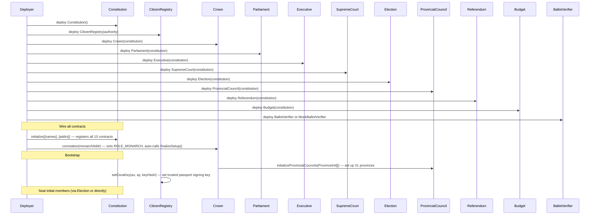
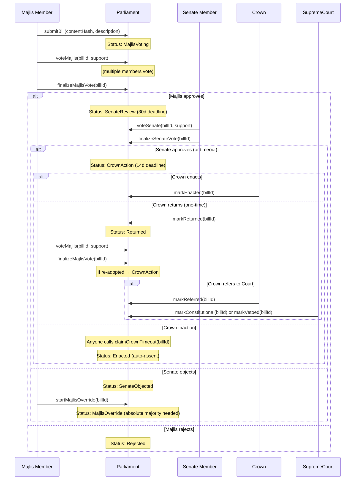
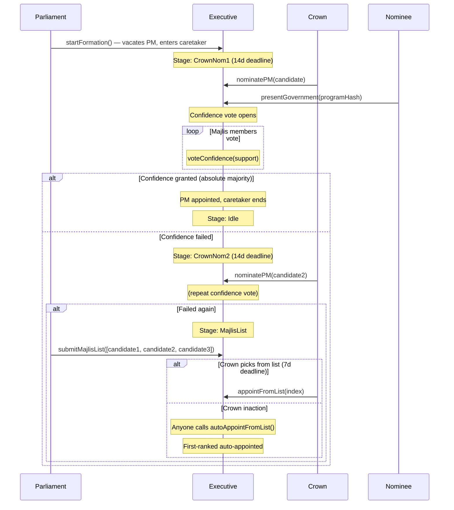
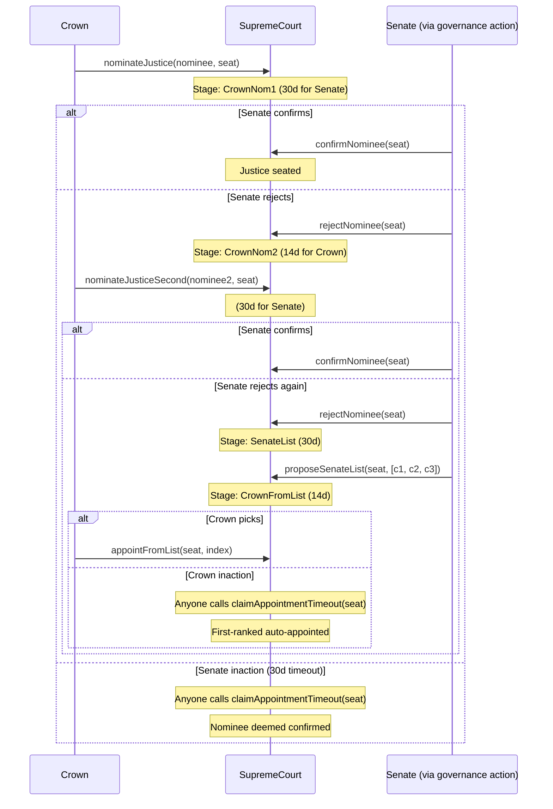
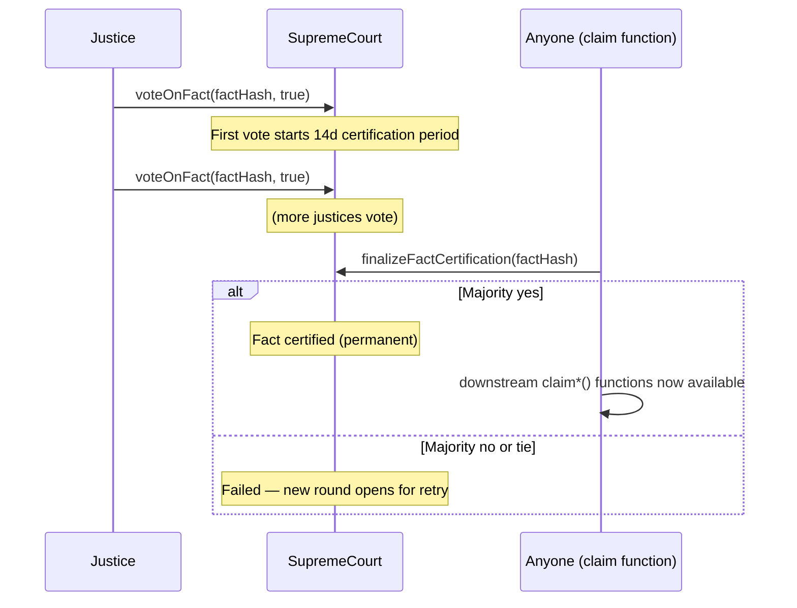
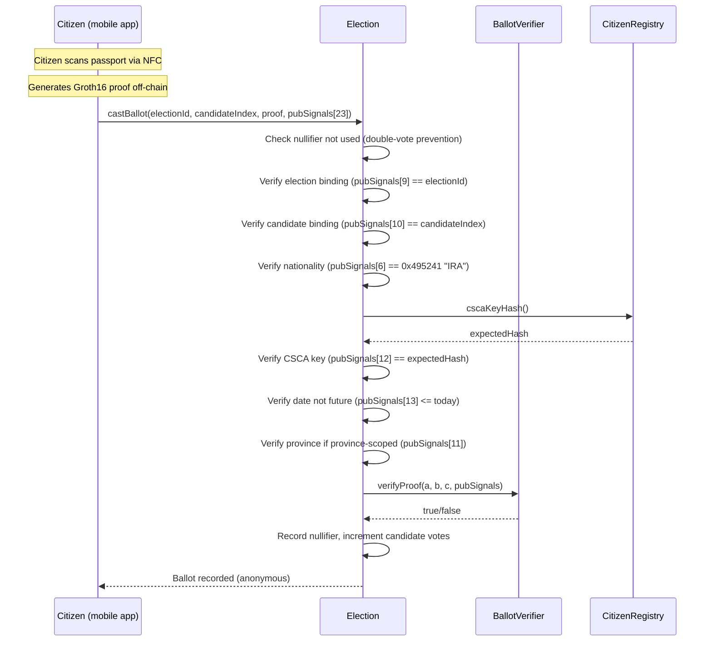
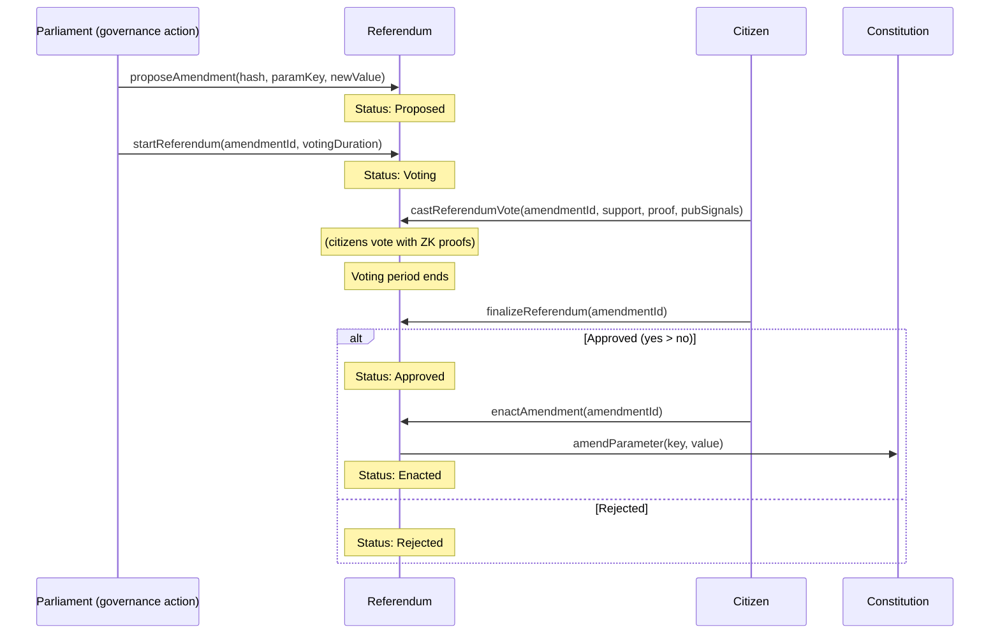

# Constitutional Monarchy Contracts — Technical Reference

Ten Solidity contracts implementing a constitutional monarchy governance system on the blockchain. This document is a developer and auditor reference covering every contract, function, parameter, and design pattern. For the constitutional rationale and Iranian historical context, see the [whitepaper](../whitepaper/whitepaper-shah.md).

**Stack:** Solidity 0.8.20, [Foundry](https://book.getfoundry.sh/), optimizer enabled (200 runs), `via_ir = false` in the default profile (15s build, 25s test suite). Production builds use `FOUNDRY_PROFILE=deploy` with `via_ir = true`.

**Chain target:** Chain-agnostic (Gnosis Chain if ever deployed).

---

## Table of Contents

1. [Design Patterns](#1-design-patterns)
2. [Deployment and Initialization](#2-deployment-and-initialization)
3. [Constitutional Parameters](#3-constitutional-parameters)
4. [Roles](#4-roles)
5. [Contract Reference: Constitution](#5-constitution)
6. [Contract Reference: CitizenRegistry](#6-citizenregistry)
7. [Contract Reference: Crown](#7-crown)
8. [Contract Reference: Parliament](#8-parliament)
9. [Contract Reference: Executive](#9-executive)
10. [Contract Reference: SupremeCourt](#10-supremecourt)
11. [Contract Reference: Election](#11-election)
12. [Contract Reference: ProvincialCouncil](#12-provincialcouncil)
13. [Contract Reference: Referendum](#13-referendum)
14. [Contract Reference: Budget](#14-budget)
15. [ZK Ballot Integration](#15-zk-ballot-integration)
16. [Cross-Contract Authorization Matrix](#16-cross-contract-authorization-matrix)
17. [Build and Test](#17-build-and-test)

---

## 1. Design Patterns

These recurring patterns appear across multiple contracts. Understanding them is essential for auditing the codebase.

### Hub-and-Spoke Registry

`Constitution.sol` is the central registry of parameters, roles, and contract addresses. Every other contract takes a `Constitution` address in its constructor and resolves sibling contracts, configuration values, and role holders through it. There is no direct coupling between governance contracts — all cross-references go through the hub. This means upgrading a contract (via referendum) only requires updating one registry entry.

### Permissionless Claim/Timeout

Functions named `claim*Timeout()` let *anyone* trigger the constitutional consequence of inaction. If the Crown doesn't enact a bill within 14 days, anyone calls `claimCrownTimeout(billId)` and the bill auto-enacts. If the Crown doesn't seat election winners within 14 days, anyone calls `claimSeatTimeout(electionId)`. This achieves constitutional automation without admin keys — no single actor can block governance by refusing to act.

### Round-Based Vote Clearing

When a vote context changes (bill returned for re-vote, confidence vote restarted, fact certification failed), the contract increments a `voteRound` counter. All previous votes are keyed by `mapping(uint256 => mapping(uint256 => mapping(address => bool)))` where the middle key is the round. Incrementing the round invalidates all previous votes in O(1) without looping over mappings. Used in Parliament (bills, governance actions, vacancies), Executive (confidence, no-confidence), and SupremeCourt (fact certification).

### Self-Enforcing Terms

`isActiveMajlisMember()`, `isActiveSenateMember()`, and `isActiveCouncilMember()` check term expiry on every call. An expired member cannot act even if `expireMember()` has never been called. The `expireMember()` function exists as a permissionless cleanup mechanism to update counters, but it is not the enforcement mechanism. This prevents zombie members from voting after their term ends.

### Governance Action Mechanism

Parliament provides a generic propose → vote → execute pattern for parliamentary collective decisions. Instead of per-function wrappers for every `onlyParliament`-gated function on other contracts, Parliament uses `proposeGovernanceAction(target, data, chamber, threshold, descriptionHash)`. During execution, chamber flags (`executingSenateAction` / `executingMajlisAction`) are set so target contracts can verify which chamber authorized the call. This is how the Senate confirms justice nominations, proposes PM lists, and more.

### Ministerial Act Wrappers

Crown's `executeMinisterialAct(target, data)` and Executive's `executePMAction(target, data)` are generic low-level call wrappers. The caller must be the monarch/regent or PM respectively, and the target must be a registered governance contract. Target contracts enforce their own access modifiers (e.g., `onlyCrown`, `onlyExecutive`). Crown also provides convenience wrappers for common ministerial acts (`enactLaw`, `returnLaw`, `nominatePrimeMinister`, etc.) that emit domain-specific events.

### Suspension Fallbacks

During Crown suspension (succession exhausted, no eligible monarch or regent), constitutional powers transfer to other actors:
- **PM inherits Crown legislative powers**: `returnLawDuringSuspension()`, `referToCourtDuringSuspension()`, `enactLawDuringSuspension()` (3 functions on Parliament, callable by PM)
- **PM inherits Crown justice nomination powers**: `nominateJusticeDuringSuspension()`, `nominateJusticeSecondDuringSuspension()`, `appointJusticeFromListDuringSuspension()` (3 functions on Executive, callable by PM)
- **Senate inherits PM nomination and appointment powers**: `nominatePM()` and `appointFromList()` on Executive accept Senate governance actions when Crown is suspended

### Split Getters

Large-struct arrays (`Bill[15 fields]`, `Amendment[15]`, `GovernanceAction[11]`, `ElectionData[11]`, `SenateSelection[10]`, `BudgetData[9]`) are declared `internal` with explicit getter functions returning at most 6 values each. This avoids stack-too-deep errors in auto-generated getters without enabling `via_ir` (which causes multi-minute builds).

---

## 2. Deployment and Initialization

All contracts take a single `address _constitution` constructor argument, except `Constitution` (no args) and `CitizenRegistry` (takes `address _authority`).

### Deployment Sequence



### Key Points

- `constitution.initialize(names, addrs)` can only be called once by the deployer. All addresses must be deployed contracts (code length > 0).
- `crown.coronation(monarchAddr)` sets `ROLE_MONARCH` and auto-calls `constitution.finalizeSetup()`, which zeros the deployer address. After this, no deployer-privileged operations are possible.
- Province initialization (`initializeProvinces`) is a one-time operation. Each province gets an ID (1–31), a name hash, council size, Senate seat count, Majlis seat count, and a stagger cohort (A/B/C).
- The CSCA key must be set on `CitizenRegistry` before any ZK-verified ballot can be cast.

---

## 3. Constitutional Parameters

All parameters are stored in `Constitution._parameters` as `uint256` values keyed by `bytes32` constants. Defaults are set in the constructor.

| Key | Default | Description | Protected |
|---|---|---|---|
| `PARAM_MAJLIS_TERM` | 4 years | Majlis member term length | Yes |
| `PARAM_SENATE_TERM` | 6 years | Senate member term length | Yes |
| `PARAM_JUSTICE_TERM` | 9 years | Supreme Court justice term | Yes |
| `PARAM_JUSTICE_COUNT` | 12 | Number of justice seats | Yes |
| `PARAM_COURT_QUORUM` | 7 | Justices needed for court quorum | Yes |
| `PARAM_SENATE_CROWN_PCT` | 10 | Max % of senators Crown can appoint | No |
| `PARAM_CROWN_LAW_DEADLINE` | 14 days | Deadline for Crown to act on a bill | No |
| `PARAM_SENATE_REVIEW_PERIOD` | 30 days | Senate review period for bills and nominations | No |
| `PARAM_CONFIDENCE_HONEYMOON` | 90 days | Honeymoon period (2/3 required for no-confidence) | No |
| `PARAM_NOMINATION_DEADLINE` | 14 days | Crown nomination deadline during formation | No |
| `PARAM_MAJLIS_LIST_DEADLINE` | 14 days | Majlis ranked list submission deadline | No |
| `PARAM_ELECTION_REG_PERIOD` | 14 days | Election candidate registration period | Yes |
| `PARAM_ELECTION_VOTE_PERIOD` | 7 days | Election voting period | Yes |
| `PARAM_DISSOLUTION_ELECTION_DEADLINE` | 60 days | Deadline for new election after dissolution | Yes |
| `PARAM_AMENDMENT_THRESHOLD` | 67 | Referendum approval threshold (%) | Yes |
| `PARAM_EMERGENCY_AMEND_THRESHOLD` | 75 | Emergency amendment threshold (%) | Yes |
| `PARAM_EMERGENCY_AMEND_DURATION` | 365 days | Emergency amendment expiry period | Yes |
| `PARAM_CROWN_APPOINT_DEADLINE` | 7 days | Crown deadline to pick PM from Majlis list | No |
| `PARAM_CROWN_JUSTICE_APPOINT_DEADLINE` | 14 days | Crown deadline to pick justice from Senate list | No |
| `PARAM_CONFIDENCE_VOTE_PERIOD` | 14 days | Duration of confidence/no-confidence votes | Yes |
| `PARAM_MAJLIS_QUORUM` | 50 | Majlis quorum (%) | No |
| `PARAM_SENATE_QUORUM` | 50 | Senate quorum (%) | No |
| `PARAM_MIN_VOTING_PERIOD` | 3 days | Minimum deliberation period for any vote | No |
| `PARAM_PETITION_TIMEOUT` | 30 days | Time to collect petition signatures | No |
| `PARAM_FACT_CERT_PERIOD` | 14 days | Fact certification voting period | No |
| `PARAM_BY_ELECTION_DEADLINE` | 90 days | Deadline for by-election after vacancy | No |
| `PARAM_VACANCY_VOTE_PERIOD` | 14 days | Vacancy declaration vote period | No |
| `PARAM_COURT_LIVENESS_PERIOD` | 7 days | Court liveness challenge window | No |
| `PARAM_COURT_INACTIVITY_PERIOD` | 14 days | Court inactivity fallback timeout | No |
| `PARAM_COUNCIL_TERM` | 4 years | Provincial council member term | Yes |
| `PARAM_SENATE_SELECTION_REG_PERIOD` | 14 days | Senate candidate registration in council selections | No |
| `PARAM_SENATE_SELECTION_VOTE_PERIOD` | 7 days | Council voting period for Senate selections | No |
| `PARAM_SUCCESSION_REFERENDUM_DEADLINE` | 365 days | Deadline for form-of-government referendum after succession exhaustion | No |
| `PARAM_DEPUTY_DESIGNATION_DEADLINE` | 14 days | PM deadline to designate Deputy PM | No |
| `PARAM_TOTAL_MAJLIS_SEATS` | 290 | Total Majlis seats across all provinces | Yes |
| `PARAM_CROWN_SEAT_DEADLINE` | 14 days | Crown deadline to seat election/selection winners | No |

**Protected parameters** cannot be changed by emergency amendment (3/4 parliament). They require a full referendum.

---

## 4. Roles

Roles are stored in `Constitution._roles` as `address` values keyed by `bytes32` constants.

| Role Key | Set By | Description |
|---|---|---|
| `ROLE_MONARCH` | Crown (coronation, succession), Referendum | The reigning monarch or the address succeeding to the throne |
| `ROLE_REGENT` | Crown (regency claim) | Acting head of state during monarch incapacity |
| `ROLE_PRIME_MINISTER` | Executive (confidence vote, PM vacancy), Crown (formation), Referendum | Head of government |
| `ROLE_AUDIT_HEAD` | Budget (appointment), Referendum | Head of the National Audit Office (9-year non-renewable term) |

---

## 5. Constitution

**Purpose:** Central registry of parameters, roles, and contract addresses. The "hub" of the governance system — all contracts reference it for authorization, role lookup, and configuration.

### Functions

**Initialization**

#### `initialize(bytes32[] calldata names, address[] calldata addrs)`

Register all governance contracts. Can only be called once by the deployer.

- **Access:** Deployer (once)
- **State changes:** `_contracts[names[i]] = addrs[i]`, `initialized = true`
- **Reverts:** `AlreadyInitialized` · `NotDeployer` · `InvalidParameter` (length mismatch) · `ZeroAddress` · `InvalidAddress` (no code)
- **Events:** `ContractRegistered(name, addr)` per entry · `Initialized()`

#### `finalizeSetup()`

Zero the deployer address (irreversible). Auto-called by Crown during coronation.

- **Access:** Deployer or Crown contract
- **State changes:** `deployer = address(0)`
- **Reverts:** `AlreadyFinalized` · `NotAuthorized`
- **Events:** `SetupFinalized()`

**Role Management**

#### `setRole(bytes32 role, address holder)`

Set a role holder. Caller restrictions vary by role.

- **Access:** Crown, Executive, or Referendum (general roles) · Budget or Referendum (`ROLE_AUDIT_HEAD` only)
- **State changes:** `_roles[role] = holder`
- **Reverts:** `NotAuthorized`
- **Events:** `RoleChanged(role, oldHolder, newHolder)`

#### `getRole(bytes32 role) → address`

Returns `_roles[role]` (`address(0)` if vacant).

#### `hasRole(bytes32 role, address account) → bool`

Returns `_roles[role] == account`.

**Parameter Management**

#### `getParameter(bytes32 key) → uint256`

Returns `_parameters[key]`.

#### `amendParameter(bytes32 key, uint256 value)`

Amend a constitutional parameter. Only the Referendum contract can call this after a successful amendment.

- **Access:** Referendum only
- **State changes:** `_parameters[key] = value`
- **Reverts:** `NotAuthorized`
- **Events:** `ParameterAmended(key, oldValue, newValue)`

**Contract Registry**

#### `getContract(bytes32 name) → address`

Returns `_contracts[name]`.

#### `amendContract(bytes32 name, address newAddr)`

Replace a governance contract address (structural amendment).

- **Access:** Referendum only
- **State changes:** `_contracts[name] = newAddr`
- **Reverts:** `NotAuthorized`
- **Events:** `ContractAmended(name, oldAddr, newAddr)`

#### `isProtectedParameter(bytes32 key) → bool`

Returns `_protectedParameters[key]`.

### Implementation Notes

- `setRole` enforces caller restrictions per role: `ROLE_AUDIT_HEAD` can only be set by Budget or Referendum. All other roles require Crown, Executive, or Referendum.
- `initialize` requires all addresses to be deployed contracts (`code.length > 0`).
- After `finalizeSetup()`, the deployer address is permanently zeroed. The function can be called by either the deployer or the Crown contract (auto-called during coronation).

---

## 6. CitizenRegistry

**Purpose:** Passport office for the governance system. A signing authority registers citizens for candidate eligibility and province tracking. Stores the trusted CSCA key hash for ZK proof verification during ballot casting.

### Functions

**Registration**

#### `registerCitizen(address citizen, bytes32 idHash, uint8 province)`

Register a citizen with province assignment.

- **Access:** Authority only
- **State changes:** `_registered[citizen] = true`, `_identityHashes[citizen] = idHash`, `_province[citizen] = province`, `_citizenCount++`, `_provinceCitizenCount[province]++`
- **Reverts:** `ZeroAddress` · `AlreadyRegistered(citizen)` · `InvalidProvince`
- **Events:** `CitizenRegistered(citizen, idHash)` · `ProvinceAssigned(citizen, province)`

#### `registerWithSignature(address citizen, bytes32 idHash, uint8 province, uint8 v, bytes32 r, bytes32 s)`

Gasless registration via ECDSA signature. Digest includes `chainid` and `address(this)` to prevent cross-chain/cross-contract replay.

- **Access:** Anyone (with valid authority signature)
- **State changes:** Same as `registerCitizen`
- **Reverts:** `ZeroAddress` · `AlreadyRegistered(citizen)` · `InvalidProvince` · `InvalidSignature`
- **Events:** `CitizenRegistered(citizen, idHash)` · `ProvinceAssigned(citizen, province)`

#### `assignProvince(address citizen, uint8 province)`

Reassign a citizen's province.

- **Access:** Authority only
- **State changes:** `_provinceCitizenCount[oldProvince]--`, `_province[citizen] = province`, `_provinceCitizenCount[province]++`
- **Reverts:** `NotRegistered(citizen)` · `InvalidProvince`
- **Events:** `ProvinceAssigned(citizen, province)`

**Revocation**

#### `revokeCitizenship(address citizen)`

Revoke registration and increment nonce to invalidate pre-signed registrations.

- **Access:** Authority only
- **State changes:** `_registered[citizen] = false`, `delete _identityHashes[citizen]`, `_citizenCount--`, `registrationNonce[citizen]++`, `_provinceCitizenCount[oldProvince]--`, `_province[citizen] = 0`
- **Reverts:** `NotRegistered(citizen)`
- **Events:** `CitizenRevoked(citizen)`

**Authority Management**

#### `transferAuthority(address newAuthority)`

Transfer the authority role.

- **Access:** Authority only
- **State changes:** `authority = newAuthority`
- **Reverts:** `ZeroAddress`
- **Events:** `AuthorityTransferred(oldAuthority, newAuthority)`

**CSCA Key Management**

#### `setCscaKey(uint256 ax, uint256 ay, uint256 keyHash)`

Set the trusted CSCA public key and its Poseidon hash for ZK proof verification.

- **Access:** Authority only
- **State changes:** `cscaPubKeyAx = ax`, `cscaPubKeyAy = ay`, `cscaKeyHash = keyHash`

**View Functions**

#### `isCitizen(address citizen) → bool`

Returns `_registered[citizen]`.

#### `citizenCount() → uint256`

Returns `_citizenCount`.

#### `identityHash(address citizen) → bytes32`

Returns `_identityHashes[citizen]`.

#### `citizenProvince(address citizen) → uint8`

Returns `_province[citizen]` (0 if unassigned).

#### `provinceCitizenCount(uint8 province) → uint256`

Returns `_provinceCitizenCount[province]`.

#### `registrationNonce(address citizen) → uint256`

Returns per-citizen replay prevention nonce.

#### `cscaPubKeyAx() → uint256` / `cscaPubKeyAy() → uint256` / `cscaKeyHash() → uint256`

CSCA Baby Jubjub coordinates and Poseidon hash.

### Implementation Notes

- The signature-based registration includes `chainid` and `address(this)` in the digest to prevent cross-chain and cross-contract replay.
- Revoking citizenship increments a per-citizen nonce, invalidating any pre-signed but unused registration signatures.
- Province IDs range from 1 to 31. Province 0 means unassigned.

---

## 7. Crown

**Purpose:** Constitutional office of continuity and guardianship. The Crown does not govern, legislate, or control finances. Powers are limited to ministerial acts (signing bills, nominations, appointments) with deadlines — inaction triggers automatic constitutional consequences.

### Functions

**Coronation & Succession**

#### `coronation(address monarch)`

Set the first monarch during system bootstrap. Auto-calls `constitution.finalizeSetup()`.

- **Access:** Deployer (once, before finalization)
- **State changes:** `ROLE_MONARCH = monarch`, `deployer = address(0)`
- **Reverts:** `ZeroAddress` · `MonarchAlreadySet` · `NotAuthorized`
- **Events:** `Coronation(monarch, timestamp)`

#### `abdicate(address confirmedHeir)`

Abdicate and crown the confirmed heir in one atomic step. Requires Court certification of abdication and heir, plus succession order verification.

- **Access:** Monarch (or regent)
- **State changes:** `ROLE_MONARCH = confirmedHeir`, `successionList[heirPos] = address(0)`
- **Reverts:** `NotMonarch` · `CrownSuspended` · `CourtCertificationRequired` · `HeirNotConfirmed` · `InvalidSuccessor` · `NotCitizen(candidate)` · `SuccessionOrderViolated`
- **Events:** `Abdication(currentMonarch, timestamp)` · `SuccessionTriggered(oldMonarch, newMonarch)`

#### `updateSuccessionList(address[] calldata successors)`

Set the succession line. Requires Court certification and all successors must be registered citizens. Max 20 entries.

- **Access:** Monarch (or regent)
- **State changes:** `delete successionList`, `successionList = successors`
- **Reverts:** `NotMonarch` · `CrownSuspended` · `SuccessionListTooLong` · `CourtCertificationRequired` · `ZeroAddress` · `NotCitizen(successor)`
- **Events:** `SuccessorUpdated(index, successor)` per entry

#### `getSuccessionList() → address[]`

Returns the full succession list.

#### `successionListLength() → uint256`

Returns `successionList.length`.

**PM Nomination (Art. II.4)**

#### `nominatePrimeMinister(address candidate)`

Nominate a PM candidate during executive formation. Delegates to `Executive.nominatePM()`.

- **Access:** Monarch (or regent)
- **Reverts:** `NotMonarch` · `CrownSuspended` · `ZeroAddress` + Executive reverts
- **Events:** `PMNominated(candidate)`

**Justice Nomination (Art. V.3)**

#### `nominateJustice(address candidate, uint256 seat)`

First justice nomination. Direct Solidity call to `SupremeCourt.nominateJustice()` (inner errors propagate directly).

- **Access:** Monarch (or regent)
- **Reverts:** `NotMonarch` · `CrownSuspended` · `ZeroAddress` + SupremeCourt reverts
- **Events:** `JusticeNominated(candidate)`

#### `nominateJusticeSecond(address candidate, uint256 seat)`

Second justice nomination after Senate rejection. Direct Solidity call to `SupremeCourt.nominateJusticeSecond()`.

- **Access:** Monarch (or regent)
- **Reverts:** `NotMonarch` · `CrownSuspended` · `ZeroAddress` + SupremeCourt reverts
- **Events:** `JusticeNominated(candidate)`

#### `appointJusticeFromList(uint256 seat, uint256 index)`

Pick a justice from the Senate's ranked list. Direct Solidity call to `SupremeCourt.appointFromList()`.

- **Access:** Monarch (or regent)
- **Reverts:** `NotMonarch` · `CrownSuspended` + SupremeCourt reverts

**Senator & PM Appointment**

#### `appointSenators(address[] calldata senators)`

Appoint Crown senators. Parliament enforces the 10% cap via `seatCrownSenator()`.

- **Access:** Monarch (or regent)
- **Reverts:** `NotMonarch` · `CrownSuspended` · `ZeroAddress` + Parliament reverts (`CrownSenatorCapExceeded`, etc.)
- **Events:** `SenatorsAppointed(senators)`

#### `appointPMFromList(uint256 index)`

Pick PM from the Majlis-proposed ranked list. Delegates to `Executive.appointFromList()`.

- **Access:** Monarch (or regent)
- **Reverts:** `NotMonarch` · `CrownSuspended` + Executive reverts

**Initialization**

#### `initializeSenateStagger(address[] calldata senators)`

One-time Senate term staggering (2/4/6yr cohorts). Delegates to `Parliament.initializeSenateStagger()`.

- **Access:** Monarch (or regent)
- **Reverts:** `NotMonarch` · `CrownSuspended` + Parliament reverts

#### `initializeProvincialCouncils(ProvincialCouncil.ProvinceInit[] calldata inits)`

One-time province setup. Delegates to `ProvincialCouncil.initializeProvinces()`.

- **Access:** Monarch (or regent)
- **Reverts:** `NotMonarch` · `CrownSuspended` + ProvincialCouncil reverts

**Legislative Actions (Art. II.5)**

#### `returnLaw(uint256 billId)`

Return a bill to the Majlis for reconsideration (one-time per bill). Calls `Parliament.markReturned()`.

- **Access:** Monarch (or regent)
- **Reverts:** `NotMonarch` · `CrownSuspended` + Parliament reverts
- **Events:** `LawReturned(billId)`

#### `referToSupremeCourt(uint256 billId)`

Refer a re-adopted bill to the Supreme Court. Calls `Parliament.markReferred()`.

- **Access:** Monarch (or regent)
- **Reverts:** `NotMonarch` · `CrownSuspended` + Parliament reverts
- **Events:** `LawReferred(billId)`

#### `enactLaw(uint256 billId)`

Sign a bill into law. Calls `Parliament.markEnacted()`.

- **Access:** Monarch (or regent)
- **Reverts:** `NotMonarch` · `CrownSuspended` + Parliament reverts
- **Events:** `LawEnacted(billId)`

**Executive & Dissolution**

#### `designateActingPM(address acting)`

Designate Acting PM when both PM and Deputy are dead. Delegates to `Executive.designateActingPM()`.

- **Access:** Monarch (or regent)
- **Reverts:** `NotMonarch` · `CrownSuspended` + Executive reverts

#### `declareDissolution()`

Dissolve the Majlis. Calls `Parliament.dissolveMajlis()`.

- **Access:** Monarch (or regent)
- **Reverts:** `NotMonarch` · `CrownSuspended` + Parliament reverts
- **Events:** `DissolutionDeclared(timestamp)`

**Generic Ministerial Execute**

#### `executeMinisterialAct(address target, bytes calldata data)`

Execute any function on a registered governance contract via low-level `.call()`. Failures are wrapped in `ExecutionFailed`.

- **Access:** Monarch (or regent)
- **Reverts:** `NotMonarch` · `CrownSuspended` · `InvalidTarget` · `ExecutionFailed`

**Permissionless Claim Functions**

#### `claimSuccession(address confirmedHeir)`

Trigger succession after Court certifies monarch vacancy and heir. Verifies succession order.

- **Access:** Anyone
- **State changes:** `ROLE_MONARCH = confirmedHeir`, `successionList[heirPos] = address(0)`
- **Reverts:** `VacancyNotCertified` · `HeirNotConfirmed` · `InvalidSuccessor` · `NotCitizen(candidate)` · `SuccessionOrderViolated`
- **Events:** `SuccessionTriggered(oldMonarch, newMonarch)`

#### `claimSuccessionExhausted()`

Suspend the Crown when all successors are ineligible. Vacates monarch role.

- **Access:** Anyone
- **State changes:** `ROLE_MONARCH = address(0)`, `suspended = true`, `successionExhaustedAt = block.timestamp`
- **Reverts:** `VacancyNotCertified` · `SuccessionNotExhausted`
- **Events:** `CrownSuspension(true)`

#### `claimRegency(address confirmedRegent)`

Start regency after Court certifies monarch incapacity and regent identity.

- **Access:** Anyone
- **State changes:** `ROLE_REGENT = confirmedRegent`
- **Reverts:** `IncapacityNotCertified` · `ZeroAddress` · `RegentAlreadySet` · `RegentNotConfirmed` · `InvalidSuccessor` · `NotCitizen(candidate)` · `SuccessionOrderViolated`
- **Events:** `RegencyStarted(confirmedRegent)`

#### `claimRegencyEnd()`

End regency after Court certifies monarch recovery.

- **Access:** Anyone
- **State changes:** `ROLE_REGENT = address(0)`
- **Reverts:** `RecoveryNotCertified`
- **Events:** `RegencyEnded(regent)`

#### `claimCrownResumption()`

Resume Crown operations after suspension is resolved (new monarch set by referendum or other mechanism).

- **Access:** Anyone
- **State changes:** `suspended = false`, `successionExhaustedAt = 0`, `successionReferendumClaimed = false`
- **Reverts:** `CrownNotSuspended` · `NoMonarch`
- **Events:** `CrownSuspension(false)`

#### `claimSuccessionReferendumDeadline()`

Record that the Art. VI.6.1 succession referendum deadline has passed (1 year from exhaustion).

- **Access:** Anyone
- **State changes:** `successionReferendumClaimed = true`
- **Reverts:** `SuccessionNotExhausted` · `AlreadyClaimed` · `DeadlineNotReached`
- **Events:** `SuccessionReferendumDue(timestamp)`

### Implementation Notes

- `nominateJustice`, `nominateJusticeSecond`, and `appointJusticeFromList` make *direct Solidity calls* to SupremeCourt. Inner errors propagate directly (not wrapped in `ExecutionFailed`). Only `executeMinisterialAct` uses low-level `.call()` which wraps failures.
- `_verifySuccessionOrder` enforces that every candidate ahead of the confirmed heir in the succession list is either on-chain ineligible (zero address, not a citizen, same as departing monarch) or Court-certified as `SUCCESSION_INELIGIBLE`.
- The `onlyMonarch` modifier accepts both the monarch and the regent, and reverts if Crown is suspended.

---

## 8. Parliament

**Purpose:** Bicameral legislature — Majlis (lower house, elected) and Senate (upper house, elected via provincial councils + Crown appointees). Manages member seating, the full legislative process, governance actions, dissolution, by-elections, incapacity, and vacancy declarations.

### Legislative Process



### Functions

**Member Management**

#### `seatMember(address member, Chamber chamber)`

Seat a member in the Majlis or Senate. For Senate, enforces non-renewability and sets individual term endpoint.

- **Access:** Election contract only
- **State changes:** `isMajlisMember[member] = true`, `majlisMemberCount++` (Majlis) or `isSenateMember[member] = true`, `senateMemberCount++`, `senateTermEnd[member]` (Senate) · `seatTimestamp[member] = block.timestamp` · vacancy count decremented if filling by-election
- **Reverts:** `ZeroAddress` · `AlreadyMember(member)` · `SenateNonRenewable(member)`
- **Events:** `MemberSeated(member, chamber)`

#### `seatMajlisMemberWithProvince(address member, uint8 provinceId)`

Seat a Majlis member with province tracking after a province-scoped election.

- **Access:** Election contract only
- **State changes:** `isMajlisMember[member] = true`, `majlisMemberCount++`, `majlisMemberProvince[member] = provinceId`, `seatTimestamp[member] = block.timestamp` · vacancy counts decremented
- **Reverts:** `ZeroAddress` · `AlreadyMember(member)`
- **Events:** `MemberSeated(member, Chamber.Majlis)`

#### `seatSenatorWithProvince(address member, uint8 provinceId)`

Seat a senator from the provincial council two-tier selection pipeline.

- **Access:** ProvincialCouncil only
- **State changes:** `isSenateMember[member] = true`, `senateMemberCount++`, `senateTermEnd[member]`, `senatorProvince[member] = provinceId`, `seatTimestamp[member] = block.timestamp`
- **Reverts:** `ZeroAddress` · `AlreadyMember(member)` · `SenateNonRenewable(member)`
- **Events:** `MemberSeated(member, Chamber.Senate)`

#### `seatCrownSenator(address member)`

Seat a Crown-appointed senator, enforcing the 10% cap.

- **Access:** Crown only
- **State changes:** `isSenateMember[member] = true`, `senateMemberCount++`, `crownSenatorCount++`, `isCrownSenator[member] = true`, `senateTermEnd[member]`, `seatTimestamp[member] = block.timestamp`
- **Reverts:** `ZeroAddress` · `AlreadyMember(member)` · `SenateNonRenewable(member)` · `CrownSenatorCapExceeded`
- **Events:** `MemberSeated(member, Chamber.Senate)`

#### `removeMember(address member, Chamber chamber)`

Remove a member. Triggers by-election vacancy tracking (skip if < 6 months remain).

- **Access:** SupremeCourt only
- **State changes:** membership flags cleared, member count decremented, vacancy tracking updated, `hasPreviousSenateTerm[member] = true` (Senate), `crownSenatorCount--` (if Crown senator)
- **Reverts:** `NotActiveMember(member)`
- **Events:** `MemberRemoved(member, chamber)`

#### `expireMember(address member, Chamber chamber)`

Permissionless cleanup of an expired member's seat.

- **Access:** Anyone
- **State changes:** membership flags cleared, member count decremented, `hasPreviousSenateTerm[member] = true` (Senate)
- **Reverts:** `NotActiveMember(member)` · `TermNotExpired`
- **Events:** `MemberRemoved(member, chamber)`

#### `majlisElectionSeated()`

Notify that one province's Majlis election has been seated. When all pending elections complete, restores the Majlis if dissolved.

- **Access:** Election contract only
- **State changes:** `pendingMajlisElections--` · if zero and dissolved: `dissolved = false`, `dissolvedAt = 0`, vacancy tracking reset
- **Events:** `MajlisRestored(timestamp)` (if restored)

#### `isActiveMajlisMember(address member) → bool`

Returns true if seated, not incapacitated, and term not expired. Self-enforcing.

#### `isActiveSenateMember(address member) → bool`

Returns true if seated, not incapacitated, and term not expired. Uses `senateTermEnd` if set, else `seatTimestamp + PARAM_SENATE_TERM`.

#### `isTermExpired(address member, Chamber chamber) → bool`

Returns true if the member's term has expired.

#### `effectiveMajlisMemberCount() → uint256`

Returns `majlisMemberCount - incapacitatedMajlisCount`.

#### `effectiveSenateMemberCount() → uint256`

Returns `senateMemberCount - incapacitatedSenateCount`.

**Legislative Process**

#### `submitBill(bytes32 contentHash, string calldata description) → uint256 billId`

Submit a bill. Blocked during caretaker government.

- **Access:** Active Majlis member (not dissolved)
- **State changes:** new `Bill` pushed with `status = MajlisVoting`, `votingStarted = block.timestamp`
- **Reverts:** `NotMajlisMember` · `MajlisDissolved` · `EmptyContent` · `CaretakerModeActive`
- **Events:** `BillSubmitted(billId, sponsor, contentHash)` · `BillStatusChanged(billId, Introduced, MajlisVoting)`

#### `submitBudgetBill(bytes32 contentHash, string calldata description) → uint256 billId`

Submit a budget bill. Allowed during caretaker mode.

- **Access:** Active Majlis member (not dissolved)
- **State changes:** new `Bill` pushed with `isBudget = true`, `status = MajlisVoting`
- **Reverts:** `NotMajlisMember` · `MajlisDissolved` · `EmptyContent`
- **Events:** `BillSubmitted(billId, sponsor, contentHash)` · `BillStatusChanged(billId, Introduced, MajlisVoting)`

#### `voteMajlis(uint256 billId, bool support)`

Cast a Majlis vote. Accepts bills in `MajlisVoting`, `MajlisOverride`, or `Returned` status.

- **Access:** Active Majlis member (not dissolved)
- **State changes:** `hasVoted[billId][round][voter] = true`, `bill.majlisYes++` or `bill.majlisNo++`
- **Reverts:** `NotMajlisMember` · `MajlisDissolved` · `InvalidBillId` · `BillNotInStatus(billId, MajlisVoting)` · `AlreadyVoted(billId, voter)`
- **Events:** `BillVoteCast(billId, voter, support, Chamber.Majlis)`

#### `finalizeMajlisVote(uint256 billId)`

Tally Majlis vote. Handles three statuses: `MajlisVoting` (simple majority), `MajlisOverride` (absolute majority), `Returned` (simple majority).

- **Access:** Anyone
- **State changes:** bill status advanced based on vote outcome · `senateDeadline` set on approval · `crownActionDeadline` set on CrownAction
- **Reverts:** `InvalidBillId` · `VotingPeriodNotElapsed` · `QuorumNotMet` · `BillNotInStatus`
- **Events:** `BillStatusChanged(billId, oldStatus, newStatus)`

#### `voteSenate(uint256 billId, bool support)`

Cast a Senate vote on a bill in `SenateReview`.

- **Access:** Active Senate member
- **State changes:** `hasVoted[billId][round][voter] = true`, `bill.senateYes++` or `bill.senateNo++`
- **Reverts:** `NotSenateMember` · `InvalidBillId` · `BillNotInStatus(billId, SenateReview)` · `AlreadyVoted(billId, voter)`
- **Events:** `BillVoteCast(billId, voter, support, Chamber.Senate)`

#### `finalizeSenateVote(uint256 billId)`

Tally Senate vote. Approval moves to CrownAction; objection moves to SenateObjected.

- **Access:** Anyone
- **State changes:** bill status → `CrownAction` or `SenateObjected`, `crownActionDeadline` set
- **Reverts:** `InvalidBillId` · `BillNotInStatus(billId, SenateReview)` · `VotingPeriodNotElapsed` · `QuorumNotMet`
- **Events:** `BillStatusChanged(billId, SenateReview, newStatus)`

#### `claimSenateTimeout(uint256 billId)`

Auto-approve bill after Senate review period expires without a vote.

- **Access:** Anyone
- **State changes:** bill status → `CrownAction`, `crownActionDeadline` set
- **Reverts:** `InvalidBillId` · `BillNotInStatus(billId, SenateReview)` · `SenateReviewNotExpired`
- **Events:** `BillStatusChanged(billId, SenateReview, CrownAction)`

#### `claimCrownTimeout(uint256 billId)`

Auto-enact bill after Crown deadline expires (inaction = assent per Art. II.5).

- **Access:** Anyone
- **State changes:** bill status → `Enacted`
- **Reverts:** `InvalidBillId` · `BillNotInStatus(billId, CrownAction)` · `DeadlineNotExpired`
- **Events:** `BillStatusChanged(billId, CrownAction, Enacted)`

#### `startMajlisOverride(uint256 billId)`

Begin override vote after Senate objection. Resets Majlis vote counts and increments round.

- **Access:** Active Majlis member (not dissolved)
- **State changes:** `bill.majlisYes = 0`, `bill.majlisNo = 0`, `bill.voteRound++`, status → `MajlisOverride`
- **Reverts:** `NotMajlisMember` · `MajlisDissolved` · `InvalidBillId` · `BillNotInStatus(billId, SenateObjected)`
- **Events:** `BillStatusChanged(billId, SenateObjected, MajlisOverride)`

#### `markEnacted(uint256 billId)`

Crown signs bill into law.

- **Access:** Crown only
- **State changes:** bill status → `Enacted`
- **Reverts:** `NotAuthorized` · `InvalidBillId` · `BillNotInStatus(billId, CrownAction)`
- **Events:** `BillStatusChanged(billId, CrownAction, Enacted)`

#### `markReturned(uint256 billId)`

Crown returns bill to Majlis. One-time per bill (sets `crownReturned` flag). Resets Majlis vote counts and increments round.

- **Access:** Crown only
- **State changes:** `bill.crownReturned = true`, `bill.majlisYes = 0`, `bill.majlisNo = 0`, `bill.voteRound++`, status → `Returned`
- **Reverts:** `NotAuthorized` · `InvalidBillId` · `BillNotInStatus(billId, CrownAction)` (also if already returned)
- **Events:** `BillStatusChanged(billId, CrownAction, Returned)`

#### `markReferred(uint256 billId)`

Crown refers a re-adopted bill to the Supreme Court. Only allowed after the bill was previously returned (`crownReturned` must be true).

- **Access:** Crown only
- **State changes:** bill status → `Referred`
- **Reverts:** `NotAuthorized` · `InvalidBillId` · `BillNotInStatus(billId, CrownAction)` · `BillNotInStatus(billId, Returned)` (if not previously returned)
- **Events:** `BillStatusChanged(billId, CrownAction, Referred)`

#### `markConstitutional(uint256 billId)`

Court finds bill constitutional — enacted. Called by SupremeCourt after review.

- **Access:** SupremeCourt only
- **State changes:** bill status → `Enacted`
- **Reverts:** `NotAuthorized` · `InvalidBillId` · `BillNotInStatus(billId, Referred)`
- **Events:** `BillStatusChanged(billId, Referred, Enacted)`

#### `markVetoed(uint256 billId)`

Court finds bill unconstitutional.

- **Access:** SupremeCourt only
- **State changes:** bill status → `Vetoed`
- **Reverts:** `NotAuthorized` · `InvalidBillId` · `BillNotInStatus(billId, Referred)`
- **Events:** `BillStatusChanged(billId, Referred, Vetoed)`

**Dissolution**

#### `dissolveMajlis()`

Dissolve the Majlis.

- **Access:** Crown or Executive
- **State changes:** `dissolved = true`, `dissolvedAt = block.timestamp`
- **Reverts:** `NotAuthorized`
- **Events:** `MajlisDissolution(timestamp)`

#### `restoreMajlis()`

Restore the Majlis after elections. Idempotent (safe to call when not dissolved).

- **Access:** Election contract only
- **State changes:** `dissolved = false`, `dissolvedAt = 0`, `dissolutionElectionTriggered = false`, vacancy tracking reset
- **Events:** `MajlisRestored(timestamp)` (if was dissolved)

#### `claimDissolutionElectionTimeout()`

Auto-start Majlis elections for all provinces after 60-day dissolution deadline.

- **Access:** Anyone
- **State changes:** `dissolutionElectionTriggered = true`, `pendingMajlisElections = provinceCount` · starts one election per province
- **Reverts:** `NotDissolved` · `DissolutionElectionAlreadyTriggered` · `DissolutionElectionDeadlineNotReached`
- **Events:** `DissolutionElectionTriggered(electionId)` per province

#### `claimByElectionTimeout(Chamber chamber)`

Auto-start by-elections after 90-day vacancy deadline. Majlis by-elections are province-scoped.

- **Access:** Anyone
- **State changes:** by-election triggered flags set · elections started for provinces with vacancies (Majlis) or a single Senate election
- **Reverts:** `NoVacancies` · `ByElectionAlreadyTriggered` · `ByElectionDeadlineNotReached`
- **Events:** `ByElectionTriggered(chamber, electionId)`

**Senate Stagger**

#### `initializeSenateStagger(address[] calldata senators)`

One-time Senate term staggering. Assigns 2/4/6yr initial terms using `prevrandao` to create three cohorts.

- **Access:** Crown only
- **State changes:** `senateStaggerInitialized = true`, `senateTermEnd[senator]` set per cohort assignment
- **Reverts:** `StaggerAlreadyInitialized` · `NotActiveMember(senator)`
- **Events:** `SenateStaggerInitialized(senatorCount, timestamp)`

**Incapacity / Vacancy**

#### `acknowledgeIncapacity(address member, Chamber chamber)`

Acknowledge Court-certified incapacity. Excludes member from quorum calculations.

- **Access:** Anyone
- **State changes:** `isIncapacitated[member] = true`, `incapacitatedMajlisCount++` or `incapacitatedSenateCount++`
- **Reverts:** `NotActiveMember(member)` · `AlreadyIncapacitated` · `IncapacityNotCertified`
- **Events:** `IncapacityAcknowledged(member, chamber)`

#### `proposeVacancy(address member, Chamber chamber) → uint256 vacancyId`

Propose to declare a member's seat vacant.

- **Access:** Active member of the same chamber
- **State changes:** new `VacancyProposal` pushed, `hasActiveVacancyProposal[member] = true`
- **Reverts:** `NotMajlisMember` / `NotSenateMember` · `NotActiveMember(member)` · `VacancyAlreadyProposed`
- **Events:** `VacancyProposed(vacancyId, member, chamber)`

#### `voteOnVacancy(uint256 vacancyId, bool support)`

Vote on a vacancy proposal. Target member cannot vote.

- **Access:** Active member of the same chamber (excluding target)
- **State changes:** `hasVotedOnVacancy[vacancyId][round][voter] = true`, `v.yesVotes++` or `v.noVotes++`
- **Reverts:** `InvalidVacancyId` · `VacancyAlreadyResolved` · `NotAuthorized` (target) · `NotMajlisMember` / `NotSenateMember` · `AlreadyVotedOnVacancy(vacancyId, voter)`
- **Events:** `VacancyVoteCast(vacancyId, voter, support)`

#### `finalizeVacancy(uint256 vacancyId)`

Finalize vacancy vote after voting period. Simple majority of votes cast required.

- **Access:** Anyone
- **State changes:** `v.resolved = true`, `hasActiveVacancyProposal[member] = false` · if approved: member removed (triggers vacancy tracking)
- **Reverts:** `InvalidVacancyId` · `VacancyAlreadyResolved` · `VacancyVotingNotElapsed`
- **Events:** `VacancyDeclared(vacancyId, member, chamber)` or `VacancyRejected(vacancyId, member)`

#### `vacancyProposalCount() → uint256`

Returns `vacancyProposals.length`.

**Crown Suspension Fallbacks**

#### `returnLawDuringSuspension(uint256 billId)`

PM exercises Crown's return power during suspension. Same logic as `markReturned`.

- **Access:** PM only (Crown must be suspended)
- **State changes:** `bill.crownReturned = true`, vote counts reset, `bill.voteRound++`, status → `Returned`
- **Reverts:** `NotPrimeMinister` · `CrownNotSuspended` · `InvalidBillId` · `BillNotInStatus(billId, CrownAction)`
- **Events:** `BillStatusChanged(billId, CrownAction, Returned)`

#### `referToCourtDuringSuspension(uint256 billId)`

PM exercises Crown's referral power during suspension. Only for re-adopted bills.

- **Access:** PM only (Crown must be suspended)
- **State changes:** status → `Referred`
- **Reverts:** `NotPrimeMinister` · `CrownNotSuspended` · `InvalidBillId` · `BillNotInStatus(billId, CrownAction)` · `BillNotInStatus(billId, Returned)`
- **Events:** `BillStatusChanged(billId, CrownAction, Referred)`

#### `enactLawDuringSuspension(uint256 billId)`

PM exercises Crown's enactment power during suspension.

- **Access:** PM only (Crown must be suspended)
- **State changes:** status → `Enacted`
- **Reverts:** `NotPrimeMinister` · `CrownNotSuspended` · `InvalidBillId` · `BillNotInStatus(billId, CrownAction)`
- **Events:** `BillStatusChanged(billId, CrownAction, Enacted)`

#### `initiateFormationDuringSuspension()`

Senate triggers executive formation during Crown suspension. Called directly by a senator (not through governance action).

- **Access:** Active Senate member (Crown must be suspended)
- **State changes:** delegates to `Executive.startFormation()`
- **Reverts:** `NotSenateMember` · `CrownNotSuspended` + Executive reverts

**Governance Actions**

#### `proposeGovernanceAction(address target, bytes calldata data, Chamber chamber, uint256 threshold, bytes32 descriptionHash) → uint256 actionId`

Propose a call to a registered governance contract for parliamentary collective decision.

- **Access:** Active member of the specified chamber
- **State changes:** new `GovernanceAction` pushed with `status = Voting`
- **Reverts:** `NotMajlisMember` / `NotSenateMember` · `MajlisDissolved` · `InvalidTarget` · `InvalidThreshold` (must be 50, 67, or 75)
- **Events:** `GovernanceActionProposed(actionId, target, proposer, chamber)`

#### `voteOnGovernanceAction(uint256 actionId, bool support)`

Vote on a governance action.

- **Access:** Active member of the action's chamber
- **State changes:** `hasVotedOnAction[actionId][round][voter] = true`, `a.yesVotes++` or `a.noVotes++`
- **Reverts:** `InvalidAction` · `NotMajlisMember` / `NotSenateMember` · `MajlisDissolved` · `AlreadyVoted(actionId, voter)`
- **Events:** `GovernanceActionVoteCast(actionId, voter, support)`

#### `finalizeGovernanceAction(uint256 actionId)`

Finalize governance action vote after minimum voting period. Checks quorum and threshold.

- **Access:** Anyone
- **State changes:** `a.status = Passed` or `a.status = Failed`
- **Reverts:** `InvalidAction` · `VotingPeriodNotElapsed` · `QuorumNotMet`
- **Events:** `GovernanceActionFinalized(actionId, status)`

#### `executeGovernanceAction(uint256 actionId)`

Execute a passed governance action via low-level `.call()`. Sets chamber flags (`executingSenateAction` / `executingMajlisAction`) during execution.

- **Access:** Anyone
- **State changes:** `a.status = Executed` · chamber flags set/cleared · target contract state modified
- **Reverts:** `InvalidAction` · `ActionNotPassed` · `ExecutionFailed`
- **Events:** `GovernanceActionExecuted(actionId)`

#### `governanceActionCount() → uint256`

Returns `governanceActions.length`.

**View Functions**

#### `billCount() → uint256`

Returns `bills.length`.

#### `getBillStatus(uint256 billId) → BillStatus`

Returns the bill's current status. Reverts `InvalidBillId` if out of range.

#### `getBillVotes(uint256 billId) → (uint256 majYes, uint256 majNo, uint256 senYes, uint256 senNo)`

Returns Majlis and Senate vote counts for a bill. Reverts `InvalidBillId` if out of range.

### Implementation Notes

- `finalizeMajlisVote` handles three statuses: `MajlisVoting` (simple majority), `MajlisOverride` (absolute majority of effective members), and `Returned` (simple majority for re-adoption).
- Quorum calculations exclude incapacitated members (`effectiveMajlisMemberCount()` / `effectiveSenateMemberCount()`).
- Bill returns reset Majlis vote counts and increment `voteRound` (clearing all previous votes). The `crownReturned` flag prevents a second return.
- Senate stagger uses `prevrandao` to pseudo-randomly assign 2/4/6-year initial terms, creating three natural renewal cohorts.
- Dissolution elections are province-scoped: `claimDissolutionElectionTimeout` starts one election per province. The Majlis is restored when all provinces have seated their winners.
- By-elections are also province-scoped for Majlis: only provinces with vacancies get elections. No by-election is triggered when remaining term < 6 months.

---

## 9. Executive

**Purpose:** PM nomination, confidence votes, no-confidence motions, caretaker government, and executive formation cycle. Formation follows a state machine: Idle → CrownNom1 → CrownNom2 → MajlisList → Dissolved.

### PM Formation Process



### Functions

**Formation Cycle**

#### `startFormation()`

Start executive formation. Vacates PM role, enters caretaker mode, begins at CrownNom1.

- **Access:** Parliament only
- **State changes:** `caretaker = true`, `ROLE_PRIME_MINISTER = address(0)`, `stage = CrownNom1`, `crownNominationDeadline` set, all formation state reset
- **Reverts:** `NotAuthorized` · `FormationInProgress`
- **Events:** `FormationStarted(timestamp)` · `CaretakerActivated(timestamp)`

#### `nominatePM(address candidate)`

Crown nominates a PM candidate (stages 1 and 2). During Crown suspension, accepts Senate governance actions instead.

- **Access:** Crown contract (or Parliament executing Senate action during suspension)
- **State changes:** `nominee = candidate`, `crownNominationDeadline = 0`, confidence vote reset, `confidenceVoteStart` and `confidenceVoteDeadline` set
- **Reverts:** `NotAuthorized` · `ZeroAddress` · `NotInStage(CrownNom1)`
- **Events:** `PMNominated(candidate, stage)`

#### `presentGovernment(bytes32 programHash)`

Present government program. Required before confidence voting (Art. IV.4).

- **Access:** Current nominee only
- **State changes:** `governmentProgram = programHash`
- **Reverts:** `NomineeNotSet` · `NotAuthorized`
- **Events:** `GovernmentProgramPresented(nominee, programHash)`

#### `voteConfidence(bool support)`

Cast a confidence vote for the current nominee.

- **Access:** Active Majlis member
- **State changes:** `confVoted[confRound][voter] = true`, `confYes++` or `confNo++`
- **Reverts:** `NotMajlisMember` · `NomineeNotSet` · `ProgramNotPresented` · `AlreadyVoted`
- **Events:** `ConfidenceVoteCast(voter, support)`

#### `finalizeConfidenceVote()`

Tally confidence vote. Absolute majority grants confidence; failure advances formation stage.

- **Access:** Anyone
- **State changes:** On success: `ROLE_PRIME_MINISTER = nominee`, `caretaker = false`, `stage = Idle`, `deputyDesignationDeadline` set · On failure: `stage` advances (CrownNom1→CrownNom2→MajlisList)
- **Reverts:** `NomineeNotSet` · `VotingPeriodNotElapsed` · `ParliamentCallFailed`
- **Events:** `ConfidenceGranted(pm, timestamp)` or `ConfidenceFailed(nominee, stage)`

**No-Confidence**

#### `fileNoConfidence()`

File a motion of no confidence against the sitting PM.

- **Access:** Active Majlis member
- **State changes:** `noConfidenceMotionActive = true`, `noConfidenceDeadline` set
- **Reverts:** `NotMajlisMember` · `FormationInProgress` · `PMNotActive`
- **Events:** `NoConfidenceMotionFiled(timestamp)`

#### `voteNoConfidence(bool support)`

Vote on the no-confidence motion.

- **Access:** Active Majlis member
- **State changes:** `noConfVoted[noConfRound][voter] = true`, `noConfYes++` or `noConfNo++`
- **Reverts:** `NotMajlisMember` · `NoFormationInProgress` · `AlreadyVoted`
- **Events:** `NoConfidenceVoteCast(voter, support)`

#### `finalizeNoConfidence()`

Tally no-confidence vote. Within honeymoon (90d): 2/3 required; after: simple majority.

- **Access:** Anyone
- **State changes:** On pass: PM vacated, `caretaker = true`, formation cycle starts · On fail: motion cleared
- **Reverts:** `NoFormationInProgress` · `ParliamentCallFailed`
- **Events:** `NoConfidencePassed(pm, timestamp)` or `NoConfidenceFailed(timestamp)` · `FormationStarted(timestamp)` · `CaretakerActivated(timestamp)` (if passed)

**Majlis List (Stage 3)**

#### `submitMajlisList(address[3] calldata candidates)`

Majlis submits a ranked list of 3 PM candidates. Must be via Majlis governance action.

- **Access:** Parliament only (executing Majlis action)
- **State changes:** `majlisCandidates = candidates`, `majlisListDeadline` set, `nominee = candidates[0]`
- **Reverts:** `NotAuthorized` (not Majlis action) · `NotInStage(MajlisList)` · `ZeroAddress` · `DuplicateCandidate`
- **Events:** `MajlisListSubmitted(candidates)`

#### `appointFromList(uint256 index)`

Crown picks PM from the Majlis list. During suspension, accepts Senate governance actions.

- **Access:** Crown contract (or Parliament executing Senate action during suspension)
- **State changes:** `ROLE_PRIME_MINISTER = selected`, `caretaker = false`, `stage = Idle`, `deputyDesignationDeadline` set
- **Reverts:** `NotAuthorized` · `NotInStage(MajlisList)` · `IndexOutOfBounds` · `ZeroAddress`
- **Events:** `ConfidenceGranted(selected, timestamp)`

#### `autoAppointFromList()`

Auto-appoint first-ranked candidate after Crown deadline expires.

- **Access:** Anyone
- **State changes:** Same as `appointFromList(0)`
- **Reverts:** `NotInStage(MajlisList)` · `DeadlineNotSet` · `DeadlineNotReached` · `ZeroAddress`
- **Events:** `ConfidenceGranted(selected, timestamp)`

**Dissolution & Timeouts**

#### `triggerDissolution()`

Dissolve the Majlis after Majlis list stage fails.

- **Access:** Parliament only
- **State changes:** `stage = Dissolved`, calls `Parliament.dissolveMajlis()`
- **Reverts:** `NotAuthorized` · `NotInStage(MajlisList)`
- **Events:** `DissolutionTriggered(timestamp)`

#### `claimMajlisListTimeout()`

Trigger dissolution after Majlis list submission deadline expires.

- **Access:** Anyone
- **State changes:** `stage = Dissolved`, calls `Parliament.dissolveMajlis()`
- **Reverts:** `NotInStage(MajlisList)` · `DeadlineNotSet` · `DeadlineNotReached`
- **Events:** `DissolutionTriggered(timestamp)`

#### `claimCrownNominationTimeout()`

Skip to MajlisList after Crown nomination deadline expires. Forfeits both nomination chances.

- **Access:** Anyone
- **State changes:** `stage = MajlisList`, `crownNominationDeadline = 0`, `majlisSubmissionDeadline` set
- **Reverts:** `NotInStage(CrownNom1)` · `DeadlineNotSet` · `DeadlineNotReached`
- **Events:** `CrownNominationTimeout(fromStage)`

**Deputy PM & Succession**

#### `designateDeputyPM(address deputy)`

PM designates Deputy PM (mandatory per Art. IV.9.1).

- **Access:** PM only
- **State changes:** `deputyPM = deputy`, `deputyDesignationDeadline = 0`
- **Reverts:** `ZeroAddress` · `NotPrimeMinister`
- **Events:** `DeputyPMDesignated(deputy)`

#### `claimPMVacancy()`

Trigger formation after Court certifies PM vacancy. Deputy PM becomes Acting PM if designated.

- **Access:** Anyone
- **State changes:** `caretaker = true`, `stage = CrownNom1`, formation state reset · `ROLE_PRIME_MINISTER = deputyPM` (if set) or `address(0)`
- **Reverts:** `PMVacancyNotCertified`
- **Events:** `FormationStarted(timestamp)` · `CaretakerActivated(timestamp)` · `ActingPMActivated(deputyPM)` (if Deputy exists)

#### `designateActingPM(address acting)`

Crown designates Acting PM when both PM and Deputy are dead. Formation must be in progress.

- **Access:** Crown only
- **State changes:** `ROLE_PRIME_MINISTER = acting`
- **Reverts:** `NotAuthorized` · `ZeroAddress` · `NoFormationInProgress`
- **Events:** `ActingPMActivated(acting)`

**Justice Nomination During Crown Suspension**

#### `nominateJusticeDuringSuspension(address candidate, uint256 seat)`

PM nominates a justice candidate when Crown is suspended. Direct call to `SupremeCourt.nominateJustice()`.

- **Access:** PM only (Crown must be suspended, Deputy not overdue)
- **Reverts:** `NotPrimeMinister` · `CrownNotSuspended` · `DeputyDesignationOverdue` · `ZeroAddress` + SupremeCourt reverts

#### `nominateJusticeSecondDuringSuspension(address candidate, uint256 seat)`

PM makes second justice nomination during suspension. Direct call to `SupremeCourt.nominateJusticeSecond()`.

- **Access:** PM only (Crown must be suspended, Deputy not overdue)
- **Reverts:** `NotPrimeMinister` · `CrownNotSuspended` · `DeputyDesignationOverdue` · `ZeroAddress` + SupremeCourt reverts

#### `appointJusticeFromListDuringSuspension(uint256 seat, uint256 index)`

PM picks from Senate's ranked list during suspension. Direct call to `SupremeCourt.appointFromList()`.

- **Access:** PM only (Crown must be suspended, Deputy not overdue)
- **Reverts:** `NotPrimeMinister` · `CrownNotSuspended` · `DeputyDesignationOverdue` + SupremeCourt reverts

**Generic PM Execute**

#### `executePMAction(address target, bytes calldata data)`

Execute any function on a registered governance contract via low-level `.call()`.

- **Access:** PM only
- **State changes:** target contract state modified
- **Reverts:** `NotPrimeMinister` · `InvalidTarget` · `ExecutionFailed`

**View Functions**

#### `isCaretaker() → bool`

Returns `caretaker`.

#### `isDeputyOverdue() → bool`

Returns true if Deputy PM designation deadline passed and no Deputy designated.

### Implementation Notes

- No-confidence threshold depends on timing: within 90 days of confidence (honeymoon), 2/3 required; after that, simple majority suffices.
- `claimCrownNominationTimeout` skips directly from CrownNom1 or CrownNom2 to MajlisList — Crown inaction forfeits both nomination chances.
- During Crown suspension, `nominatePM` and `appointFromList` accept calls from Parliament only when `executingSenateAction` is true (Senate governance actions).
- `_isDeputyOverdue()` blocks PM's judicial nominations and legislation when Deputy PM has not been designated within the deadline.

---

## 10. SupremeCourt

**Purpose:** Highest judicial authority — justice appointments, constitutional review, inter-organ disputes, and fact certification. 12 seats, 9-year non-renewable terms. The contract tracks procedural steps (petitions filed, votes cast, rulings recorded), not legal reasoning.

### Justice Appointment Process



### Fact Certification



### Functions

**Justice Appointments**

#### `nominateJustice(address nominee, uint256 seat)`

Crown nominates a candidate for a vacant seat. Starts the appointment process at `CrownNom1` stage.

- **Access:** Crown or Executive (`onlyCrownOrExecutive`)
- **State changes:** `appointments[seat].stage = CrownNom1`, `appointments[seat].nominee1 = nominee`, `appointments[seat].stageDeadline`
- **Reverts:** `ZeroAddress` · `CourtFull` · `CaretakerModeActive` · `AlreadyJustice(nominee)` · `PreviouslyServed(nominee)` · `SeatOccupied(seat)` · `AppointmentNotInStage(Idle)`
- **Events:** `NominationMade(seat, nominee, CrownNom1)`

#### `nominateJusticeSecond(address nominee, uint256 seat)`

Crown makes second nomination after the first was rejected by the Senate. Must be a distinct candidate from the first nominee.

- **Access:** Crown or Executive (`onlyCrownOrExecutive`)
- **State changes:** `appointments[seat].nominee2 = nominee`, `appointments[seat].stageDeadline`
- **Reverts:** `ZeroAddress` · `AlreadyJustice(nominee)` · `PreviouslyServed(nominee)` · `AppointmentNotInStage(CrownNom2)` · `NomineeNotDistinct`
- **Events:** `NominationMade(seat, nominee, CrownNom2)`

#### `confirmNominee(uint256 seat)`

Senate confirms the current nominee (first or second). Seats the justice immediately.

- **Access:** Parliament (`onlyParliament`, must be Senate action)
- **State changes:** `appointments[seat].stage = Completed`, `justices[seat]`, `isActiveJustice[nominee]`, `justiceSeat[nominee]`, `hasServed[nominee]`, `activeJusticeCount++`
- **Reverts:** `NotAuthorized` · `AppointmentNotInStage(CrownNom1)`
- **Events:** `NominationConfirmed(seat, nominee)` · `JusticeAppointed(nominee, seat, termEnd)` · `JusticeSeated(seat, nominee)`

#### `rejectNominee(uint256 seat)`

Senate rejects the current nominee. After first rejection, advances to `CrownNom2` (Crown gets second nomination). After second rejection, advances to `SenateList` (Senate proposes ranked list of 3).

- **Access:** Parliament (`onlyParliament`, must be Senate action)
- **State changes:** `appointments[seat].stage` (advances), `appointments[seat].stageDeadline`
- **Reverts:** `NotAuthorized` · `AppointmentNotInStage(CrownNom1)`
- **Events:** `NominationRejected(seat, nominee, stage)`

#### `proposeSenateList(uint256 seat, address[3] calldata candidates)`

Senate proposes a ranked list of 3 candidates after rejecting both Crown nominees. All three must be distinct, non-active, and never previously served.

- **Access:** Parliament (`onlyParliament`, must be Senate action)
- **State changes:** `appointments[seat].senateList = candidates`, `appointments[seat].stage = CrownFromList`, `appointments[seat].stageDeadline`
- **Reverts:** `NotAuthorized` · `AppointmentNotInStage(SenateList)` · `ZeroAddress` · `AlreadyJustice(candidate)` · `PreviouslyServed(candidate)` · `DuplicateCandidate`
- **Events:** `SenateListProposed(seat, candidates)`

#### `appointFromList(uint256 seat, uint256 index)`

Crown picks a justice from the Senate's ranked list. Index must be 0, 1, or 2.

- **Access:** Crown or Executive (`onlyCrownOrExecutive`)
- **State changes:** `appointments[seat].stage = Completed`, `justices[seat]`, `isActiveJustice`, `justiceSeat`, `hasServed`, `activeJusticeCount++`
- **Reverts:** `AppointmentNotInStage(CrownFromList)` · `IndexOutOfBounds`
- **Events:** `JusticeAppointed(chosen, seat, termEnd)` · `JusticeSeated(seat, chosen)`

#### `claimAppointmentTimeout(uint256 seat)`

Trigger the constitutional consequence of a missed deadline at any appointment stage. Handles four scenarios: CrownNom1 timeout (nominee deemed confirmed), CrownNom2 timeout without second nominee (goes to SenateList), CrownNom2 timeout with second nominee (deemed confirmed), SenateList timeout (Crown appoints first nominee), CrownFromList timeout (first-ranked auto-appointed).

- **Access:** Anyone (permissionless)
- **State changes:** depends on stage — may seat a justice, or advance to next stage
- **Reverts:** `DeadlineNotExpired` · `NoActiveAppointment`
- **Events:** `NominationConfirmed(seat, nominee)` (for deemed confirmations) · `JusticeAppointed` · `JusticeSeated`

#### `removeExpiredJustice(uint256 seat)`

Remove a justice whose term has expired. Anyone can call.

- **Access:** Anyone (permissionless)
- **State changes:** `justices[seat].active = false`, `isActiveJustice[addr] = false`, `activeJusticeCount--`
- **Reverts:** `NotActiveJustice(address(0))` · `TermNotExpired(justice)`
- **Events:** `JusticeRemoved(addr, seat)`

#### `vacateJusticeSeat(uint256 seat)`

Vacate a justice seat after the Court has certified the vacancy fact (`keccak256("JUSTICE_VACANCY", seat)`). Handles incapacity, misconduct, or any other grounds.

- **Access:** Anyone (permissionless, requires prior fact certification)
- **State changes:** `justices[seat].active = false`, `isActiveJustice[addr] = false`, `activeJusticeCount--`
- **Reverts:** `NotActiveJustice(address(0))` · `VacancyNotCertified`
- **Events:** `JusticeRemoved(addr, seat)`

#### `getAppointmentStage(uint256 seat) → AppointmentStage`

Returns `appointments[seat].stage`.

**Constitutional Review**

#### `fileConstitutionalReview(uint256 lawId, bytes32 petitionHash) → uint256 reviewId`

File a petition for constitutional review of a law.

- **Access:** PM, Monarch, Crown contract, Executive contract, or Parliament contract (standing check)
- **State changes:** pushes to `reviews[]`
- **Reverts:** `NotAuthorized`
- **Events:** `ReviewFiled(reviewId, lawId, petitioner)`

#### `voteOnReview(uint256 reviewId, bool isConstitutional)`

Cast a vote on a constitutional review. Records court activity.

- **Access:** Active justice (`onlyJustice`)
- **State changes:** `reviewVoted[reviewId][sender] = true`, `reviews[reviewId].yesConstitutional++` or `noUnconstitutional++`, `lastCourtActivity`
- **Reverts:** `InvalidReview` · `NotInStatus` · `AlreadyVoted`
- **Events:** `ReviewVoteCast(reviewId, justice, isConstitutional)`

#### `finalizeReview(uint256 reviewId)`

Finalize a constitutional review. Requires effective quorum (`min(PARAM_COURT_QUORUM, activeJusticeCount)`). Sets status to `Constitutional` or `Unconstitutional` based on majority.

- **Access:** Anyone (permissionless)
- **State changes:** `reviews[reviewId].status`
- **Reverts:** `InvalidReview` · `NotInStatus` · `QuorumNotMet` · `NoActiveJustices`
- **Events:** `ReviewDecided(reviewId, outcome)`

#### `executeReviewOutcome(uint256 reviewId)`

Push a finalized review outcome to Parliament. If constitutional, calls `parliament.markConstitutional(lawId)`. If unconstitutional, calls `parliament.markVetoed(lawId)`. Can only be called once (status changes to `Executed`).

- **Access:** Anyone (permissionless)
- **State changes:** `reviews[reviewId].status = Executed`
- **Reverts:** `InvalidReview` · `NotInStatus`
- **Events:** none (downstream events from Parliament)

**Collective Petitions**

#### `createCollectivePetition(uint256 lawId, bytes32 petitionHash, Parliament.Chamber chamber) → uint256 petitionId`

Create a collective petition for constitutional review (Art. V.5). Creator automatically signs. If 1/10 of the chamber's members have signed (ceiling division), the petition auto-files a constitutional review. Prevents duplicate petitions for the same (chamber, lawId).

- **Access:** Active member of the specified chamber
- **State changes:** pushes to `petitions[]`, `petitionSigned[petitionId][sender] = true`, `petitionExists[chamber][lawId] = true`; may auto-file a review if threshold met
- **Reverts:** `NotParliamentMember` · `DuplicatePetition`
- **Events:** `PetitionCreated(petitionId, lawId, chamber)` · `PetitionSigned(petitionId, sender)`; if threshold met: `PetitionThresholdMet(petitionId, reviewId)` · `ReviewFiled(reviewId, lawId, address(this))`

#### `signPetition(uint256 petitionId)`

Sign an existing collective petition. Checks term-enforced active membership, expiry timeout, and duplicate signatures. May auto-file review if threshold reached.

- **Access:** Active member of the petition's chamber
- **State changes:** `petitionSigned[petitionId][sender] = true`, `petition.signatureCount++`; may auto-file review
- **Reverts:** `InvalidPetition` · `PetitionAlreadyFiled` · `PetitionExpired` · `PetitionAlreadySigned` · `NotParliamentMember`
- **Events:** `PetitionSigned(petitionId, sender)`; if threshold met: `PetitionThresholdMet` · `ReviewFiled`

#### `petitionCount() → uint256`

Returns `petitions.length`.

**Disputes**

#### `fileDispute(bytes32 disputeHash) → uint256 disputeId`

File a dispute between constitutional organs.

- **Access:** PM, Monarch, Crown contract, Executive contract, or Parliament contract (standing check)
- **State changes:** pushes to `disputes[]`
- **Reverts:** `NotAuthorized`
- **Events:** `DisputeFiled(disputeId, petitioner)`

#### `voteOnDispute(uint256 disputeId, bool support)`

Cast a vote on a dispute. Records court activity.

- **Access:** Active justice (`onlyJustice`)
- **State changes:** `disputeVoted[disputeId][sender] = true`, `disputes[disputeId].yesVotes++` or `noVotes++`, `lastCourtActivity`
- **Reverts:** `InvalidDispute` · `NotInStatus` · `AlreadyVoted`
- **Events:** `DisputeVoteCast(disputeId, justice, support)`

#### `finalizeDispute(uint256 disputeId, bytes32 rulingHash)`

Finalize a dispute with a ruling hash. Requires effective quorum. Records court activity.

- **Access:** Active justice (`onlyJustice`)
- **State changes:** `disputes[disputeId].rulingHash`, `disputes[disputeId].status = Resolved`, `lastCourtActivity`
- **Reverts:** `InvalidDispute` · `NotInStatus` · `QuorumNotMet` · `NoActiveJustices`
- **Events:** `DisputeResolved(disputeId, rulingHash)`

**Fact Certification**

#### `voteOnFact(bytes32 factHash, bool support)`

Vote on a fact certification (vacancy, incapacity, etc.). Deadline-based with no quorum. The first vote starts the certification period. Records court activity.

- **Access:** Active justice (`onlyJustice`)
- **State changes:** `factVotedInRound[factHash][round][sender] = true`, `factYesVotesInRound` or `factNoVotesInRound`, `factCertStarted[factHash]` (if first vote), `lastCourtActivity`
- **Reverts:** `FactAlreadyCertified` · `AlreadyVoted`
- **Events:** `FactVoteCast(factHash, justice)`

#### `finalizeFactCertification(bytes32 factHash)`

Finalize fact certification after `PARAM_FACT_CERT_PERIOD`. Majority of votes cast wins (no quorum). On failure, increments round for retry and resets start timestamp.

- **Access:** Anyone (permissionless)
- **State changes:** `certifiedFacts[factHash] = true` (if majority yes); or `factCertStarted[factHash] = 0`, `factCertRound[factHash]++` (if failed)
- **Reverts:** `FactAlreadyCertified` · `FactCertPeriodNotElapsed`
- **Events:** `FactCertified(factHash, timestamp)` or `FactCertificationFailed(factHash, round)`

#### `isFactCertified(bytes32 factHash) → bool`

Returns `certifiedFacts[factHash]`.

**Court Liveness**

#### `challengeCourtLiveness()`

Trigger a liveness challenge (fast path, 7d). Sets `livenessDeadline`.

- **Access:** PM, Monarch, or Crown contract
- **State changes:** `livenessDeadline = block.timestamp + PARAM_COURT_LIVENESS_PERIOD`
- **Reverts:** `NotAuthorized` · `LivenessChallengeActive`
- **Events:** `LivenessChallenged(livenessDeadline)`

#### `petitionCourtLiveness()`

Petition for a liveness challenge. Active members of either chamber can petition. Once 10% of a single chamber's effective members have petitioned (ceiling division), the challenge auto-activates.

- **Access:** Active Majlis or Senate member
- **State changes:** `hasLivenessPetitioned[round][sender] = true`, `majlisLivenessPetitions++` or `senateLivenessPetitions++`; may set `livenessDeadline`
- **Reverts:** `LivenessChallengeActive` · `AlreadyPetitioned` · `NotParliamentMember`
- **Events:** `LivenessPetitionCast(petitioner)`; if threshold met: `LivenessChallenged(livenessDeadline)`

#### `emergencyVacateSeat(uint256 seat)`

Vacate a justice seat under emergency conditions. Two triggers (either suffices): liveness challenge expired (7d fast path), or court inactivity timeout (14d slow path, `PARAM_COURT_INACTIVITY_PERIOD`).

- **Access:** Anyone (permissionless)
- **State changes:** `justices[seat].active = false`, `isActiveJustice[addr] = false`, `activeJusticeCount--`
- **Reverts:** `NotActiveJustice(address(0))` · `NeitherLivenessConditionMet`
- **Events:** `EmergencyVacated(seat)` · `JusticeRemoved(addr, seat)`

#### `checkIn()`

Justice records court activity, resetting the inactivity timer and clearing any active liveness challenge.

- **Access:** Active justice (`onlyJustice`)
- **State changes:** `lastCourtActivity`, `livenessDeadline = 0`, `majlisLivenessPetitions = 0`, `senateLivenessPetitions = 0`, `livenessChallengeRound++`
- **Events:** `JusticeCheckedIn(justice)`

**Judicial Orders**

#### `executeJudicialOrder(address target, bytes calldata data)`

Execute a judicial order on a registered governance contract. Requires prior fact certification of the exact action: `keccak256("JUDICIAL_ORDER", target, data)`. Consumes the fact certification to prevent replay.

- **Access:** Active justice (`onlyJustice`)
- **State changes:** `certifiedFacts[factHash] = false`, then low-level `.call(data)` on target
- **Reverts:** `FactNotCertified` · `InvalidTarget` · `ExecutionFailed`

**View Functions**

#### `reviewCount() → uint256`

Returns `reviews.length`.

#### `disputeCount() → uint256`

Returns `disputes.length`.

#### `getReviewStatus(uint256 reviewId) → ReviewStatus`

Returns `reviews[reviewId].status`. Reverts `InvalidReview` if out of bounds.

#### `getDisputeStatus(uint256 disputeId) → DisputeStatus`

Returns `disputes[disputeId].status`. Reverts `InvalidDispute` if out of bounds.

### Implementation Notes

- Effective quorum is `min(PARAM_COURT_QUORUM, activeJusticeCount)`, preventing deadlock when the court is below full strength.
- Fact certification is deadline-based with no quorum requirement (majority of votes cast wins). This avoids deadlock when certifying justice incapacity at low court membership.
- `executeJudicialOrder` consumes the fact certification to prevent replay (`certifiedFacts[factHash] = false`).
- `_recordActivity()` resets `lastCourtActivity`, clears any active liveness challenge, and resets petition counts. Any justice vote action triggers this.
- `claimAppointmentTimeout` handles four stages: CrownNom1 timeout (nominee deemed confirmed), CrownNom2 timeout without second nominee (goes to SenateList), CrownNom2 timeout with second nominee (deemed confirmed), SenateList timeout (Crown appoints previous nominee), CrownFromList timeout (first-ranked auto-appointed).

---

## 11. Election

**Purpose:** Election cycles for Majlis and ProvincialCouncil. Candidate registration (citizenship required), ZK proof-verified ballot casting, tallying, and member seating. Senate elections go through the ProvincialCouncil two-tier pipeline instead.

### ZK Ballot Casting



### Functions

**Election Lifecycle**

#### `startElection(ElectionType electionType) → uint256 electionId`

Start a new Senate election cycle. Majlis elections must use `startMajlisElection` instead.

- **Access:** Parliament (`onlyParliament`)
- **State changes:** pushes to `elections[]` with `Registration` phase, sets timing from `PARAM_ELECTION_REG_PERIOD` and `PARAM_ELECTION_VOTE_PERIOD`
- **Reverts:** `MajlisElectionMustUseProvince`
- **Events:** `ElectionCreated(electionId, electionType)`

#### `startMajlisElection(uint8 provinceId) → uint256 electionId`

Start a province-scoped Majlis election. Candidates and voters must belong to the specified province.

- **Access:** Parliament (`onlyParliament`)
- **State changes:** pushes to `elections[]` with `Registration` phase and `provinceId` set
- **Reverts:** `InvalidProvince`
- **Events:** `ElectionCreated(electionId, Majlis)`

#### `startProvincialElection(uint8 provinceId) → uint256 electionId`

Start a provincial council election for a specific province.

- **Access:** Crown (`onlyCrown`)
- **State changes:** pushes to `elections[]` with `Registration` phase, type `ProvincialCouncil`, and `provinceId` set
- **Reverts:** `InvalidProvince`
- **Events:** `ElectionCreated(electionId, ProvincialCouncil)`

#### `registerCandidate(uint256 electionId, bytes32 partyHash)`

Register as a candidate. Requires citizenship via `CitizenRegistry`. For province-scoped elections, candidate must be from the correct province.

- **Access:** Any registered citizen
- **State changes:** `candidates[electionId][idx]`, `isCandidate[electionId][sender] = true`, `elections[electionId].candidateCount++`
- **Reverts:** `InvalidElection` · `NotInPhase(Registration)` · `RegistrationPeriodEnded` · `AlreadyRegistered(sender)` · `NotCitizen(sender)` · `WrongProvince`
- **Events:** `CandidateRegistered(electionId, candidate, partyHash)`

#### `openVoting(uint256 electionId)`

Advance election from Registration to Voting phase after the registration period ends.

- **Access:** Anyone (permissionless)
- **State changes:** `elections[electionId].phase = Voting`
- **Reverts:** `InvalidElection` · `NotInPhase(Registration)` · `RegistrationNotEnded` · `NoCandidates`

#### `castBallot(uint256 electionId, uint256 candidateIndex, ProofPoints calldata proof, uint256[23] calldata pubSignals)`

Cast an anonymous ballot using a ZK proof. Verifies nullifier (double-vote prevention), election/candidate binding, Iranian nationality, CSCA key trust, date validity, province match (if province-scoped), and Groth16 proof.

- **Access:** Anyone with a valid ZK proof
- **State changes:** `nullifierUsed[electionId][nullifier] = true`, `candidates[electionId][candidateIndex].voteCount++`, `elections[electionId].totalVotes++`
- **Reverts:** `InvalidElection` · `NotInPhase(Voting)` · `VotingNotOpen` · `InvalidCandidate` · `AlreadyVoted(nullifier)` · `InvalidElectionBinding` · `InvalidProof` · `WrongProvince`
- **Events:** `BallotCast(electionId, nullifier, candidateIndex)`

#### `tallyVotes(uint256 electionId)`

Tally votes and determine results after voting ends. Sets seating deadline for Crown.

- **Access:** Anyone (permissionless)
- **State changes:** `elections[electionId].phase = Tallied`, `elections[electionId].seatDeadline`
- **Reverts:** `InvalidElection` · `NotInPhase(Voting)` · `VotingNotOpen`
- **Events:** `ElectionTallied(electionId, totalVotes)`

#### `seatMembers(uint256 electionId)`

Seat elected members based on vote tallies. Crown triggers seating but winners are determined automatically by vote count (top-N selection). Seat count looked up from `ProvincialCouncil` at seating time.

- **Access:** Crown (`onlyCrown`)
- **State changes:** `elections[electionId].seated = true`, `elections[electionId].phase = Seated`; calls `Parliament.seatMajlisMemberWithProvince`, `Parliament.seatMember`, or `ProvincialCouncil.seatCouncilMember` for each winner
- **Reverts:** `InvalidElection` · `ElectionNotTallied` · `NoCandidates` · `SeatMemberFailed`
- **Events:** `MembersSeated(electionId, memberCount)`

#### `claimSeatTimeout(uint256 electionId)`

Permissionless seating after Crown fails to act within `PARAM_CROWN_SEAT_DEADLINE`. Same logic as `seatMembers` but callable by anyone after deadline.

- **Access:** Anyone (permissionless)
- **State changes:** same as `seatMembers`
- **Reverts:** `InvalidElection` · `ElectionNotTallied` · `DeadlineNotReached`
- **Events:** `MembersSeated(electionId, memberCount)`

**View Functions**

#### `electionCount() → uint256`

Returns `elections.length`.

#### `getCandidateVotes(uint256 electionId, uint256 candidateIndex) → uint256`

Returns `candidates[electionId][candidateIndex].voteCount`. Reverts `InvalidElection` · `InvalidCandidate`.

#### `getCandidateAddr(uint256 electionId, uint256 candidateIndex) → address`

Returns `candidates[electionId][candidateIndex].addr`. Reverts `InvalidElection` · `InvalidCandidate`.

#### `getElectionPhase(uint256 electionId) → ElectionPhase`

Returns `elections[electionId].phase`. Reverts `InvalidElection`.

#### `getElection(uint256 electionId) → (ElectionType, ElectionPhase, uint8 provinceId, bool seated)`

Returns core election data. Reverts `InvalidElection`.

#### `getElectionTiming(uint256 electionId) → (uint256 registrationStart, uint256 registrationEnd, uint256 votingStart, uint256 votingEnd, uint256 seatDeadline)`

Returns election timing data. Reverts `InvalidElection`.

#### `getElectionCounts(uint256 electionId) → (uint256 candidateCount, uint256 totalVotes)`

Returns election count data. Reverts `InvalidElection`.

#### `isNullifierUsed(uint256 electionId, uint256 nullifier) → bool`

Returns `nullifierUsed[electionId][nullifier]`.

### Implementation Notes

- Seat count is looked up from `ProvincialCouncil` at seating time (not election creation time), so reapportionment takes effect immediately.
- `_topNCandidates` uses O(N * candidateCount) selection sort — acceptable for elections where N is small relative to the candidate pool.
- Majlis elections must use `startMajlisElection(provinceId)` — `startElection(Majlis)` reverts. This enforces province-scoped elections.
- For province-scoped elections, candidates must be registered citizens of the correct province, and the ZK proof's province signal (`pubSignals[11]`) must match.

---

## 12. ProvincialCouncil

**Purpose:** Provincial councils for the two-tier Senate selection pipeline. Citizens elect council members via Election.sol. Council members then vote to select senators for their province. Also stores province data (council size, Senate/Majlis seat allocations, stagger cohort) and provides seat count lookups for Election.sol.

### Functions

**Province Setup**

#### `initializeProvinces(ProvinceInit[] calldata inits)`

One-time initialization of all provinces. Each `ProvinceInit` contains id (1-31), name, councilSize, senateSeatCount, majlisSeatCount, and stagger cohort.

- **Access:** Crown (`onlyCrown`)
- **State changes:** `provinces[id]` for each init, `provinceCount`, `provincesInitialized = true`
- **Reverts:** `ProvincesAlreadyInitialized` · `InvalidProvince` · `AlreadyInitialized`
- **Events:** `ProvinceInitialized(id, name, councilSize, senateSeatCount, majlisSeatCount, cohort)` per province

**Council Membership**

#### `seatCouncilMember(address member, uint8 provinceId)`

Seat a council member after a provincial election.

- **Access:** Election contract (`onlyElection`)
- **State changes:** `isCouncilMember[provinceId][member] = true`, `councilSeatTimestamp[member]`, `memberProvince[member]`, `provinces[provinceId].currentCouncilCount++`
- **Reverts:** `ZeroAddress` · `ProvinceNotInitialized` · `AlreadyCouncilMember` · `CouncilFull`
- **Events:** `CouncilMemberSeated(member, provinceId)`

#### `removeCouncilMember(address member)`

Remove a council member.

- **Access:** SupremeCourt (`onlySupremeCourt`)
- **State changes:** `isCouncilMember[provinceId][member] = false`, `provinces[provinceId].currentCouncilCount--`
- **Reverts:** `NotCouncilMember`
- **Events:** `CouncilMemberRemoved(member, provinceId)`

#### `isActiveCouncilMember(address member) → bool`

Returns true if `member` is a seated council member whose term has not expired (checked against `PARAM_COUNCIL_TERM`).

**Senate Selection Pipeline**

#### `startSenateSelection(uint8 provinceId) → uint256 selectionId`

Start a senate candidate selection for a province. Sets registration and voting periods from `PARAM_SENATE_SELECTION_REG_PERIOD` and `PARAM_SENATE_SELECTION_VOTE_PERIOD`.

- **Access:** Crown (`onlyCrown`)
- **State changes:** pushes to `senateSelections[]`
- **Reverts:** `ProvinceNotInitialized`
- **Events:** `SenateSelectionStarted(selectionId, provinceId)`

#### `registerSenateCandidate(uint256 selectionId)`

Register as a senate candidate. Must be a registered citizen of the province.

- **Access:** Any citizen of the selection's province
- **State changes:** `selectionCandidates[selectionId][idx]`, `isSelectionCandidate[selectionId][sender] = true`, `senateSelections[selectionId].candidateCount++`
- **Reverts:** `InvalidSelection` · `RegistrationNotOpen` · `AlreadyRegistered(sender)` · `NotCitizen(sender)` · `WrongProvince`
- **Events:** `SenateCandidateRegistered(selectionId, candidate)`

#### `openSenateVoting(uint256 selectionId)`

Validate that registration has ended and candidates exist. Voting is time-based (no explicit phase transition).

- **Access:** Anyone (permissionless)
- **Reverts:** `InvalidSelection` · `RegistrationNotEnded` · `NoCandidates`

#### `castSenateVote(uint256 selectionId, uint256 candidateIndex)`

Cast a vote for a senate candidate. Only active council members of the same province can vote.

- **Access:** Active council member of the selection's province
- **State changes:** `hasVotedInSelection[selectionId][sender] = true`, `selectionCandidates[selectionId][candidateIndex].voteCount++`, `senateSelections[selectionId].totalVotes++`
- **Reverts:** `InvalidSelection` · `VotingNotOpen` · `InvalidCandidate` · `AlreadyVoted(sender)` · `NotCouncilMember` · `WrongProvince`
- **Events:** `SenateVoteCast(selectionId, voter)`

#### `tallySenateSelection(uint256 selectionId)`

Tally senate selection results after voting ends. Sets seating deadline for Crown.

- **Access:** Anyone (permissionless)
- **State changes:** `senateSelections[selectionId].tallied = true`, `senateSelections[selectionId].seatDeadline`
- **Reverts:** `InvalidSelection` · `VotingNotOpen` · `SelectionAlreadyTallied`
- **Events:** `SenateSelectionTallied(selectionId, totalVotes)`

#### `seatSelectedSenators(uint256 selectionId)`

Seat top-N winners in Parliament by vote count. Crown triggers seating but winners are determined automatically. Calls `Parliament.seatSenatorWithProvince` for each winner.

- **Access:** Crown (`onlyCrown`)
- **State changes:** `senateSelections[selectionId].seated = true`
- **Reverts:** `InvalidSelection` · `SelectionNotTallied` · `SelectionAlreadySeated` · `NoCandidates` · `SeatMemberFailed`
- **Events:** `SenateSelectionSeated(selectionId, seatedCount)`

#### `claimSenatorSeatTimeout(uint256 selectionId)`

Permissionless senator seating after Crown fails to act within `PARAM_CROWN_SEAT_DEADLINE`. Same logic as `seatSelectedSenators`.

- **Access:** Anyone (permissionless)
- **State changes:** same as `seatSelectedSenators`
- **Reverts:** `InvalidSelection` · `SelectionNotTallied` · `SelectionAlreadySeated` · `DeadlineNotReached` · `SeatMemberFailed`
- **Events:** `SenateSelectionSeated(selectionId, seatedCount)`

**Reapportionment**

#### `updateMajlisSeatAllocation(uint8[] calldata ids, uint256[] calldata newCounts)`

Reapportion Majlis seats across provinces. New counts must sum to `PARAM_TOTAL_MAJLIS_SEATS`. Called via Parliament governance action.

- **Access:** Parliament (`onlyParliament`)
- **State changes:** `provinces[id].majlisSeatCount` for each province
- **Reverts:** `ArrayLengthMismatch` · `ProvinceNotInitialized` · `TotalSeatsMismatch`
- **Events:** `MajlisSeatAllocationUpdated(provinceId, oldCount, newCount)` per province

**View Functions**

#### `selectionCount() → uint256`

Returns `senateSelections.length`.

#### `getSelection(uint256 selectionId) → (uint8 provinceId, bool tallied, bool seated, uint256 seatDeadline)`

Returns selection core data. Reverts `InvalidSelection`.

#### `getSelectionCandidateVotes(uint256 selectionId, uint256 candidateIndex) → uint256`

Returns `selectionCandidates[selectionId][candidateIndex].voteCount`. Reverts `InvalidSelection` · `InvalidCandidate`.

#### `getSelectionCandidateAddr(uint256 selectionId, uint256 candidateIndex) → address`

Returns `selectionCandidates[selectionId][candidateIndex].addr`. Reverts `InvalidSelection` · `InvalidCandidate`.

#### `getProvince(uint8 provinceId) → (bytes32 name, uint256 councilSize, uint256 senateSeatCount, uint256 majlisSeatCount, uint256 currentCouncilCount, uint8 staggerCohort)`

Returns province info.

#### `getMajlisSeatCount(uint8 provinceId) → uint256`

Returns `provinces[provinceId].majlisSeatCount`.

#### `provinceCount() → uint256`

Returns total initialized provinces.

### Implementation Notes

- Province IDs range from 1 to 31. ID 0 is invalid.
- Council members vote on senate candidates (not citizens directly). Only active council members of the same province can vote.
- Senate selection is a simplified vote: no ZK proofs, just council member addresses casting one vote each. Privacy is not needed for a small council.
- `updateMajlisSeatAllocation` enforces that the new seat counts sum to `PARAM_TOTAL_MAJLIS_SEATS`. Called via Parliament governance action after a reapportionment bill.

---

## 13. Referendum

**Purpose:** Constitutional amendment proposals and citizen referendums. Amendments can change parameters, roles, or contract addresses. Emergency amendments (3/4 parliament + Court certification) take effect immediately but expire after 1 year without referendum ratification.

### Amendment Lifecycle



### Functions

**Amendment Proposals**

#### `proposeAmendment(bytes32 amendmentHash, bytes32 parameterKey, uint256 newValue) → uint256 amendmentId`

Propose a parameter amendment after parliamentary adoption.

- **Access:** Parliament (`onlyParliament`)
- **State changes:** pushes to `amendments[]` with status `Proposed`, type `Parameter`
- **Events:** `AmendmentProposed(amendmentId, amendmentHash, proposer)`

#### `proposeRoleAmendment(bytes32 amendmentHash, bytes32 roleKey, address newHolder) → uint256 amendmentId`

Propose a structural amendment changing a role holder.

- **Access:** Parliament (`onlyParliament`)
- **State changes:** pushes to `amendments[]` with status `Proposed`, type `Role`
- **Events:** `AmendmentProposed(amendmentId, amendmentHash, proposer)`

#### `proposeContractAmendment(bytes32 amendmentHash, bytes32 contractKey, address newContract) → uint256 amendmentId`

Propose a structural amendment swapping a governance contract address.

- **Access:** Parliament (`onlyParliament`)
- **State changes:** pushes to `amendments[]` with status `Proposed`, type `Contract`
- **Events:** `AmendmentProposed(amendmentId, amendmentHash, proposer)`

**Referendum Voting**

#### `startReferendum(uint256 amendmentId, uint256 votingDuration)`

Open referendum voting for a proposed amendment. Enforces minimum voting period from `PARAM_MIN_VOTING_PERIOD`.

- **Access:** Parliament (`onlyParliament`)
- **State changes:** `amendments[amendmentId].status = Voting`, `votingStart`, `votingEnd`
- **Reverts:** `InvalidAmendment` · `NotInStatus(Proposed)` · `VotingDurationTooShort`
- **Events:** `ReferendumStarted(amendmentId, votingEnd)`

#### `castReferendumVote(uint256 amendmentId, bool support, ProofPoints calldata proof, uint256[23] calldata pubSignals)`

Cast a referendum vote using a ZK proof. Same verification as `Election.castBallot` (nullifier, amendment binding, nationality, CSCA key, date, Groth16 proof) except no candidate binding or province check.

- **Access:** Anyone with a valid ZK proof
- **State changes:** `nullifierUsed[amendmentId][nullifier] = true`, `amendments[amendmentId].yesVotes++` or `noVotes++`
- **Reverts:** `InvalidAmendment` · `NotInStatus(Voting)` · `VotingNotOpen` · `AlreadyVoted(nullifier)` · `InvalidElectionBinding` · `InvalidProof`
- **Events:** `ReferendumVoteCast(amendmentId, nullifier, support)`

#### `finalizeReferendum(uint256 amendmentId)`

Finalize a referendum after voting ends. Simple majority: if `yesVotes > noVotes`, status becomes `Approved`; otherwise `Rejected`.

- **Access:** Anyone (permissionless)
- **State changes:** `amendments[amendmentId].status` → `Approved` or `Rejected`
- **Reverts:** `InvalidAmendment` · `NotInStatus(Voting)` · `VotingNotOpen`
- **Events:** `ReferendumPassed(amendmentId, yesVotes, noVotes)` or `ReferendumFailed(amendmentId, yesVotes, noVotes)`

**Enactment**

#### `enactAmendment(uint256 amendmentId)`

Enact an approved amendment by updating the Constitution. Intentionally permissionless: once citizens approve by referendum, no governance actor can block enactment. Calls `constitution.amendParameter`, `constitution.setRole`, or `constitution.amendContract` depending on type. Supersedes any active emergency amendment on the same parameter.

- **Access:** Anyone (permissionless)
- **State changes:** `amendments[amendmentId].status = Enacted`, `amendments[amendmentId].enactedAt`; Constitution state updated; may set emergency amendment to `Superseded`
- **Reverts:** `InvalidAmendment` · `AmendmentNotApproved`
- **Events:** `AmendmentEnacted(amendmentId, parameterKey, newValue, targetAddress)`; if superseding: `EmergencyAmendmentSuperseded(emergId, amendmentId)`

**Emergency Amendments**

#### `enactEmergencyAmendment(bytes32 amendmentHash, bytes32 parameterKey, uint256 newValue) → uint256 amendmentId`

Enact an emergency amendment (3/4 parliament, no referendum). Requires Supreme Court fact certification of `keccak256("EMERGENCY_AMENDMENT", amendmentHash)`. Stores old value for rollback on expiry. Expires after `PARAM_EMERGENCY_AMEND_DURATION`. Protected parameters cannot be changed.

- **Access:** Parliament (`onlyParliament`)
- **State changes:** pushes to `amendments[]` with status `Enacted`, `emergency = true`; `constitution.amendParameter(key, newValue)`; `hasActiveEmergency[key] = true`, `activeEmergencyForParam[key]`
- **Reverts:** `ProtectedParameter(key)` · `EmergencyAlreadyActive(key)` · `CourtCertificationRequired`
- **Events:** `EmergencyAmendmentEnacted(amendmentId, expiresAt)`

#### `expireEmergencyAmendment(uint256 amendmentId)`

Roll back an expired emergency amendment, restoring the original parameter value.

- **Access:** Anyone (permissionless)
- **State changes:** `amendments[amendmentId].status = Expired`; `constitution.amendParameter(key, oldValue)`; `hasActiveEmergency[key] = false`
- **Reverts:** `InvalidAmendment` · `NotAuthorized` (if not emergency) · `NotInStatus(Enacted)` · `EmergencyNotExpired`
- **Events:** `EmergencyAmendmentExpired(amendmentId)`

#### `confirmEmergencyAmendment(uint256 amendmentId)`

Confirm an emergency amendment by referendum, making it permanent. Clears active emergency tracking so the parameter cannot be rolled back by expiry.

- **Access:** Parliament (`onlyParliament`)
- **State changes:** `amendments[amendmentId].status = Confirmed`; `hasActiveEmergency[key] = false`
- **Reverts:** `InvalidAmendment` · `NotEmergencyAmendment` · `AmendmentAlreadyConfirmed` · `NotInStatus(Enacted)`
- **Events:** `EmergencyAmendmentConfirmed(amendmentId)`

**View Functions**

#### `amendmentCount() → uint256`

Returns `amendments.length`.

#### `getAmendmentStatus(uint256 amendmentId) → AmendmentStatus`

Returns `amendments[amendmentId].status`. Reverts `InvalidAmendment`.

#### `getAmendmentVotes(uint256 amendmentId) → (uint256 yesVotes, uint256 noVotes)`

Returns vote counts. Reverts `InvalidAmendment`.

#### `getAmendmentEmergency(uint256 amendmentId) → (bool emergency, uint256 enactedAt, uint256 expiresAt)`

Returns emergency metadata. Reverts `InvalidAmendment`.

#### `isNullifierUsed(uint256 amendmentId, uint256 nullifier) → bool`

Returns `nullifierUsed[amendmentId][nullifier]`.

### Implementation Notes

- `enactAmendment` is intentionally permissionless: once citizens approve by referendum, no governance actor can block enactment. This prevents the Crown, Parliament, or Executive from frustrating the people's will.
- Emergency amendments store the `oldValue` at enactment time. On expiry, the original value is restored via `constitution.amendParameter(key, oldValue)`.
- Only one active emergency amendment per parameter at a time. A normal referendum on the same parameter supersedes the emergency amendment (the emergency's old value snapshot becomes stale).
- Protected parameters (justice term, court quorum, election periods, etc.) cannot be changed by emergency amendment.
- Referendum voting uses the same ZK proof verification as Election (citizenship, CSCA key, date check, nullifier).

---

## 14. Budget

**Purpose:** Budget proposals, parliamentary approval, fund allocation, prior-year continuation, supplementary budgets, and audit. Implements Part IX (Public Finance). Tracks procedural lifecycle on-chain — actual fund flows are represented as allocations against approved budget ceilings.

### Functions

**Budget Lifecycle**

#### `proposeBudget(bytes32 budgetHash, uint256 fiscalYear, uint256 totalAmount) → uint256 budgetId`

PM proposes an annual budget. Blocked during caretaker mode and when Deputy PM designation is overdue.

- **Access:** Executive contract (`onlyExecutive`)
- **State changes:** pushes to `budgets[]` with status `Proposed`
- **Reverts:** `CaretakerModeActive` · `DeputyDesignationOverdue`
- **Events:** `BudgetProposed(budgetId, fiscalYear, totalAmount)`

#### `approveBudget(uint256 budgetId)`

Parliament approves a proposed budget.

- **Access:** Parliament (`onlyParliament`)
- **State changes:** `budgets[budgetId].status = Approved`, `budgets[budgetId].approvedAt`
- **Reverts:** `InvalidBudget` · `NotInStatus(Proposed)`
- **Events:** `BudgetApproved(budgetId, fiscalYear)`

#### `rejectBudget(uint256 budgetId)`

Parliament rejects a proposed budget.

- **Access:** Parliament (`onlyParliament`)
- **State changes:** `budgets[budgetId].status = Rejected`
- **Reverts:** `InvalidBudget` · `NotInStatus(Proposed)`
- **Events:** `BudgetRejected(budgetId, fiscalYear)`

#### `activateBudget(uint256 budgetId)`

Activate an approved budget for its fiscal year. If a continuation budget is active for that year, it is superseded. Reverts if a non-continuation budget is already active.

- **Access:** Executive contract (`onlyExecutive`)
- **State changes:** `budgets[budgetId].status = Active`, `activeBudgetForYear[fiscalYear] = budgetId`, `hasActiveBudget[fiscalYear] = true`; may set prior continuation budget to `Superseded`
- **Reverts:** `InvalidBudget` · `NotInStatus(Approved)` · `BudgetAlreadyActive(fiscalYear)`
- **Events:** `BudgetActivated(budgetId, fiscalYear)`; if superseding: `ContinuationBudgetSuperseded(oldId, budgetId, fiscalYear)`

**Fund Allocation**

#### `allocateFunds(uint256 budgetId, bytes32 category, uint256 amount)`

Allocate funds from the active budget against its ceiling.

- **Access:** Executive contract (`onlyExecutive`)
- **State changes:** `budgets[budgetId].allocatedAmount += amount`
- **Reverts:** `InvalidBudget` · `BudgetNotActive` · `InsufficientBudget(requested, available)`
- **Events:** `FundsAllocated(budgetId, category, amount)`

**Prior Year Continuation**

#### `continuePriorBudget(uint256 priorYear, uint256 newYear) → uint256 budgetId`

Continue the prior year's budget when no new budget is adopted. Creates a copy with same hash and total amount, allocated reset to 0.

- **Access:** Parliament (`onlyParliament`)
- **State changes:** pushes to `budgets[]` with status `Active`, `isContinuation = true`, `activeBudgetForYear[newYear]`, `hasActiveBudget[newYear] = true`
- **Reverts:** `NoBudgetForYear(priorYear)` · `BudgetAlreadyActive(newYear)`
- **Events:** `PriorBudgetContinued(budgetId, newYear)`

**Supplementary Budget**

#### `approveSupplementary(uint256 fiscalYear, uint256 additionalAmount, bytes32 supplementaryHash)`

Increase the active budget's ceiling for the fiscal year.

- **Access:** Parliament (`onlyParliament`)
- **State changes:** `budgets[activeBudgetForYear[fiscalYear]].totalAmount += additionalAmount`
- **Reverts:** `NoBudgetToSupplement(fiscalYear)`
- **Events:** `SupplementaryBudgetApproved(budgetId, fiscalYear, additionalAmount, newTotal)`

**Audit**

#### `submitAuditReport(uint256 fiscalYear, bytes32 reportHash)`

National Audit Office submits an annual audit report. One report per fiscal year.

- **Access:** Audit Head (`onlyAuditHead`)
- **State changes:** `auditReports[fiscalYear]`, `hasAuditReport[fiscalYear] = true`
- **Reverts:** `AuditAlreadySubmitted(fiscalYear)`
- **Events:** `AuditReportSubmitted(fiscalYear, reportHash)`

**Audit Head Appointment**

#### `appointAuditHead(address nominee)`

Parliament appoints the Audit Head (Art. IX.4). Nine-year non-renewable term (`AUDIT_HEAD_TERM = 9 years`). Cannot appoint while a current Audit Head is active.

- **Access:** Parliament (`onlyParliament`)
- **State changes:** `hasServedAsAuditHead[nominee] = true`, `auditHeadTermStart`, `auditHeadTermEnd`; `constitution.setRole(ROLE_AUDIT_HEAD, nominee)`
- **Reverts:** `ZeroAddress` · `AuditHeadActive` · `AuditHeadAlreadyServed`
- **Events:** `AuditHeadAppointed(nominee, termEnd)`

#### `removeExpiredAuditHead()`

Remove the Audit Head after their term expires. Anyone can call.

- **Access:** Anyone (permissionless)
- **State changes:** `constitution.setRole(ROLE_AUDIT_HEAD, address(0))`
- **Reverts:** `NoAuditHead` · `AuditHeadTermNotExpired`
- **Events:** `AuditHeadRemoved(current, "term_expired")`

#### `vacateAuditHead()`

Vacate the Audit Head after Court certifies `keccak256("AUDIT_HEAD_VACANCY")`. Anyone can call.

- **Access:** Anyone (permissionless, requires prior fact certification)
- **State changes:** `constitution.setRole(ROLE_AUDIT_HEAD, address(0))`
- **Reverts:** `NoAuditHead` · `AuditHeadVacancyNotCertified`
- **Events:** `AuditHeadRemoved(current, "court_certified_vacancy")`

**View Functions**

#### `getBudget(uint256 budgetId) → (bytes32 budgetHash, uint256 fiscalYear, uint256 totalAmount, uint256 allocatedAmount, address proposer, BudgetStatus status)`

Returns budget core data. Reverts `InvalidBudget`.

#### `getBudgetMeta(uint256 budgetId) → (uint256 proposedAt, uint256 approvedAt, bool isContinuation)`

Returns budget metadata. Reverts `InvalidBudget`.

#### `budgetCount() → uint256`

Returns `budgets.length`.

#### `getBudgetStatus(uint256 budgetId) → BudgetStatus`

Returns `budgets[budgetId].status`. Reverts `InvalidBudget`.

#### `getRemainingBudget(uint256 budgetId) → uint256`

Returns `budgets[budgetId].totalAmount - budgets[budgetId].allocatedAmount`. Reverts `InvalidBudget`.

### Implementation Notes

- `proposeBudget` is blocked during caretaker mode and when the PM's Deputy designation is overdue.
- `activateBudget` will supersede an existing continuation budget for the same fiscal year but reverts if a non-continuation budget is already active.
- The `AUDIT_HEAD_TERM` is a constant (9 years), not a constitutional parameter. The Audit Head role is non-renewable (`hasServedAsAuditHead` mapping).
- `continuePriorBudget` copies the prior budget's hash and total amount, resetting allocated to 0.

---

## 15. ZK Ballot Integration

### Interface

`IBallotVerifier` defines a single function:

```solidity
function verifyProof(
    uint256[2] calldata _pA,
    uint256[2][2] calldata _pB,
    uint256[2] calldata _pC,
    uint256[23] calldata _pubSignals
) external view returns (bool);
```

Two implementations exist:
- `MockBallotVerifier` — always returns true (unit tests)
- `GeneratedBallotVerifier` — auto-generated from the Circom trusted setup (real Groth16 verification)

### The 23 Public Signals

| Index | Signal | Description |
|---|---|---|
| 0 | `nullifier` | Per-election nullifier (prevents double-voting) |
| 1–5 | (circuit internals) | EdDSA signature components |
| 6 | `nationality` | ISO 3166-1 alpha-3 code (0x495241 = "IRA" for Iran) |
| 7 | `birthDate` | Date of birth (YYYYMMDD integer, age >= 18 enforced in circuit) |
| 8 | (reserved) | — |
| 9 | `electionId` | Binds proof to a specific election/referendum |
| 10 | `candidateIndex` | Binds proof to a specific candidate (Election only) |
| 11 | `provinceId` | Voter's province (verified for province-scoped elections) |
| 12 | `cscaKeyHash` | Poseidon hash of the CSCA public key |
| 13 | `currentDate` | Date used for age calculation (YYYYMMDD, must not be future) |
| 14–22 | (circuit internals) | Passport data commitments, Merkle proofs |

### Verification Flow

Both `Election.castBallot` and `Referendum.castReferendumVote` perform identical verification:

1. **Nullifier check**: `pubSignals[0]` must not have been used in this election/referendum
2. **Election binding**: `pubSignals[9]` must equal the `electionId` / `amendmentId`
3. **Candidate binding**: `pubSignals[10]` must equal the `candidateIndex` (Election only)
4. **Nationality**: `pubSignals[6]` must equal `0x495241` (Iran)
5. **CSCA key trust**: `pubSignals[12]` must match `CitizenRegistry.cscaKeyHash()` — this confirms the passport was signed by a trusted government key
6. **Date check**: `pubSignals[13]` must not be in the future (prevents age-check gaming)
7. **Province check**: For province-scoped elections, `pubSignals[11]` must match the election's province
8. **Proof verification**: `IBallotVerifier.verifyProof(a, b, c, pubSignals)` must return true

### CSCA Key Trust Chain

The Country Signing Certificate Authority (CSCA) is the government key that signs biometric passports. `CitizenRegistry` stores:
- `cscaPubKeyAx` / `cscaPubKeyAy`: Baby Jubjub coordinates of the CSCA public key
- `cscaKeyHash`: Poseidon(Ax, Ay), pre-computed off-chain

The ZK circuit verifies the passport's EdDSA signature against this key and outputs the key hash as `pubSignals[12]`. The smart contract checks this against the stored `cscaKeyHash` to confirm the passport is government-issued.

### Nullifier Mechanism

Each proof generates a per-election nullifier derived from the passport data and the election ID. The same passport produces different nullifiers for different elections, enabling privacy (no link between votes) while preventing double-voting within a single election.

---

## 16. Cross-Contract Authorization Matrix

This table shows which contracts can call into which, and the modifier that enforces it.

| Caller | Target | Modifier / Check |
|---|---|---|
| Crown | Parliament | `onlyCrown` |
| Crown | Executive | `onlyCrown` |
| Crown | SupremeCourt | `onlyCrownOrExecutive` |
| Crown | ProvincialCouncil | `onlyCrown` |
| Crown | Election | `onlyCrown` |
| Parliament (governance action) | Any registered contract | `_isRegisteredContract()` check + chamber flag |
| Parliament | Executive | `onlyParliament` |
| Parliament | SupremeCourt | `onlyParliament` + `_requireSenateAction()` |
| Parliament | Referendum | `onlyParliament` |
| Parliament | Budget | `onlyParliament` |
| Parliament | ProvincialCouncil | `onlyParliament` |
| Parliament | Election | `onlyParliament` |
| Executive | Parliament (dissolution) | `onlyCrownOrExecutive` |
| Executive | SupremeCourt | `onlyCrownOrExecutive` |
| Executive | Budget | `onlyExecutive` |
| Executive | Any registered contract | `_isRegisteredContract()` via `executePMAction` |
| SupremeCourt | Parliament | `onlySupremeCourt` |
| SupremeCourt | ProvincialCouncil | `onlySupremeCourt` |
| SupremeCourt | Any registered contract | `_isRegisteredContract()` via `executeJudicialOrder` |
| Election | Parliament | `onlyElection` |
| Election | ProvincialCouncil | `onlyElection` |
| ProvincialCouncil | Parliament | `onlyProvincialCouncil` |
| Referendum | Constitution | Direct calls (`amendParameter`, `setRole`, `amendContract`) |
| Budget | Constitution | Direct call (`setRole` for AUDIT_HEAD) |

---

## 17. Build and Test

```shell
# Build (default profile, no via_ir)
forge build

# Run all tests
forge test

# Run tests with verbosity
forge test -vvv

# Run a specific test file
forge test --match-path test/Parliament.t.sol

# Production build with via_ir
FOUNDRY_PROFILE=deploy forge build
```

### Test Organization

964 tests across 14 test files:

| File | Coverage |
|---|---|
| `Constitution.t.sol` | Constitution parameter and role management |
| `CitizenRegistry.t.sol` | Registration, revocation, CSCA key, signatures |
| `Crown.t.sol` | Coronation, succession, abdication, regency, ministerial acts |
| `Parliament.t.sol` | Legislative process, member management, governance actions, dissolution |
| `Executive.t.sol` | Formation cycle, confidence, no-confidence, Majlis list, suspension |
| `SupremeCourt.t.sol` | Justice appointments, reviews, disputes, fact certification, liveness |
| `Election.t.sol` | Election lifecycle, ZK ballot casting, tallying, seating |
| `ProvincialCouncil.t.sol` | Province setup, council membership, senate selection pipeline |
| `Referendum.t.sol` | Amendments, referendums, emergency amendments |
| `Budget.t.sol` | Budget lifecycle, allocation, audit, supplementary |
| `Integration.t.sol` | Cross-contract integration scenarios |
| `EdgeCaseInteraction.t.sol` | Edge cases across contract boundaries |
| `HierarchySmoke.t.sol` | Smoke tests for full governance hierarchy |
| `ZKIntegration.t.sol` | ZK proof verification integration |

Test methodology follows the [Moloch DAO testing guide](test/README.md) adapted for Foundry: test code quality, DRY with verification functions, trigger every require/revert, test modifiers, boundary conditions, 100% code paths, logical progression.
