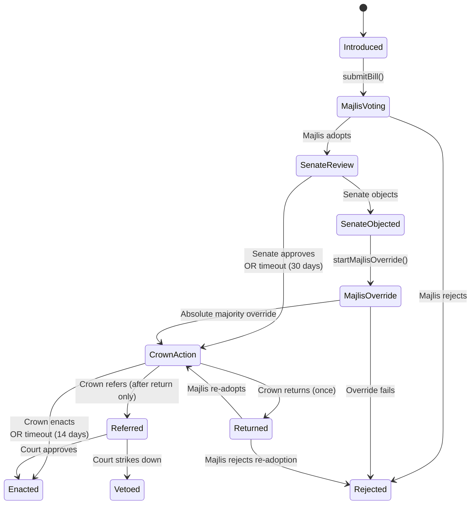

# پاسخ به آینده
## پادشاهی مشروطه بر بستر بلاکچین

### محمدرضا شاه پهلوی

---

## ۱. خطاب به مردم ایران

در شانزدهم ژانویه ۱۹۷۹، برای آخرین بار ایران را ترک کردم. آخرین تصویری که از کشورم با خود بردم، پریشانی هولناک بر چهره‌های اشکبار کسانی بود که برای بدرقه آمده بودند. بادی یخ‌زده فرودگاه مهرآباد را درنوردیده بود، جایی که ردیف‌هایی از هواپیماها بر اثر اعتصابات زمین‌گیر شده بودند. آن روز نمی‌دانستم که هرگز بازنخواهم گشت.

فرصت تأمل داشته‌ام. نه ماه تبعید به سال‌ها بدل شد، و سال‌ها به دهه‌ها، و اکنون از پس پرده مرگ با شما سخن می‌گویم. دیده‌ام که پس از رفتنم بر سر کشورم چه آمد. اعدام‌ها را دیده‌ام، جنگ با عراق را که یک میلیون از جوانان ما را کشت، انتخابات دزدیده‌شده ۲۰۰۹ را، سرکوب‌های ۲۰۱۹ و ۲۰۲۲ را. دلم به خون نشسته از آنچه بر سر مردمم آمده است.

چیزی نیز دیده‌ام که انتظارش را نداشتم. فناوری‌ای پدید آمده که می‌توانست از همان بحران‌هایی جلوگیری کند که سلطنت مرا و جمهوری پس از آن را نابود ساخت. بلاکچین نام دارد: دفتر کل عمومی که هر تراکنش را برای همیشه ثبت می‌کند و دستکاری را ناممکن می‌سازد. من راه‌آهن ساختم، کارخانه‌های فولاد، مجتمع‌های پتروشیمی و دانشگاه‌ها. باور داشتم که فناوری ابزار پیشرفت ملی است. بلاکچین ابزار بعدی است، و این بار آنچه می‌سازد خودِ حکمرانی است.

من به مردمم یک پادشاهی مشروطه تقدیم می‌کنم که در قالب ده «قرارداد هوشمند» (برنامه‌هایی که به‌صورت خودکار بر روی بلاکچین اجرا می‌شوند و قوانین را بدون واسطه‌های انسانی اعمال می‌کنند) پیاده‌سازی شده است. این ده قرارداد همه شاخه‌های حکومت را اداره می‌کنند. یک **قانون اساسی** پارامترهای حاکمیتی را ذخیره می‌کند. **تاج** اختیارات محدود دارد و بی‌عملی‌اش نمی‌تواند اراده پارلمان را سد کند. یک **پارلمان** دو مجلسی، متشکل از مجلس شورای ملی و سنا، قانون‌گذاری می‌کند. یک **قوه مجریه** اقتدار خود را از رأی اعتماد پارلمان می‌گیرد. یک **دیوان عالی** متشکل از دوازده قاضی با دوره‌های غیرقابل‌تمدید، نگهبان قانون اساسی است. یک **دفتر ثبت شهروندان** هویت رأی‌دهندگان را تأیید می‌کند. **انتخابات** با آرای مخفی انجام می‌شود که با اثبات رمزنگاری تأیید می‌گردد. **انجمن‌های ایالتی** به هریک از سی و یک استان ایران صدایی در انتخاب سناتورها می‌دهند. **همه‌پرسی‌ها** به مردم اجازه می‌دهند هر ماده‌ای را اصلاح کنند، از جمله الغای خود سلطنت. یک **بودجه** از تعطیلی دولت جلوگیری می‌کند و خزانه عمومی را حفاظت می‌نماید.

این یک اثبات مفهوم است، یک مدل عملی. هم عملیات عادی را اداره می‌کند و هم بحران را: اگر پارلمان دچار بن‌بست شود، بودجه سال گذشته به‌صورت خودکار ادامه می‌یابد؛ اگر قانون اساسی نیاز به تغییر فوری داشته باشد، یک اصلاحیه موقت قابل تصویب است که پس از یک سال منقضی می‌شود؛ اگر هیچ نخست‌وزیری نتواند رأی اعتماد پارلمان را کسب کند، انتخابات جدید برگزار می‌شود. چارچوب قانون اساسی از دیدگاه پسرم رضا برای یک پادشاهی مشروطه سکولار و دموکراتیک برای ایران الهام گرفته، آن‌گونه که در سال ۲۰۰۲ در کتاب *بادهای تغییر* ترسیم کرد. سخنانش را با غرور و دردی خوانده‌ام که تنها یک پدر می‌تواند احساس کند. او اصولی را که من برایشان جنگیدم گرفته و با خردی که من همیشه از آن بهره‌مند نبودم، پالوده است.

پسرم می‌نویسد که مأموریتش را در روزی تمام‌شده خواهد دانست که ایرانیان پای صندوق‌های رأی بروند و تصمیم خود را بگیرند. من این امید را شریکم. این نوشته نشان می‌دهد که چگونه آن انتخابات می‌تواند برگزار شود به گونه‌ای که هیچ‌کس، نه شاهی، نه نخست‌وزیری، نه رهبر اعظمی، نتواند نتیجه را جعل کند.

---

## ۲. قانون اساسی‌ای که خود را اداره می‌کند

پدرم وقتی جوان بودم به من گفت که امیدوار است امپراتوری‌ای برایم به جا بگذارد «که نهادهای محکمش آن را قادر سازد تا موجودیت داشته و عملاً خود بر خود حکومت کند.» او عمر نکرد تا تحقق این امید را ببیند. من هم آن را محقق نکردم. این نظام برای تحقق آن اکنون طراحی شده است.

من پیش‌نویس قانون اساسی‌ای با ۶۶ ماده تهیه کرده‌ام که نهادهای قابل کدگذاری بر روی بلاکچین را پوشش می‌دهد: تاج، پارلمان، قوه مجریه، دیوان عالی، جانشینی، انتخابات، مالیه عمومی و اصلاحیات. عناصر باقی‌مانده (نیروهای مسلح، منشور حقوق، حکومت محلی، جدایی دین از حکومت) خارج از حوزه این کار هستند.

### تاج

پادشاه در این نظام یک نگهبان قانون اساسی است. تمایز میان نگهبان و حاکم در کد اعمال می‌شود، نه صرفاً بر روی کاغذ اعلام می‌گردد. تاج نمی‌تواند حکومت کند، قانون‌گذاری کند، فرماندهی نیروهای مسلح را بر عهده بگیرد، یا مالیه عمومی را کنترل نماید. اختیاراتش نمی‌تواند از طریق عرف، رویه یا استنباط گسترش یابد. در موارد تردید، قانون اساسی تفسیر را به نفع نهادهای دموکراتیک الزامی می‌کند.

قانون اساسی هشت اختیار مشخص به تاج اعطا می‌کند:

1. **معرفی نخست‌وزیر**: معرفی نخست‌وزیر، منوط به تصویب مجلس (Art. II.4)
2. **معرفی قاضی**: معرفی نامزدهای دیوان عالی، منوط به تأیید سنا (Art. II.3)
3. **بازگرداندن لایحه**: بازگرداندن لایحه به مجلس برای بازنگری (Art. II.5)
4. **ارجاع به دیوان**: ارجاع لایحه به دیوان عالی برای بازنگری قانون اساسی (Art. II.5)
5. **اقدامات وزارتی**: امضای لایحه‌ها به عنوان قانون، اعلام انحلال در صورت لزوم، نشاندن برندگان انتخابات، و سایر اقدامات رویه‌ای که قانون اساسی مقرر می‌کند (Arts. II.2, II.7)
6. **انتصاب سناتور**: انتصاب حداکثر ۱۰ درصد سنا (Art. II.6)
7. **فهرست جانشینی**: حفظ ترتیب جانشینی (Art. VI.1)
8. **کناره‌گیری و نیابت سلطنت**: آغاز کناره‌گیری و فعال‌سازی نیابت سلطنت (Arts. VI.3, VI.4)

هریک از این اختیارات با مهلت‌ها و سازوکارهای جایگزین محدود شده است. اگر تاج عمل نکند، نظام بدون آن پیش می‌رود. تاج لوایح را به عنوان قانون امضا می‌کند ولی نمی‌تواند بی‌نهایت امتناع ورزد: پس از ۱۴ روز بی‌عملی، تصویب خودکار انجام می‌شود و وتوی جیبی (که در آن یک شخص واحد با بی‌عملی قانون‌گذاری را سد می‌کند) را خنثی می‌نماید.

از من انتقاد شده، گاهی به‌حق، که در دوران سلطنتم قدرت بیش از حد را در تاج متمرکز کردم. آن انتقاد را می‌پذیرم. این نظام پاسخ آن است. تاجی که اینجا توصیف می‌کنم اختیاراتی کمتر از تاجی دارد که من در دست داشتم، و همین‌طور باید باشد.

پسرم می‌نویسد: «بهترین راه خدمت پادشاه به کشور این است که ضامن فرایند قانون اساسی باشد و از خود قانون اساسی حمایت کند. او باید با فاصله گرفتن از اداره روزانه حکومت، از آسیب‌پذیری و انتقاد مصون بماند.»

من همیشه این اصل را رعایت نکردم. حکومت کردم وقتی باید سلطنت می‌کردم. پسرم این تمایز را روشن‌تر از من درک می‌کند، و فهم او در این نظام کدگذاری شده است. وقتی سخنانش را می‌خوانم، هم سرزنش روش‌هایم و هم ادامه هدفم را می‌بینم. یک پدر می‌تواند چنین سرزنشی را با افتخار بپذیرد.

### پارلمان

تا زمانی که قدرت را به دست گرفتم، حکومتم مانند یک الیگارشی عمل می‌کرد. هیچ سنایی تأسیس نشده بود. اعضای مجلس قادر بودند انتخابات را کنترل کنند و خود را در قدرت تثبیت نمایند. دیده‌ام که وقتی مجلس قانون‌گذاری نظارت و ساختار نداشته باشد چه اتفاقی می‌افتد.

پارلمان در این نظام یک قوه مقننه دو مجلسی است: مجلس شورای ملی (مجلس سفلی، منتخب با نمایندگی تناسبی در هر استان، دوره‌های چهارساله قابل‌تمدید) و سنا (مجلس علیا، دوره‌های شش‌ساله غیرقابل‌تمدید که به‌صورت یک‌سوم در هر نوبت تغییر می‌کنند، با حداکثر ۱۰ درصد منتصب تاج و بقیه منتخب از انجمن‌های ایالتی). یک مجلس واحد می‌تواند توسط اکثریت گذرا تسخیر شود. سنا تداوم فراهم می‌آورد و قانون‌گذاری شتاب‌زده را کند می‌کند، و حتی هنگام انحلال مجلس نیز پابرجا می‌ماند.

مجلس شورای ملی مجلس اولیه دموکراتیک است. اختیارات قانون اساسی آن (Art. III.3):

1. **اعطا و سلب اعتماد** از نخست‌وزیر و کابینه
2. **ارائه لایحه**: تنها اعضای مجلس می‌توانند لایحه معرفی کنند
3. **ارائه بودجه سالانه**
4. **رد اعتراض سنا** با اکثریت مطلق

سنا مجلس بازنگری و تداوم است. اختیارات قانون اساسی آن (Arts. III.4, III.5):

1. **بازنگری لوایح و بودجه‌های** مصوب مجلس
2. **تأیید یا رد انتصابات قضایی**
3. **مشارکت در فرایندهای اصلاح قانون اساسی**
4. **آغاز تشکیل دولت** در دوران تعلیق تاج

سنا نمی‌تواند لایحه یا بودجه ارائه دهد. مجلس منتخب مستقیم همواره حرف آخر قانون‌گذاری را می‌زند. نه سنا و نه تاج نمی‌توانند قانون‌گذاری‌ای را که مجلس بر آن اصرار دارد به‌صورت دائم مسدود کنند. کرسی‌های سنا به تناسب جمعیت استانی تخصیص می‌یابد، با حداقل یک کرسی برای هر استان. تاج می‌تواند حداکثر ۱۰ درصد سنا را منصوب کند. کرسی‌های باقی‌مانده از طریق انتخاب انجمن‌های ایالتی پر می‌شوند.

قانون اساسی مشروطه ۱۹۰۶ ما ایجاد سنا را الزامی کرده بود، اما بیش از چهل سال هیچ سنایی تأسیس نشد. مقرره‌ای که هیچ‌کس نتواند اجرا کند، مقرره‌ای است که وجود ندارد. در این نظام، دوره‌ها خود را اجرا می‌کنند: قرارداد پارلمان عضویت و انقضای دوره را پیش از اجازه هر اقدامی بررسی می‌کند. عضوی با دوره منقضی نمی‌تواند رأی دهد، صرف‌نظر از اینکه آیا کسی تابع پاکسازی را فراخوانده یا نه. هیچ مقامی نمی‌تواند دوره‌ای را فراتر از حد قانون اساسی تمدید کند.

### انجمن‌های ایالتی و سنای دومرحله‌ای

قانون اساسی مشروطه ۱۹۰۶ در مواد ۹۰ تا ۹۳ انجمن‌های ایالتی را ایجاد کرد، نهادهای انتخابی که به هر استان صدایی در حکمرانی ملی می‌دادند. آنها هرگز به‌طور کامل اجرا نشدند. این نظام آنها را به عنوان سازوکاری که از طریق آن سناتورها انتخاب می‌شوند، زنده می‌کند.

سنا مشروعیت خود را از منبعی متمایز از مجلس می‌گیرد. شهروندان مستقیماً برای سناتورها رأی نمی‌دهند. در عوض، شهروندان در هریک از سی و یک استان ایران یک انجمن ایالتی پانزده‌نفره را از طریق قرارداد انتخابات برمی‌گزینند. این اعضای انجمن سپس سناتورهای استان خود را انتخاب می‌کنند. ساختار دومرحله‌ای به سنا مأموریتی ریشه‌دار در نمایندگی استانی می‌دهد، در حالی که مجلس مستقیماً نماینده شهروندان است.

### قوه مجریه

پسرم می‌نویسد: «رئیس دولت به‌وضوح نخست‌وزیر منتخب است، نه پادشاه.»

نخست‌وزیر توسط تاج معرفی می‌شود ولی بدون رأی اعتماد مجلس نمی‌تواند حکومت کند. اقتدار اجرایی شامل هدایت اداره عمومی، اجرای قوانین، اداره روابط خارجی و مدیریت خدمات عمومی است (Art. IV.2). تمامی آن منوط به اعتماد مجلس و بازنگری قانون اساسی توسط دیوان عالی است.

در دوران سلطنتم، نخست‌وزیرانی منصوب کردم در شرایطی که از انتخاب آزاد تا فشار خارجی متغیر بود. درس قانون اساسی روشن است: دخالت تاج در انتخاب رئیس دولت تنها زمانی موجه است که نمایندگان مردم حرف آخر را بزنند. در این نظام، هیچ نخست‌وزیری بدون اعطای رأی اعتماد مجلس نمی‌تواند مسئولیت بپذیرد، و مجلس می‌تواند هر زمان آن اعتماد را سلب کند. تاج معرفی می‌کند؛ پارلمان تصمیم می‌گیرد.

### دیوان عالی

پسرم می‌نویسد که قانون اساسی آینده باید «حقوق هر فرد را بر اساس قانون کشور تضمین کند، صرف‌نظر از اینکه به اکثریت تعلق دارد یا اقلیت.»

دیوان صلاحیت انحصاری بر سه موضوع دارد (Art. V.1, V.4):

1. **بازنگری قانون اساسی**: تعیین اینکه آیا قوانین، مقررات و اقدامات اجرایی با قانون اساسی سازگار هستند
2. **اختلافات میان ارکان حکومت**: حل اختلافات میان تاج، پارلمان و قوه مجریه
3. **گواهی واقعیت**: گواهی واقعیت‌های قانون اساسی (خلأها، عدم صلاحیت، جانشینی، شرایط اضطراری)

دوازده قاضی با دوره‌های نه‌ساله غیرقابل‌تمدید خدمت می‌کنند. هیچ شاخه‌ای بدون همه‌پرسی نمی‌تواند دیوان را گسترش دهد یا اعضای آن را دستچین کند.

---

## ۳. ده قرارداد، یک قانون اساسی

من حکومتی با ده‌ها وزارتخانه، هزاران مسئول و بودجه‌ای که از ۴۰۰ میلیون دلار به ۵۷ میلیارد دلار رسید اداره کردم. دستگاه عظیم بود، و وقتی چیزی خراب می‌شد، هیچ‌کس نمی‌توانست دقیقاً به چرخ‌دنده شکسته اشاره کند. این نظام متفاوت ساخته شده: ده قرارداد، هرکدام مسئول یک وظیفه، همگی لنگرگاه‌شده به یک دفتر مرکزی.

### مرکز قانون اساسی

هر حکومتی نیاز به یک دفتر مرکزی دارد: چه کسی کدام سمت را دارد، قوانین چیست، نهادها کجا قرار دارند. در حکومت من این اطلاعات در قفسه‌های بایگانی و فرامین وزارتی نگهداری می‌شد. اینجا در قرارداد قانون اساسی زندگی می‌کنند. این قرارداد ذخیره می‌کند:

- **نقش‌ها**: چه کسی در حال حاضر هر سمت را دارد (پادشاه، نخست‌وزیر، نائب‌السلطنه، رئیس دیوان محاسبات)
- **پارامترها**: ثوابت حکمرانی قابل تنظیم (طول دوره‌ها، حد نصاب‌ها، مهلت‌ها، آستانه‌ها)
- **دفتر ثبت قراردادها**: آدرس‌های تمام قراردادهای حکمرانی (تاج، پارلمان، قوه مجریه و بقیه)

هر قرارداد حکمرانی برای پارامترها، بررسی مجوزها و جستجوی نقش‌ها به قرارداد قانون اساسی رجوع می‌کند. وقتی قرارداد همه‌پرسی اصلاحیه‌ای را اعمال می‌کند، تابع `constitution.amendParameter()` را فراخوانی می‌کند تا دفتر مرکزی را به‌روزرسانی نماید. تنها قرارداد همه‌پرسی این اختیار را دارد.

```solidity
function amendParameter(bytes32 key, uint256 value) external {
    // Only the Referendum contract can change parameters — no one else
    if (msg.sender != _contracts[CONTRACT_REFERENDUM]) revert NotAuthorized();
    uint256 old = _parameters[key];
    _parameters[key] = value;
    // Record the change publicly so any citizen can see what was amended
    emit ParameterAmended(key, old, value);
}
```

### نظام چگونه آغاز می‌شود

دفترچه مرحله اضطراری پروژه سعادت ایران (ژوئیه ۲۰۲۵) مسیر گذار را ارائه می‌دهد: یک حکومت انتقالی همه‌پرسی درباره شکل حکومت برگزار می‌کند، یک مجلس مؤسسان قانون اساسی را تدوین و تصویب می‌کند، و حکومت منتخب به دنبالش می‌آید. نظام زنجیره‌ای به عنوان بخشی از آن تصویب فعال می‌شود.

در زمان راه‌اندازی، قرارداد قانون اساسی نه قرارداد حکمرانی دیگر را ثبت می‌کند، پارامترهای اولیه را تعیین می‌نماید و صاحبان اولیه نقش‌ها را جای‌گذاری می‌کند. وقتی نخستین پادشاه تاج‌گذاری می‌شود، آدرس استقرارکننده در همان تراکنش به‌صورت دائم حذف می‌گردد. پس از آن هیچ‌کس دسترسی ممتاز ندارد. تنها راه تغییر نظام از آن نقطه به بعد، فرایند اصلاحیات است: پیشنهاد، رأی‌گیری، همه‌پرسی.

اگر پیکربندی اولیه اشکالی داشته باشد، فقط از طریق فرایند اصلاحیات قابل رفع است، فرایندی که خود وابسته به درست کار کردن پیکربندی است. فرایند اصلاحیات شکسته نمی‌تواند خودش را اصلاح کند. به همین دلیل است که تصویب مجلس مؤسسان آخرین لحظه‌ای است که در آن پیکربندی مؤسس می‌تواند پیش از تبدیل‌شدن به قانون تغییرناپذیر، اصلاح شود.

---

## ۴. چگونه یک لایحه به قانون تبدیل می‌شود

در تجربه من، تصویب یک قانون هرگز صرفاً مسئله رویه نبود. مسئله آن بود که چه کسی می‌تواند مانع‌تراشی کند، چه کسی تأخیر بیندازد، و چه کسی بی‌سروصدا لایحه‌ای را پیش از رسیدن به رأی‌گیری از بین ببرد. قوانین بر روی کاغذ وجود داشتند، ولی اجرایشان به حسن نیت افراد بستگی داشت. این نظام به حسن نیت وابسته نیست.

### فرایند قانون‌گذاری

در این نظام، سفر یک لایحه از معرفی تا تصویب به عنوان یک ماشین حالت (مجموعه مراحل تعریف‌شده با قوانینی برای حرکت بین آنها) یازده‌مرحله‌ای کدگذاری شده است. یک عضو مجلس لایحه‌ای معرفی می‌کند، مجلس رأی می‌دهد، سنا بازنگری می‌کند، تاج امضا می‌کند، و قانون می‌شود یا رد می‌گردد. نمودار کامل در انتهای این بخش آمده است. از نخستین رأی آغاز می‌کنم: مجلس.

**ماده III.6** مقرر می‌کند که مجلس لوایح را با اکثریت آرای مأخوذه تصویب کند، به شرطی که حد نصاب حاضر باشد. اینجا نحوه اعمال این قاعده توسط قرارداد پارلمان آمده:

```solidity
function finalizeMajlisVote(uint256 billId) external billExists(billId) {
    Bill storage bill = bills[billId];

    // Reject if the minimum voting period has not elapsed
    uint256 minPeriod = constitution.getParameter(constitution.PARAM_MIN_VOTING_PERIOD());
    if (block.timestamp < bill.votingStarted + minPeriod) revert VotingPeriodNotElapsed();

    // Effective count excludes incapacitated members (Art. III.9.3)
    uint256 effMajlis = effectiveMajlisMemberCount();
    if (effMajlis == 0) revert QuorumNotMet();
    // Read the quorum percentage from the Constitution
    uint256 quorumPct = constitution.getParameter(constitution.PARAM_MAJLIS_QUORUM());

    if (bill.status == BillStatus.MajlisVoting) {
        // Did enough members participate?
        uint256 totalVotes = bill.majlisYes + bill.majlisNo;
        if (totalVotes * 100 < quorumPct * effMajlis) revert QuorumNotMet();
        // Simple majority: more yes votes than no votes
        if (bill.majlisYes > bill.majlisNo) {
            _changeStatus(billId, BillStatus.SenateReview);
            // ...
        } else {
            _changeStatus(billId, BillStatus.Rejected);
        }
    }
}
```

اگر مجلس لایحه را تصویب کند، به بازنگری سنا می‌رود. سنا یک مهلت ۳۰ روزه بازنگری دارد. اگر سنا ظرف ۳۰ روز اقدام نکند، تابع `claimSenateTimeout()` در قرارداد پارلمان لایحه را خودکار پیش می‌برد و سنا را از مسدود کردن قانون‌گذاری از طریق بی‌عملی بازمی‌دارد. هیچ مجلسی نباید قدرت کشتن لایحه با بی‌عملی را داشته باشد. من این مهلت را به همین دلیل طراحی کردم.

**ماده III.6** مقرر می‌کند که اگر سنا اعتراض کند، لایحه به مجلس بازمی‌گردد، و مجلس می‌تواند با اکثریت مطلق کل اعضایش آن را مجدداً تصویب کند.

رد اعتراض نیاز به اکثریت مطلق دارد: اکثریت *همه* اعضای مجلس، نه صرفاً حاضران.

```solidity
} else if (bill.status == BillStatus.MajlisOverride) {
    // ... quorum check ...
    // Override requires absolute majority: more than half of all effective members
    if (bill.majlisYes > effMajlis / 2) {
        _changeStatus(billId, BillStatus.CrownAction);
    }
}
```

پس از تصویب، لایحه برای تنفیذ به تاج می‌رسد. نقش تاج در این مرحله نقش نگهبان قانون اساسی در غربال‌گری قوانین است. تاج می‌تواند لایحه را یک بار برای بازنگری به مجلس بازگرداند (Art. II.5). اگر مجلس پس از بازگشت تاج مجدداً تصویب کند، تاج با گزینشی روبرو است: تنفیذ لایحه، یا ارجاع آن به دیوان عالی برای بازنگری قانون اساسی (Art. II.5.3). تاج نمی‌تواند مطلقاً لایحه‌ای را وتو کند. فقط می‌تواند از پارلمان بخواهد بازنگری کند، و اگر پارلمان اصرار ورزد، تاج می‌تواند موضوع را به دیوان تشدید دهد. یک بار فرصت گفتن «بازنگری کنید»، سپس قوه قضاییه تصمیم می‌گیرد. این تمایز میان نگهبان و حاکم است: تاج غربال می‌کند، حکومت نمی‌کند.



*نمودار ۱: ماشین حالت فرایند قانون‌گذاری. لوایح از معرفی، از میان مداولات دو مجلسی، تا اقدام تاج جریان می‌یابند.*

---

## ۵. قوه مجریه

من در دوران سلطنتم نخست‌وزیران بسیاری منصوب کردم، گاهی آزادانه، گاهی تحت فشارهایی که قادر به مقاومت در برابرشان نبودم. در این نظام، تاج نامزدی معرفی می‌کند و مجلس رأی اعتماد می‌دهد. قضاوت سیاسی اینکه چه کسی معرفی شود نزد تاج می‌ماند. رویه توسط کد اعمال می‌شود.

نخست‌وزیر اداره عمومی را هدایت می‌کند، قوانین مصوب پارلمان را اجرا می‌نماید، روابط خارجی را اداره می‌کند و خدمات عمومی را مدیریت می‌نماید (Art. IV.2). تمامی اقتدار اجرایی منوط به اعتماد مجلس است، که می‌تواند هر زمان آن اعتماد را سلب کند.

### چرخه تشکیل دولت

وقتی سمت نخست‌وزیری خالی شود، یک چرخه تشکیل ساختاریافته آغاز می‌گردد. تاج نامزدی معرفی و مجلس رأی اعتماد می‌دهد. اگر مجلس رد کند، تاج نامزد دوم را امتحان می‌کند. اگر مجلس باز هم رد کند، بار بر دوش مجلس منتقل می‌شود: مجلس باید ظرف ۱۴ روز فهرست رتبه‌بندی‌شده‌ای از سه نامزد پیشنهاد دهد، و تاج از آن فهرست انتخاب کند. اگر تاج ظرف ۷ روز انتخاب نکند، نخستین نام فهرست به‌صورت خودکار منصوب می‌شود. اگر مجلس اصلاً نتواند فهرستی ارائه دهد، منحل می‌شود و انتخابات جدید برگزار می‌گردد.

انحلال پرسش را به رأی‌دهندگان بازمی‌گرداند. پس از انحلال، کابینه موجود با اختیارات محدود به عنوان دولت سرپرست ادامه می‌دهد، ناتوان از پیشنهاد بودجه جدید یا معرفی لایحه، و انتخابات جدید باید ظرف ۶۰ روز برگزار شود.

این ساختار همکاری را پاداش می‌دهد. تاج از معرفی کسی که پارلمان رد خواهد کرد سودی نمی‌برد. پارلمان از رد هر نامزد سودی نمی‌برد، زیرا انحلال به هر دو طرف آسیب می‌زند.

### معاون نخست‌وزیر

ظرف چهارده روز از تصدی سمت، نخست‌وزیر باید یک معاون تعیین کند. این اختیاری نیست: اگر مهلت بدون تعیین معاون بگذرد، قرارداد قوه مجریه لوایح و پیشنهادات بودجه جدید را مسدود می‌کند تا نخست‌وزیر عمل نماید. اگر نخست‌وزیر فوت کند یا از کار بیفتد (با گواهی دیوان عالی)، معاون به عنوان نخست‌وزیر موقت سمت را بر عهده می‌گیرد در حالی که چرخه تشکیل جدید آغاز می‌شود. نخست‌وزیر موقت حکومت را در جریان نگه می‌دارد ولی نمی‌تواند ابتکارات قانون‌گذاری جدید آغاز کند، زیرا قانون اساسی مقرر می‌کند که اقتدار اجرایی کامل بر رأی اعتماد پارلمان استوار باشد، و معاون هرگز به نام خود رأی اعتماد دریافت نکرده است. اگر هم نخست‌وزیر و هم معاون غایب باشند، تاج نخست‌وزیر موقتی از میان اعضای کابینه تعیین می‌کند.

---

## ۶. پاسداران قانون اساسی

من ده هزار خانه انصاف ساختم، دادگاه‌های روستایی که در آنها قاضیان منتخب محلی سه میلیون اختلاف را حل و فصل کردند. آن‌زمان درک کردم آنچه این نظام اکنون اجرا می‌کند: دستگاه نهادی‌ای که تضمین می‌کند فرایندی رخ خواهد داد، به‌صورت مداوم و قابل تأیید. دیوان عالی همین اصل را در سطح قانون اساسی خدمت می‌کند.

### مرجع واقعیت

در ۱۹۵۲، مصدق از مجلس اختیارات فوق‌العاده خواست، با این ادعا که بحران ملی حکومت با فرمان را موجه می‌سازد. مجلس آنها را اعطا کرد. ولی هیچ نهاد مستقلی گواهی نداده بود که آیا شرایط اضطراری واقعی است، و وقتی اختیارات اعطا شدند، مصدق از آنها برای انحلال خود دیوان عالی استفاده کرد. اینکه آیا شرایط اضطراری وجود دارد، آیا رهبری از کار افتاده، آیا کرسی‌ای خالی است: اینها پرسش‌های واقعیت هستند، و قانون اساسی مشروطه ۱۹۰۶ سازوکاری برای پاسخ به آنها نداشت.

یک بلاکچین می‌تواند رویه‌ها را اعمال کند، ولی نمی‌تواند واقعیت‌های دنیای فیزیکی را تأیید کند. دیوان عالی *مرجع واقعیت* این نظام است (منبع مورد اعتمادی که واقعیت‌های دنیای واقعی را وارد کد می‌کند). دیوان واقعیت‌ها را بر روی زنجیره گواهی می‌کند و سابقه‌ای دائمی ایجاد می‌نماید که قراردادهای دیگر می‌توانند بررسی کنند: اینکه نخست‌وزیر از کار افتاده، اینکه کرسی‌ای خالی است، اینکه شرایط اضطراری تدابیر قوی را موجه می‌سازد. جانشینی، کناره‌گیری، اصلاحیات اضطراری و عزل قاضی همه ابتدا نیاز به گواهی دیوان دارند.

قاضیان با اکثریت ساده درباره واقعیت‌ها رأی می‌دهند. حد نصاب لازم نیست، انتخابی عمدی برای شرایطی که دیوان کم‌نفر است، مانند گواهی عدم صلاحیت خود یک قاضی.

بازنگری قانون اساسی نیاز به حد نصاب دارد: کوچکتر از حد نصاب پیکربندی‌شده (۷) یا تعداد قاضیان فعال.

### انتصاب

دیوان عالی دوازده کرسی دارد. هر قاضی یک دوره نه‌ساله غیرقابل‌تمدید خدمت می‌کند، پس هیچ قاضی با چشم‌دوختن به انتصاب مجدد حکم نمی‌دهد. دوره‌ها زمان‌بندی‌شده‌اند: یک‌سوم دیوان هر سه سال تغییر می‌کند. فرایند انتصاب از همان منطق تشدیدی تشکیل دولت استفاده می‌کند:

1. تاج نامزدی معرفی می‌کند. سنا ۳۰ روز برای رأی‌گیری فرصت دارد.
2. اگر سنا ظرف ۳۰ روز اقدام نکند، نامزد به‌صورت پیش‌فرض تأیید می‌شود تا کرسی خالی نماند.
3. اگر سنا نامزد اول را رد کند، تاج نامزد دوم معرفی می‌نماید.
4. اگر سنا نامزد دوم را هم رد کند، بار بر دوش سنا منتقل می‌شود: سنا باید ظرف سی روز فهرست رتبه‌بندی‌شده سه نامزد ارائه دهد.
5. تاج از فهرست سنا انتخاب می‌کند. اگر تاج ظرف ۱۴ روز انتخاب نکند، نامزد اول فهرست خودکار نشانده می‌شود.
6. اگر سنا اصلاً فهرستی ارائه ندهد، نامزد اول تاج به‌صورت پیش‌فرض نشانده می‌شود.

عدم صلاحیت یا سوءرفتار باید به عنوان واقعیت توسط خود دیوان گواهی شود تا کرسی قاضی بتواند خالی اعلام گردد.

### زنده‌بودن دیوان

اگر کل دیوان ساکت شود، عدم صلاحیت هیچ نهادی قابل گواهی نیست، هیچ جانشینی‌ای قابل فعال‌سازی نیست، هیچ شرایط اضطراری قابل اعلام نیست. قوه قضاییه ساکت نظم قانون اساسی را فلج می‌کند.

تاج، نخست‌وزیر، یا ۱۰ درصد هریک از مجالس پارلمان می‌توانند زنده‌بودن دیوان را به چالش بکشند و به قاضیان هفت روز فرصت اثبات فعالیت بدهند. یک قاضی برای رعایت این شرط نیاز به پرونده معلق ندارد: یک ثبت حضور ساده تأیید می‌کند که در خدمت است. اگر چهارده روز بدون هیچ فعالیت دیوان بگذرد، هر شهروندی می‌تواند کرسی‌های قاضیان را بدون چالش قبلی خالی اعلام کند. کرسی‌های خالی‌شده از طریق فرایند عادی انتصاب پر می‌شوند.

---

## ۷. رأی مخفی

انتخابات دو شرط دارند که برآوردن همزمانشان دشوار است: هر رأی باید به‌صورت عمومی قابل تأیید باشد، و هیچ‌کس نباید بتواند تعیین کند هر فردی چگونه رأی داده است.

### چرا محرمانگی رأی اهمیت دارد

من درباره انتخابات تقلبی می‌دانم. همان‌طور که پیشتر اشاره کردم، مصدق غرفه‌های جداگانه برای آرای موافق و مخالف ترتیب داد، به‌طوری که هرکس علیه انحلال رأی می‌داد قابل شناسایی بود. ولی مشکل مقابلش به همان اندازه خطرناک است: اگر هیچ‌کس نتواند آرا را تأیید کند، نتایج قابل جعل است، همان‌طور که در ۲۰۰۹ رخ داد وقتی نتایج ۴۰ میلیون برگه رأی ظرف چند ساعت اعلام شد. هر دو نقص، آرای آشکار و آرای غیرقابل‌تأیید، دموکراسی را نابود می‌کنند. محرمانگی رأی برای جلوگیری از *خرید و اجبار رأی* وجود دارد. اگر رأی‌دهنده بتواند نحوه رأی‌دادنش را اثبات کند، کسی می‌تواند برای رأی به شکل معین به او پول بدهد، یا برای رأی متفاوت تنبیهش کند. به همین دلیل صندوق‌های رأی فیزیکی پرده دارند: پرده، رأی‌دهنده را از توانایی خودش در فروش اثبات رأیش حفاظت می‌کند.

بر روی یک بلاکچین عمومی، هر تراکنش قابل مشاهده است. یک نظام رأی‌گیری ساده‌لوحانه هر رأی را در معرض دید جهان قرار می‌دهد. پرده‌ای وجود ندارد.

### اثبات گذرنامه چگونه کار می‌کند

محرمانگی رأی در این نظام در سه مرحله کار می‌کند. دو مرحله اول بر روی دستگاه رأی‌دهنده رخ می‌دهد؛ تنها مرحله سوم بر روی بلاکچین اتفاق می‌افتد.

1. **تأیید گذرنامه**: شهروند گذرنامه بیومتریک خود را با NFC (ارتباط حوزه نزدیک، همان فناوری پرداخت‌های غیرتماسی) بر روی یک دستگاه موبایل اسکن می‌کند. گذرنامه حاوی امضای دیجیتال از کلید امضای گذرنامه دولت (کلید اصلی‌ای که دولت برای امضای تمام گذرنامه‌هایش استفاده می‌کند) است. نظام اثبات این امضا را تأیید می‌کند و ایرانی بودن و حداقل هجده سال سن شهروند را تصدیق می‌نماید، *بدون افشای هیچ اطلاعات شخصی*: نه نام، نه شماره گذرنامه، نه اطلاعات بیومتریک.

2. **جلوگیری از رأی مضاعف**: نظام اثبات برای هر شهروند در هر انتخابات یک کد ناشناس منحصربه‌فرد تولید می‌کند، مشتق از اطلاعات گذرنامه و شناسه انتخابات. اگر شهروندی سعی کند در همان انتخابات دو بار رأی دهد، نظام کد تکراری را شناسایی و رأی دوم را رد می‌کند.

3. **تأیید**: شهروند رأی خود را همراه با یک اثبات ریاضی ارسال می‌کند که همه موارد بالا را نشان می‌دهد. قرارداد انتخابات اثبات را تأیید می‌کند، بررسی می‌کند که کلید گذرنامه دولت با کلید مورد اعتماد ذخیره‌شده در دفتر ثبت شهروندان مطابقت دارد، و اطمینان حاصل می‌کند تاریخ در آینده تنظیم نشده. اگر همه بررسی‌ها موفق باشند، رأی ثبت می‌شود. هویت رأی‌دهنده از بلاکچین پنهان است: خود رأی به‌صورت عمومی ثبت می‌شود، ولی هیچ‌کس نمی‌تواند تعیین کند کدام شهروند آن را داده است.

### یک انتخابات چگونه برگزار می‌شود

دو نوع انتخابات از طریق قرارداد انتخابات برگزار می‌شود: انتخابات مجلس و انتخابات انجمن‌های ایالتی. هر دو در حوزه استانی هستند، به‌صورت جداگانه در هریک از سی و یک استان ایران برگزار می‌شوند. شهروندان مستقیماً در هر دو رأی می‌دهند. سنا به شکل متفاوتی پر می‌شود: اعضای انجمن ایالتی، پس از انتخاب شدن، سناتورهای استان خود را از طریق فرایند دومرحله‌ای توصیف‌شده در بخش ۲ انتخاب می‌کنند.

هر دو نوع انتخابات چهار مرحله را طی می‌کنند: **ثبت‌نام** (نامزدها خود را در استان خودشان معرفی می‌کنند)، **رأی‌گیری** (شهروندان آرای حاوی اثباتِ توصیف‌شده بالا را می‌دهند)، **شمارش** (هرکس می‌تواند پس از بسته‌شدن پنجره رأی‌گیری شمارش را فعال کند)، و **نشاندن** (تاج برندگان را به عنوان اقدام وزارتی جایگزین می‌کند). هر انتقالی به‌جز نشاندن بدون نیاز به مجوز است: وقتی پیش‌شرط‌ها برآورده شوند، هر شهروندی می‌تواند مرحله بعد را فعال کند. مانند تمام اقدامات وزارتی، تاج نمی‌تواند نشاندن را بی‌نهایت به تعویق بیندازد؛ همان منطق مهلت‌زمانی که از وتوی جیبی در قانون‌گذاری جلوگیری می‌کند اینجا نیز اعمال می‌شود.

---

## ۸. حق حاکمیت مردم

تاریخ مشروطه ایران تاریخ اصلاحیاتی است که خارج از قوانین خود قانون اساسی انجام شده‌اند.

قانون اساسی مشروطه ۱۹۰۶ ماده اصلاحیه‌ای نداشت. وقتی در ۱۹۲۵ تغییراتی لازم شد، تنها گزینه تشکیل مجلس مؤسسان برای بازنویسی قوانین از ابتدا بود، و آن مجلس رأی به انتقال تاج از سلسله قاجار به پدرم داد. قانون اساسی ۱۹۷۹ همان کاستی را تکرار کرد. وقتی بازنگری ۱۹۸۹ انجام شد، اصل ۵۹ خود قانون اساسی را دور زد، اصلی که رأی دوسوم مجلس را پیش از هر همه‌پرسی الزامی می‌کرد. در هر مورد، نبود یک رویه اصلاحیه روشن به این معنا بود که هرکس در آن لحظه قدرت را در دست داشت، شرایط را دیکته می‌کرد.

از طریق همه‌پرسی، مردم می‌توانند هر جنبه‌ای از نظم قانون اساسی را تغییر دهند، از جمله خود شکل حکومت.

دو مسیر وجود دارد. **مسیر عادی**: هر دو مجلس پارلمان اصلاحیه را هرکدام با اکثریت دوسوم تصویب می‌کنند، سپس یک همه‌پرسی ملی تصمیم می‌گیرد. اکثریت ساده آرای معتبر تصویب می‌کند. **مسیر اضطراری**: در شرایط فوری، هر دو مجلس می‌توانند اصلاحیه‌ای را هرکدام با اکثریت سه‌چهارم بدون همه‌پرسی تصویب کنند، ولی اصلاحیه *پس از یک سال منقضی می‌شود* مگر آنکه با همه‌پرسی تنفیذ شود. مسیر اضطراری همه‌پرسی را نادیده می‌گیرد، عدولی از حاکمیت مردمی که با فوریت موجه می‌شود. غروب یک‌ساله حرف آخر را به مردم می‌دهد.

اگر همان شرایط اضطراری که باعث اصلاحیه شد زیرساخت‌های انتخاباتی را نیز مختل کند، اصلاحیه ممکن است پیش از آنکه بتواند تنفیذ شود منقضی گردد. یک نظام عملیاتی نیاز به سازوکار تمدید گواهی‌شده توسط دیوان خواهد داشت.

تنها قرارداد همه‌پرسی می‌تواند قانون اساسی را اصلاح کند، و سه نوع تغییر ارائه می‌دهد:

- **اصلاحیات پارامتری** ثوابت حکمرانی را تغییر می‌دهند: طول دوره‌ها، حد نصاب‌ها، آستانه‌های رأی‌گیری.
- **اصلاحیات نقشی** نقش‌های قانون اساسی را اعطا یا سلب می‌کنند، از جمله خالی‌کردن تاج.
- **اصلاحیات قراردادی** قراردادهای حکمرانی را با پیاده‌سازی‌های جدید جایگزین می‌کنند.

پسرم متعهد شده که انتخاب مردم را محترم بشمارد، خواه پادشاهی مشروطه برگزینند خواه جمهوری.

اصلاحیات اضطراری نیاز به گواهی دیوان دارند مبنی بر واقعی بودن شرایط اضطراری، و از استفاده پارلمان از فوریت به عنوان بهانه برای تسخیر قانون اساسی جلوگیری می‌کنند. محدودیت‌های بیشتری نیز دارند: فقط می‌توانند پارامترها را تغییر دهند، و پارامترهای معینی در برابر تغییرات اضطراری قفل هستند (دوره و ترکیب قاضیان، حد نصاب دیوان، آستانه‌های اصلاحیه، زمان‌بندی انتخابات، طول دوره‌های پارلمانی، مجموع کرسی‌های مجلس، مهلت رأی اعتماد، مدت خود اصلاحیه اضطراری، و دوره‌های انجمن‌های ایالتی). فقط یک همه‌پرسی کامل می‌تواند آنها را لمس کند.

چرا از این پارامترها حفاظت شود؟ زیرا اینها همان پارامترهایی هستند که یک جناح بیشتر از همه می‌خواهد تغییرشان دهد تا خود را تثبیت کند. اصلاحیه اضطراری‌ای که انتخابات را به تعویق بیندازد یا دیوان را گسترش دهد، روش متعارف تسخیر قانون اساسی است. دیده‌ام که چنین کاری انجام شده. مصدق انتخابات را به حالت تعلیق درآورد. دیگران دیوان‌ها را دستچین کردند. بنابراین با مختص‌کردن این پارامترها به همه‌پرسی، نظام خطرناک‌ترین اصلاحیات را ملزم به گسترده‌ترین اجماع مردمی می‌سازد.

اگر مردم همه‌پرسی‌ای درباره همان پارامتر تصویب کنند در حالی که اصلاحیه اضطراری فعال است، همه‌پرسی بر آن غلبه می‌کند.

---

## ۹. خزانه عمومی

آخرین بودجه ما در ۱۹۷۸ پنجاه و هفت میلیارد دلار بود. می‌دانم وقتی بودجه ناکام بماند چه اتفاقی می‌افتد: کارمندان حقوق نمی‌گیرند، خدمات متوقف می‌شود، وظایف حیاتی فلج می‌گردد. در برخی کشورها این را «تعطیلی دولت» می‌نامند. قرارداد بودجه آن را ناممکن می‌سازد. اگر بودجه جدیدی تصویب نشود، بودجه سال قبل به‌صورت خودکار ادامه می‌یابد.

نخست‌وزیر بودجه‌ای در قرارداد بودجه پیشنهاد می‌دهد و مبلغ کل را مشخص می‌نماید. بودجه سپس همان مسیر قانون‌گذاری هر لایحه‌ای را طی می‌کند: مجلس ابتدا رأی می‌دهد، سنا بازنگری می‌کند، و تاج امضا می‌نماید. هر تخصیص در برابر مانده باقی‌مانده بررسی می‌شود: اگر دولت بخواهد بیش از مجاز بودجه خرج کند، تراکنش برگشت می‌خورد. اگر پارلمان بودجه را رد کند، نخست‌وزیر باید مجدداً پیشنهاد دهد.

اگر برای سال مالی جدید بودجه‌ای تصویب نشود، تخصیص سال گذشته به عنوان بودجه تداومی موقت با همان شرایط ادامه می‌یابد. تداوم موقتی است زیرا قابل جایگزینی است: وقتی دولت و پارلمان بر بودجه مناسب همان سال توافق کنند، تداوم جایگزین می‌شود و بودجه جدید جای آن را می‌گیرد. دولت سرپرست نمی‌تواند بودجه جدید پیشنهاد دهد؛ فقط بر اساس بودجه تداومی عمل می‌کند. بودجه ایران در دوران سلطنتم از ۴۰۰ میلیون دلار به ۵۷ میلیارد دلار رشد کرد. در یک اقتصاد در حال رشد، بودجه سال گذشته نه فقط قدیمی بلکه فعالانه ناکافی است: پروژه‌های جدید نمی‌توانند آغاز شوند، خدمات در حال گسترش در ظرفیت سال گذشته فلج می‌مانند، و تورم ارزش واقعی را می‌ساید. ولی جایگزین، یعنی اصلاً بدون بودجه، بدتر است. بودجه تداومی چراغ‌ها را روشن نگه می‌دارد در حالی که بن‌بست سیاسی حل می‌شود.

پارلمان همچنین می‌تواند بودجه تکمیلی برای افزایش سقف هزینه بودجه فعال در میانه سال تصویب کند، با همان فرایند قانون‌گذاری بودجه سالانه. نوسانات قیمت نفت، بازسازی پس از زلزله، بازنگری برنامه‌های توسعه: اینها واقعیت‌های اداره کشوری هستند که شرایطش منتظر تقویم مالی نمی‌مانند.

در ۱۹۶۱، نخست‌وزیر امینی سازمان بازرسی شاهنشاهی مرا با بهانه صرفه‌جویی منحل کرد، هرچند بودجه سالانه‌اش فقط ۳۰۰ هزار دلار بود. بازرس به بهای وجدانی ناچیز ساکت شد. در این نظام، مجلس رئیس سازمان حسابرسی ملی را برای یک دوره نه‌ساله غیرقابل‌تمدید منصوب می‌کند، و قرارداد قانون اساسی قاعده‌ای را اعمال می‌نماید که نه تاج و نه قوه مجریه نمی‌تواند آن انتصاب را لمس کند. تنها قرارداد بودجه، بنا بر دستور پارلمان، می‌تواند نقش را تعیین یا خالی کند. اگر رئیس حسابرسی فوت کند، از کار بیفتد، یا به سوءرفتار محکوم شود، دیوان عالی باید خلأ را گواهی کند تا نقش قابل پاکسازی و جایگزین منصوب شود. حسابرسی‌شونده نمی‌تواند حسابرس را اخراج کند. قرارداد بودجه گزارش‌های حسابرسی را بر روی زنجیره ثبت می‌کند. نمی‌تواند اقدام بر اساس یافته‌ها را اجبار کند، ولی می‌تواند اطمینان دهد که هرگز سرکوب نمی‌شوند.

---

## ۱۰. تاج در بحران

در سال‌های آخر سلطنتم، رازی حمل می‌کردم که تقریباً هیچ‌کس در حکومتم نمی‌دانست. به نوعی سرطان غدد لنفاوی مبتلا شده بودم، و پزشکانم بدون آشکار کردن حقیقت به وزیران و فرماندهانم مرا درمان می‌کردند. پسرم رضا نوجوان بود. قانون اساسی برای نیابت سلطنت هنگام صغر ولیعهد تدابیری داشت، و در ۱۹۶۷ آن را اصلاح کرده بودم تا همسرم فرح را به عنوان نائب‌السلطنه تعیین‌شده معرفی کنم. ولی هیچ مقرره‌ای برای عدم صلاحیت پادشاه حاکم وجود نداشت، و ایجاد آن پرسش درباره دلیلش را برمی‌انگیخت. وقتی دکتر صدیقی در ۱۹۷۸ تقاضای شورای نیابت سلطنت کرد، من امتناع ورزیدم زیرا، همان‌طور که در آن زمان نوشتم، «دلالت بر آن داشت که من صلاحیت انجام وظایف خود به عنوان پادشاه را ندارم.» بیماری‌ام را پنهان کردم زیرا هر سازوکاری که بر قضاوت سیاسی درباره شایستگی پادشاه متکی باشد، در بحران، سلاحی در دست هرکس می‌شود که آن قضاوت را کنترل کند.

قرارداد تاج این خلأ را از طریق سه فرایند پر می‌کند، همه تحت یک اصل طراحی واحد. پادشاه فهرست جانشینی را نگهداری می‌کند که ترتیب ارجحیت را مشخص می‌سازد. دیوان عالی واقعیت‌ها را گواهی و شخص معینی را که باید خدمت کند تأیید می‌نماید. کد بررسی می‌کند که تأیید دیوان ترتیب جانشینی را رعایت می‌نماید، به‌طوری که هیچ نقش واحدی نمی‌تواند جانشینی را به‌تنهایی تکمیل کند.

### کناره‌گیری

وقتی پادشاه تصمیم به کناره‌گیری بگیرد، دیوان عالی باید دو واقعیت را گواهی کند: اینکه کناره‌گیری واقعی است (Art. VI.4)، و اینکه وارث معینی به عنوان شایسته جانشینی تأیید شده.

دیوان فهرست جانشینی را به ترتیب بررسی می‌کند و عدم صلاحیت هرکس مقدم بر وارث منتخب را که ناشایسته است گواهی می‌نماید. سپس وارث را تأیید می‌کند. پادشاه تابع کناره‌گیری را فراخوانی می‌کند و وارث تأییدشده را نام می‌برد. کد هر دو گواهی و اینکه هر جانشین مقدم بر وارث بر روی زنجیره نامعتبر یا توسط دیوان گواهی‌شده به عنوان نامعتبر است، تأیید می‌نماید. پادشاه سابق کناره‌گیری می‌کند و وارث در یک تراکنش تاج‌گذاری می‌شود.

### خلأ و نیابت سلطنت

خلأ از همان منطق پیروی می‌کند: دیوان فوت یا ناپدیدشدن پادشاه را گواهی می‌کند، فهرست جانشینی را بررسی و وارث را تأیید می‌نماید. هرکس می‌تواند سپس ادعای جانشینی را فعال کند. اگر کل خط جانشینی پایان یابد، هرکس می‌تواند به جای آن تعلیق تاج را فعال نماید.

نیابت سلطنت نیز از همان تأیید پیروی می‌کند، با دو تفاوت. نائب‌السلطنه از فهرست جانشینی حذف نمی‌شود، زیرا اگر پادشاه در دوران نیابت فوت کند نائب‌السلطنه ممکن است به عنوان وارث مورد نیاز باشد. و نیابت سلطنت زمانی پایان می‌یابد که دیوان بهبود پادشاه را گواهی کند، در آن نقطه هرکس می‌تواند اختیارات کامل پادشاه را بازگرداند.

در دوران سلطنتم، هرگز پرسشی را که این سازوکار را مبرم می‌ساخت فاش نکردم. اگر در ۱۹۷۸ از پا درآمده بودم، پرسش شایستگی‌ام از پرسش اینکه چه کسی جایگزینم شود جدایی‌ناپذیر می‌بود، همان‌طور که دکتر صدیقی نشان داد وقتی شورای نیابت سلطنت را شرط تشکیل دولت قرار داد. در این نظام، دو پرسش جدا شده‌اند. دیوان عدم صلاحیت را گواهی می‌کند؛ فهرست جانشینی و کد تعیین می‌کنند چه کسی نائب‌السلطنه می‌شود. قاضیانی که قضاوت می‌کنند دوره‌های غیرقابل‌تمدید دارند و از نتیجه سودی نمی‌برند.

### تعلیق و همه‌پرسی

وقتی هیچ پادشاه یا نائب‌السلطنه واجد شرایطی وجود ندارد، تاج به حالت تعلیق درمی‌آید. حکمرانی ادامه می‌یابد: نخست‌وزیر اختیار تاج را برای بازگرداندن لوایح به پارلمان، ارجاع لوایح به دیوان عالی و معرفی نامزدهای قضایی اعمال می‌کند. سنا نقش تاج را در تشکیل دولت بر عهده می‌گیرد و نامزدهای نخست‌وزیری را برای رأی اعتماد مجلس پیشنهاد می‌دهد، با پیروی از همان چرخه دو معرفی‌ای که در شرایط عادی به تاج تعلق دارد. اگر هر دو معرفی ناکام بماند، مجلس فهرست رتبه‌بندی‌شده سه نامزد ارائه می‌دهد و سنا از آن انتخاب می‌کند، همان‌طور که تاج در شرایط عادی عمل می‌کرد. اگر هم نخست‌وزیر و هم معاون غایب باشند، سنا چرخه تشکیل را آغاز می‌کند، و لوایح در این مدت از طریق مهلت‌زمانی تاج به‌صورت خودکار تنفیذ می‌شوند. کد این جدایی را اعمال می‌کند: در دوران تعلیق، تنها رأی سنا می‌تواند توابع معرفی و انتصاب را فراخوانی کند، پس مجلس نمی‌تواند هم معرفی‌کننده و هم تأییدکننده باشد.

قرارداد تاج لحظه آغاز تعلیق را ثبت می‌کند. اگر یک سال بدون تاج‌گذاری پادشاه جدید بگذرد، هر شهروندی می‌تواند مهلت قانون اساسی را فعال کند: همه‌پرسی ملی درباره شکل حکومت (Art. VI.6). قوانین تعلیق تا زمانی که آن همه‌پرسی نتیجه‌ای تولید کند ادامه می‌یابند.

---

## ۱۱. محاسبه صادقانه

من در خاطراتم اشتباهاتم را پذیرفتم. بیش از حد سریع در باز کردن درهای دانشگاه‌ها عمل کردم. از دانشجویان داوطلب خواستم به عنوان ناظر قیمت خدمت کنند، که اشتباه بزرگی بود. این نظام نیز محدودیت‌هایی دارد.

مرز میان «رویه» و «قضاوت» خود یک انتخاب سیاسی است. چه کسی حق طرح دادخواست دارد؟ حد نصاب چقدر باید باشد؟ نظام رویه‌ها را خودکار می‌کند، ولی انتخاب اینکه کدام رویه‌ها خودکار شوند به ناگزیر سیاسی است.

### محدودیت‌ها

از من می‌پرسند: اگر حکمرانی زنجیره‌ای شفاف، خودکار و ضد دستکاری است، چرا فردا مستقرش نکنیم؟

#### تغییرناپذیری دو لبه دارد

کد اشکال دارد. در قراردادهای حکمرانی، اشکالات خطرناک آنهایی هستند که حالت‌های غیرقابل‌بازگشت تولید می‌کنند: اگر اشکالی فرایند اصلاحیات را بشکند، راهی برای رفع آن نیست، زیرا رفع باید از طریق فرایندی بگذرد که خود شکسته است. همان تغییرناپذیری‌ای که از دستکاری جلوگیری می‌کند، از اصلاح نیز جلوگیری می‌نماید. اگر یک جناح فرایند اصلاحیات را تسخیر کند، همه می‌توانند تسخیر را ببینند، ولی هیچ‌کس نمی‌تواند از طریق خود نظام آن را متوقف سازد. تنها چاره‌ها فورک کردن زنجیره (ایجاد نسخه جداگانه‌ای از کل نظام) یا رها کردن آن است.

#### مرجع واقعیت بر قضاوت انسانی متکی است

دیوان عالی به عنوان مرجع واقعیت این نظام خدمت می‌کند، ولی وقتی قاضیان گواهی می‌دهند که نخست‌وزیر از کار افتاده، قرارداد گواهی را ثبت می‌کند بدون آنکه واقعیت پزشکی را تأیید نماید. رأی‌گیری هماهنگ یک بلوک بر روی زنجیره قابل مشاهده است، ولی مشاهده‌پذیری جلوگیری نیست.

#### دفتر ثبت شهروندان جایگاه ممتازی دارد

دفتر ثبت شهروندان کلید امضای گذرنامه مورد اعتماد دولت را ذخیره می‌کند که هر اثبات رأی در برابرش تأیید می‌شود. اگر این کلید به خطر بیفتد، مهاجمی می‌تواند اثبات‌های معتبر جعل کند و نتایج انتخابات قابل اعتماد نخواهند بود. دفتر ثبت شهروندان باید با همان مراقبتی که قوه قضاییه اداره می‌شود، مدیریت گردد.

#### کلیدها می‌توانند گم یا دزدیده شوند

هر نقش حکمرانی در این نظام توسط یک کلید رمزنگاری نگهداری می‌شود: تاج، هر عضو پارلمان، هر قاضی، نخست‌وزیر. اگر کلیدی گم شود، صاحب نقش از دسترسی محروم می‌شود. اگر کلیدی دزدیده شود، جاعلی می‌تواند به نام او عمل کند. در عمل، کلیدهای حکمرانی باید با کیف‌پول‌های چندامضایی (که نیاز به چند کلید جداگانه برای مجوز هر اقدام دارند) و سازوکارهای بازیابی تعبیه‌شده ایمن شوند.

#### زیرساخت بلاکچین

نظام حکمرانی حالت‌های شکست بلاکچین خود را به ارث می‌برد. اگر زنجیره متوقف شود، حکمرانی متوقف می‌شود. اگر اعتبارسنج‌ها تراکنش‌ها را سانسور کنند، فرایندهای قانون اساسی مسدود می‌شوند.

#### آنچه هیچ قانون اساسی‌ای نمی‌تواند جلوگیری کند

نظام تدبیری برای بازیگرانی که آن را به‌کلی رد می‌کنند ندارد: یک نیروی نظامی، یک جنبش انقلابی، یا یک قدرت خارجی. حکمرانی زنجیره‌ای نمی‌تواند در برابر زور دفاع کند. قرارداد اجتماعی فقط کسانی را ملزم می‌سازد که آن را بپذیرند. این درس را بهتر از بیشتر کسان می‌دانم.

#### حلقه‌های انحلال

اگر هیچ اکثریت پارلمانی شکل نگیرد، چرخه تشکیل به انحلال و انتخابات جدید ختم می‌شود. اگر رأی‌دهندگان مجلسی به همان اندازه بن‌بست‌زده بازگردانند، چرخه تکرار می‌شود. در هر تکرار، کشور با بودجه تداومی کهنه تحت حکمرانی سرپرستی اداره می‌شود. نظام این را به عنوان بهای مشروعیت دموکراتیک می‌پذیرد: دولتی که فاقد حمایت مردمی باشد نخواهد ساخت.

#### دسترسی‌پذیری

نظامی که فقط برنامه‌نویسان بتوانند تأییدش کنند، به شفافیت دموکراتیک دست نیافته است. اگر حق تعیین سرنوشت معنایی داشته باشد، شهروندان عادی باید بتوانند از ابزارهای حکمرانی خود استفاده کنند. این نیاز به رابط‌ها، آموزش و سرمایه‌گذاری‌ای دارد که فراتر از آنچه این اثبات مفهوم فراهم می‌آورد است.

---

## ۱۲. آخرین سخن من

من یک بار پیشتر پاسخم به تاریخ را گفته‌ام، از بستر مرگم در قاهره در ۱۹۸۰. بیش از حد بیمار بودم تا تردید کنم، و بیش از حد مغرور تا تظاهر نمایم. اکنون باز با همان صراحت سخن می‌گویم.

من رؤیای تمدن بزرگ داشتم. پایه‌هایش را با فولاد، بتن و درآمد نفت ساختم. به زنان حق رأی دادم. زمین را به دو میلیون و ربع خانوار دهقان توزیع کردم. هجده دانشگاه و ده هزار خانه انصاف تأسیس کردم که در آنها قاضیان روستایی سه میلیون اختلاف را حل و فصل کردند. سپاه دانش را بنا نهادم که کودکان روستایی را با یک‌سوم هزینه آموزش سنتی تعلیم می‌داد، و سپاه بهداشت را که پوشش پزشکی روستایی را از یک میلیون به نزدیک هشت میلیون نفر گسترش داد. اشتباه کردم. قدرت بیش از حد متمرکز کردم. در برخی حوزه‌ها بیش از حد سریع و در برخی دیگر بیش از حد کند حرکت کردم. به متحدانی اعتماد کردم که شایسته اعتمادم نبودند.

کشورم بر آستانه عظمت ایستاده بود، و نیروهای ائتلاف نامقدس سرخ و سیاه آن را ویران کردند. چهل و هفت سال از رفتنم گذشته. جمهوری اسلامی موسوم آنچه ساختم را بر باد داده و مردمی را که دوستشان داشتم سرکوب کرده است. دلم از آنچه می‌بینم خون است.

من این نظام را به عنوان دستگاهی تقدیم می‌کنم که باید ساخته بودم. سدی که نساختم. نهادی که پدرم می‌خواست برایم به جا بگذارد: نهادی قادر به حکمرانی خود بر خود. فناوری نو است. آرمان کهن. کوروش نخستین امپراتوری را بر بنیاد مدارا و عدالت بنا نهاد، و سزاوار لقب کبیر است به همین دلیل. بیست و پنج قرن بعد، وارثان او می‌توانند آن اصول را در کدی رمزگذاری کنند که هیچ ستمگری نتواند دستکاریش کند و هر شهروندی بتواند تأییدش نماید.

پسرم زندگی‌اش را وقف آرمانی کرده که با تمام وجود درکش می‌کنم: آزادی و حق تعیین سرنوشت مردم ایران. او گفته که مأموریتش را در روزی تمام‌شده خواهد دانست که ایرانیان پای صندوق‌های رأی بروند و تصمیم خود را بگیرند. من دستگاهی ساخته‌ام که می‌تواند آن انتخابات را صادق، آن آرا را مخفی، و آن نتایج را دائمی سازد.

بقیه به مردمم تعلق دارد.

---

## پیوست: خلاصه قراردادها

| # | قرارداد | هدف |
|---|----------|---------|
| 1 | Constitution.sol | ثبت مرکزی پارامترها، نقش‌ها و قراردادها |
| 2 | CitizenRegistry.sol | دفتر گذرنامه: ثبت شهروندان، اعتماد کلید گذرنامه، ردیابی استانی |
| 3 | Crown.sol | تاج‌گذاری، جانشینی، اقدامات وزارتی |
| 4 | Parliament.sol | قوه مقننه دو مجلسی، چرخه عمر لوایح، مدیریت دوره‌ها |
| 5 | Executive.sol | تشکیل نخست‌وزیری، رأی اعتماد، دولت سرپرست |
| 6 | SupremeCourt.sol | بازنگری قضایی، اختلافات، گواهی واقعیت، دادخواست‌ها |
| 7 | Election.sol | چرخه‌های انتخاباتی، رأی‌گیری، نشاندن اعضا |
| 8 | ProvincialCouncil.sol | انجمن‌های ایالتی، خط لوله دومرحله‌ای انتخاب سنا |
| 9 | Referendum.sol | اصلاحیات قانون اساسی، اصلاحیات اضطراری و ساختاری |
| 10 | Budget.sol | چرخه مالی، تخصیص، بودجه‌های تداومی، حسابرسی |

هر قرارداد آزمون‌هایی دارد که هر قاعده‌ای را که اعمال می‌کند پوشش می‌دهند، از بررسی‌های ساده (آیا فقط تاج می‌تواند نخست‌وزیر معرفی کند؟) تا جریان‌های کاری کامل (وقتی دو نامزد تاج ناکام بمانند و پارلمان باید منحل شود چه اتفاقی می‌افتد؟). یک مجموعه یکپارچگی، حکمرانی را در سراسر نظام قراردادی کامل آزمایش می‌کند.

هرکس می‌تواند آرا را بخواند، مهلت‌ها را بررسی کند و انتصابات را تأیید نماید.

---

*بر بستر اتریوم ساخته شده. معماری اثبات گذرنامه با الهام از Freedom Tool رریمو. با الهام از «بادهای تغییر» رضا پهلوی و بهره‌گیری از «پاسخ به تاریخ» محمدرضا شاه پهلوی.*

پاینده ایران، جاوید شاه.
