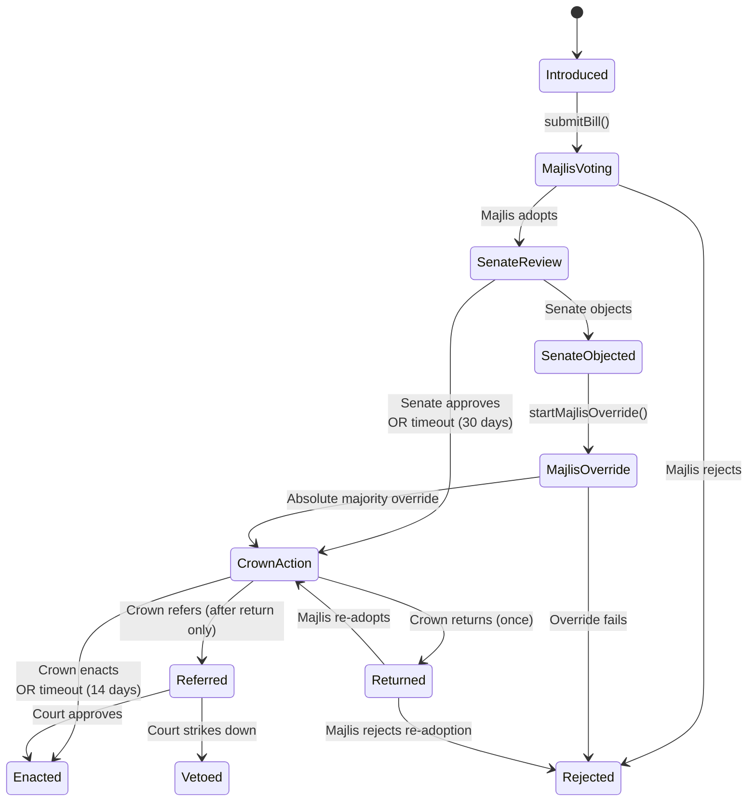

# Answer to the Future
## A Constitutional Monarchy on the Blockchain

### Mohammad Reza Shah Pahlavi

---

## 1. To the People of Iran

ON JANUARY 16, 1979, I left Iran for the last time. The last image I carried of my country was the frightful distress on the tearful faces of those who came to bid us farewell. An icy wind swept the airport at Mehrabad, where rows of planes stood immobilized by the strikes. I did not know then that I would never return.

I have had time to reflect. Nine months of exile became years, and the years became decades, and now I address you from beyond the veil of death itself. I have seen what became of my country after I left. I have seen the executions, the war with Iraq that killed a million of our young, the stolen elections of 2009, the suppressions of 2019 and 2022. My heart has bled at what has happened to my people.

I have also seen something I did not expect. A technology has emerged that could have prevented the very crises that destroyed my reign and the republic that followed. It is called the blockchain, a public ledger that records every transaction permanently and makes alteration impossible. I built railways, steel mills, petrochemical plants, and universities. I believed that technology was the instrument of national progress. The blockchain is the next instrument, and this time the thing it builds is governance itself.

I present to my people a constitutional monarchy implemented as ten "smart contracts" (programs that execute automatically on a blockchain, enforcing rules without human intermediaries). These ten contracts govern every branch of the state. A **Constitution** stores the governing parameters. The **Crown** has limited powers, and its inaction cannot obstruct the will of Parliament. A **Parliament** of two chambers, the Majlis and the Senate, legislates. An **Executive** derives its authority from parliamentary confidence. A **Supreme Court** of twelve justices with non-renewable terms guards the constitution. A **Citizen Registry** verifies the identity of voters. **Elections** are conducted with secret ballots verified by cryptographic proof. **Provincial Councils** give each of Iran's thirty-one provinces a voice in selecting senators. **Referendums** allow the people to amend any provision, including the abolition of the monarchy itself. A **Budget** prevents government shutdowns and protects the public purse.

This is a proof-of-concept, a working model. It handles normal operations and crisis alike: if Parliament stalls, last year's budget continues automatically; if the constitution must be changed urgently, a temporary amendment can be adopted that expires after one year; if no Prime Minister can win parliamentary confidence, new elections are called. The constitutional framework draws from my son Reza's vision of a secular, democratic constitutional monarchy for Iran, as he set it out in *Winds of Change* in 2002. I have read his words with the pride and pain that only a father can feel. He has taken the principles I fought for and refined them with a wisdom I did not always possess.

My son writes that he would consider his mission accomplished the day Iranians go to the polls to make their decision. I share that hope. This paper shows how those polls can be conducted so that no one, not a Shah, not a prime minister, not a supreme leader, can falsify the result.

---

## 2. A Constitution That Governs Itself

MY FATHER TOLD ME, when I was young, that he hoped to leave me an empire "whose solid institutions made it capable of existing and practically governing itself by itself." He did not live to see that hope fulfilled. I did not fulfill it either. This system is designed to fulfill it now.

I have drafted a constitution of 66 articles covering the institutions that can be encoded on the blockchain: the Crown, Parliament, the Executive, the Supreme Court, Succession, Elections, Public Finance, and Amendments. The remaining elements (armed forces, bill of rights, local government, separation of religion and state) are out of scope.

### The Crown

The monarch in this system is a constitutional guardian. The distinction between a guardian and a governor is enforced in code, not merely proclaimed on paper. The Crown cannot govern, legislate, command the armed forces, or control public finances. Its powers cannot be expanded by custom, practice, or implication. In cases of doubt, the Constitution requires interpretation to favor democratic institutions.

The Constitution confers eight specific powers on the Crown:

1. **Prime Minister nomination**: nominating the Prime Minister, subject to Majlis approval (Art. II.4)
2. **Justice nomination**: nominating Supreme Court candidates, subject to Senate confirmation (Art. II.3)
3. **Legislative return**: returning a bill to the Majlis for reconsideration (Art. II.5)
4. **Constitutional referral**: referring a bill to the Supreme Court for review (Art. II.5)
5. **Ministerial acts**: signing bills into law, declaring dissolution when required, seating election winners, and other procedural acts required by the constitution (Arts. II.2, II.7)
6. **Senator appointment**: appointing up to 10% of the Senate (Art. II.6)
7. **Succession list**: maintaining the order of succession (Art. VI.1)
8. **Abdication and regency**: initiating abdication and activating regency (Arts. VI.3, VI.4)

Every one of these powers is bounded by deadlines and fallbacks. If the Crown fails to act, the system proceeds without it. The Crown signs bills into law but cannot refuse indefinitely: after 14 days of inaction, automatic enactment proceeds, defeating the *pocket veto* (where a single actor blocks legislation by doing nothing).

I have been criticized, sometimes justly, for concentrating too much power in the Crown during my reign. I accept that criticism. This system answers it. The Crown I describe here has less power than the Crown I held, and that is as it should be.

My son writes: "The best way for a monarch to serve the country is to be the guarantor of the constitutional process and to protect the constitution itself. He or she must be immune to vulnerability and criticism by remaining detached from the day-to-day running of government."

I did not always follow this principle. I governed when I should have reigned. My son understands the distinction more clearly than I did, and his understanding is encoded in this system. When I read his words, I recognize both the rebuke to my methods and the continuation of my purpose. A father can accept such a rebuke with pride.

### Parliament

By the time I assumed power, my government was operating like an oligarchy. No Senate had been established. The members of the Majlis were able to control the elections and perpetuate themselves in power. I have seen what happens when a legislature has no checks and no structure.

Parliament in this system is a bicameral legislature: the Majlis (lower house, elected by proportional representation within each province, renewable four-year terms) and the Senate (upper house, six-year non-renewable terms staggered by thirds, with up to 10% appointed by the Crown and the remainder elected from Provincial Councils). A single chamber can be captured by a transient majority. The Senate provides continuity and slows hasty legislation, and it persists even when the Majlis is dissolved.

The Majlis is the primary democratic chamber. Its constitutional powers (Art. III.3):

1. **Grant and withdraw confidence** in the Prime Minister and Cabinet
2. **Originate legislation**: only Majlis members can introduce bills
3. **Originate the annual budget**
4. **Override Senate objections** with an absolute majority

The Senate is a chamber of review and continuity. Its constitutional powers (Arts. III.4, III.5):

1. **Review legislation and budgets** adopted by the Majlis
2. **Confirm or reject judicial appointments**
3. **Participate in constitutional amendment procedures**
4. **Initiate executive formation** during Crown suspension

The Senate cannot originate legislation or budgets. The directly elected chamber always has the final legislative word. Neither the Senate nor the Crown can permanently block legislation the Majlis insists on. Senate seats are allocated proportionally to provincial population, with a minimum of one seat per province. The Crown may appoint up to 10% of the Senate. The remaining seats are filled through provincial council selections.

Our 1906 constitution mandated a Senate, yet no Senate was established for over forty years. A provision no one can enforce is a provision that does not exist. In this system, terms enforce themselves: the Parliament contract checks membership and term expiry before allowing any action. An expired member cannot vote, regardless of whether anyone has called the cleanup function. No authority can extend a term beyond its constitutional limit.

### Provincial Councils and the Two-Tier Senate

The 1906 Constitution created provincial anjumans (councils) in Articles 90 through 93, elected bodies that gave each province a voice in national governance. They were never fully implemented. This system brings them to life as the mechanism through which senators are selected.

The Senate draws its legitimacy from a source distinct from the Majlis. Citizens do not vote for senators directly. Instead, citizens in each of Iran's thirty-one provinces elect a provincial council of fifteen members through the Election contract. These council members then select their province's senators. The two-tier structure gives the Senate a mandate rooted in provincial representation, while the Majlis represents citizens directly.

### The Executive

My son writes: "The head of government is clearly the elected prime minister, not the monarch."

The Prime Minister is nominated by the Crown but cannot govern without a confidence vote from the Majlis. Executive authority comprises the direction of public administration, implementation of laws, conduct of foreign relations, and management of public services (Art. IV.2). All of it is subject to the confidence of the Majlis and to constitutional review by the Supreme Court.

During my reign, I appointed prime ministers under circumstances that ranged from free choice to foreign pressure. The constitutional lesson is clear: the Crown's involvement in selecting the head of government is justified only when the people's representatives hold the final word. In this system, no Prime Minister can take office without the Majlis granting confidence, and the Majlis can withdraw that confidence at any time. The Crown nominates; Parliament decides.

### The Supreme Court

My son writes that the future constitution must "guarantee each person's rights under the law of the land, regardless of whether one belongs to the majority or minority."

The Court has exclusive jurisdiction over three matters (Art. V.1, V.4):

1. **Constitutional review**: determining whether laws, regulations, and executive acts are consistent with the Constitution
2. **Disputes between organs**: resolving conflicts between the Crown, Parliament, and the Executive
3. **Fact certification**: certifying constitutional facts (vacancies, incapacity, succession, emergencies)

Twelve justices serve non-renewable nine-year terms. No branch can expand or pack the Court without a referendum.

---

## 3. Ten Contracts, One Constitution

I MANAGED A GOVERNMENT of dozens of ministries, thousands of officials, and a budget that grew from $400 million to $57 billion. The machinery was vast, and when something failed, no one could point to the exact gear that broke. This system is built differently: ten contracts, each responsible for one function, all anchored to a central registry.

### The Constitution Hub

Every government needs a central registry: who holds which office, what the rules are, where the institutions sit. In my government, this information lived in filing cabinets and ministerial decrees. Here it lives in the Constitution contract. It stores:

- **Roles**: who currently holds each office (Monarch, Prime Minister, Regent, Audit Head)
- **Parameters**: configurable governance constants (term lengths, quorum sizes, deadlines, thresholds)
- **Contract Registry**: addresses of all governance contracts (Crown, Parliament, Executive, and the rest)

Every governance contract references the Constitution contract for parameters, authorization checks, and role lookups. When the Referendum contract enacts an amendment, it calls `constitution.amendParameter()` to update the central registry. Only the Referendum contract has this power.

```solidity
function amendParameter(bytes32 key, uint256 value) external {
    // Only the Referendum contract can change parameters — no one else
    if (msg.sender != _contracts[CONTRACT_REFERENDUM]) revert NotAuthorized();
    uint256 old = _parameters[key];
    _parameters[key] = value;
    // Record the change publicly so any citizen can see what was amended
    emit ParameterAmended(key, old, value);
}
```

### How the System Starts

The Iran Prosperity Project's Emergency Phase Booklet (July 2025) provides the transition path: a transitional government holds a referendum on the form of government, a Constituent Assembly drafts and ratifies the constitution, and elected government follows. The on-chain system goes live as part of that ratification.

During initialization, the Constitution contract registers the other nine governance contracts, sets initial parameters, and seats initial role holders. When the first monarch is crowned, the deployer address is permanently erased in the same transaction. No one holds privileged access afterward. The only way to change the system from that point forward is through the amendment process: propose, vote, referendum.

If the initial configuration has a bug, it can only be fixed through the amendment process, which itself depends on the configuration working correctly. A broken amendment process cannot amend itself. This is why the Constituent Assembly's ratification is the last moment when the founding configuration can be corrected before it becomes immutable.

---

## 4. How a Bill Becomes Law

IN MY EXPERIENCE, the passage of a law was never a matter of procedure alone. It was a matter of who could obstruct, who could delay, and who could quietly kill a bill before it ever reached a vote. The rules existed on paper, but whether they were followed depended on the good faith of the people involved. This system does not depend on good faith.

### The Legislative Process

In this system, a bill's journey from introduction to enactment is encoded as an eleven-stage state machine. A Majlis member introduces a bill, the Majlis votes on it, the Senate reviews it, the Crown signs it, and it becomes law or is rejected. The full diagram appears at the end of this section. I will start with the first vote: the Majlis.

**Article III.6** requires that the Majlis adopt bills by a majority of votes cast, provided a quorum is present. Here is how the Parliament contract enforces that rule:

```solidity
function finalizeMajlisVote(uint256 billId) external billExists(billId) {
    Bill storage bill = bills[billId];

    // Reject if the minimum voting period has not elapsed
    uint256 minPeriod = constitution.getParameter(constitution.PARAM_MIN_VOTING_PERIOD());
    if (block.timestamp < bill.votingStarted + minPeriod) revert VotingPeriodNotElapsed();

    // Effective count excludes incapacitated members (Art. III.9.3)
    uint256 effMajlis = effectiveMajlisMemberCount();
    if (effMajlis == 0) revert QuorumNotMet();
    // Read the quorum percentage from the Constitution
    uint256 quorumPct = constitution.getParameter(constitution.PARAM_MAJLIS_QUORUM());

    if (bill.status == BillStatus.MajlisVoting) {
        // Did enough members participate?
        uint256 totalVotes = bill.majlisYes + bill.majlisNo;
        if (totalVotes * 100 < quorumPct * effMajlis) revert QuorumNotMet();
        // Simple majority: more yes votes than no votes
        if (bill.majlisYes > bill.majlisNo) {
            _changeStatus(billId, BillStatus.SenateReview);
            // ...
        } else {
            _changeStatus(billId, BillStatus.Rejected);
        }
    }
}
```

If the Majlis adopts the bill, it advances to Senate review. The Senate has a 30-day review period. If the Senate does not act within 30 days, the Parliament contract's `claimSenateTimeout()` function advances the bill automatically, stopping the Senate from blocking legislation through inaction. No chamber should have the power to kill a bill by doing nothing. I designed this timeout for that reason.

**Article III.6** provides that if the Senate objects, the bill returns to the Majlis, which may re-adopt it with an absolute majority of its total members.

The override requires an absolute majority: a majority of *all* Majlis members, not merely those present.

```solidity
} else if (bill.status == BillStatus.MajlisOverride) {
    // ... quorum check ...
    // Override requires absolute majority: more than half of all effective members
    if (bill.majlisYes > effMajlis / 2) {
        _changeStatus(billId, BillStatus.CrownAction);
    }
}
```

After adoption, the bill reaches the Crown for enactment. The Crown's role at this stage is that of a constitutional guardian screening legislation. The Crown can return the bill to the Majlis once for reconsideration (Art. II.5). If the Majlis re-adopts after a Crown return, the Crown faces a choice: enact the bill, or refer it to the Supreme Court for constitutional review (Art. II.5.3). The Crown cannot veto legislation outright. It can only ask Parliament to reconsider, and if Parliament insists, the Crown can escalate to the Court. One chance to say "reconsider," then the judiciary decides. This is the distinction between a guardian and a governor: the Crown screens, it does not rule.



*Diagram 1: Legislative process state machine. Bills flow from introduction through bicameral deliberation to Crown action.*

---

## 5. The Executive

I NAMED MANY prime ministers during my reign, sometimes freely, sometimes under pressures I could not resist. In this system, the Crown nominates a candidate and the Majlis votes confidence. The political judgment of whom to nominate stays with the Crown. The procedure is enforced by code.

The Prime Minister directs public administration, implements laws passed by Parliament, conducts foreign relations, and manages public services (Art. IV.2). All executive authority is subject to the confidence of the Majlis, which can withdraw that confidence at any time.

### The Formation Cycle

When the Prime Minister's office becomes vacant, a structured formation cycle begins. The Crown nominates a candidate and the Majlis votes confidence. If the Majlis rejects, the Crown tries a second nominee. If the Majlis rejects again, the burden shifts: the Majlis must propose its own ranked list of three candidates within 14 days, and the Crown picks from that list. If the Crown does not pick within 7 days, the first name on the list is automatically appointed. If the Majlis cannot produce a list at all, it is dissolved and new elections are called.

Dissolution sends the question back to the voters. After dissolution, the existing Cabinet continues with restricted powers as a caretaker government, unable to propose new budgets or introduce legislation, and new elections must be called within 60 days.

The structure rewards cooperation. The Crown gains nothing by nominating someone Parliament will reject. Parliament gains nothing by rejecting every nominee, for dissolution hurts both sides.

### The Deputy

Within fourteen days of taking office, the Prime Minister must designate a Deputy. This is not optional: if the deadline passes without a designation, the Executive contract blocks new legislation and budget proposals until the Prime Minister complies. If the Prime Minister dies or is incapacitated (certified by the Supreme Court), the Deputy assumes office as Acting Prime Minister while a new formation cycle begins. The Acting Prime Minister keeps the government running but cannot start new legislative initiatives, because the constitution requires that full executive authority rest on parliamentary confidence, and the Deputy never received a confidence vote in their own right. If both the Prime Minister and Deputy are gone, the Crown designates an Acting Prime Minister from among the sitting Cabinet.

---

## 6. Guardians of the Constitution

I BUILT TEN THOUSAND Houses of Equity, village courts where locally elected judges settled three million disputes. I understood then what this system implements now: institutional machinery that guarantees a process will happen, consistently and verifiably. The Supreme Court serves that principle at the constitutional level.

### The Oracle

In 1952, Mossadegh demanded extraordinary powers from the Majlis, claiming the national crisis justified governing by decree. The Majlis granted them. But no independent body had certified whether the emergency was real, and once the powers were granted, Mossadegh used them to dissolve the Supreme Court itself. Whether an emergency exists, whether a leader is incapacitated, whether a seat is vacant: these are questions of fact, and the 1906 Constitution had no mechanism to answer them.

A blockchain can enforce procedures, but it cannot verify facts about the physical world. The Supreme Court is this system's *oracle* (the trusted source that feeds real-world facts into the code). It certifies facts on-chain, creating a permanent record other contracts can check: that a Prime Minister is incapacitated, that a seat is vacant, that an emergency justifies strong measures. Succession, abdication, emergency amendments, and justice removal all require Court certification first.

Justices vote on facts by simple majority. No quorum is required, a deliberate choice for situations where the Court is short-staffed, such as certifying a justice's own incapacity.

Constitutional review requires a quorum: the smaller of the configured quorum (7) or the number of active justices.

### Appointment

The Supreme Court has twelve seats. Each justice serves a single nine-year term, non-renewable, so no justice rules with one eye on reappointment. Terms are staggered: one-third of the court turns over every three years. The appointment process uses the same escalation logic as executive formation:

1. The Crown nominates a candidate. The Senate has 30 days to vote.
2. If the Senate does not act within 30 days, the nominee is confirmed by default, so the seat does not remain empty.
3. If the Senate rejects the first nominee, the Crown nominates a second candidate.
4. If the Senate rejects the second nominee, the burden shifts to the Senate: it must submit a ranked list of three candidates within thirty days.
5. The Crown picks from the Senate's list. If the Crown does not pick within 14 days, the first-ranked candidate is seated automatically.
6. If the Senate fails to propose a list at all, the Crown's first nominee is seated by default.

Incapacity or misconduct must be certified as a fact by the Court itself before a justice's seat can be vacated.

### Court Liveness

If the entire Court goes silent, no institution's incapacity can be certified, no succession triggered, no emergency declared. A silent judiciary paralyzes the constitutional order.

The Crown, the Prime Minister, or 10% of either parliamentary chamber can challenge the Court's liveness, giving the justices seven days to demonstrate activity. A justice does not need a pending case to satisfy this: a simple check-in confirms they are on duty. If fourteen days pass with no Court activity at all, any citizen can vacate individual justice seats without a prior challenge. Vacated seats are filled through the normal appointment process.

---

## 7. The Secret Ballot

ELECTIONS HAVE TWO requirements that are difficult to satisfy at once: every vote must be publicly verifiable, and no one should be able to determine how any individual voted.

### Why Voting Privacy Matters

I know about rigged elections. As I mentioned earlier, Mossadegh set up separate booths for yes and no votes, so that anyone who voted against dissolution could be identified. But the opposite problem is equally dangerous: if no one can verify the votes, the results can be fabricated, as happened in 2009 when results for 40 million ballots were announced within hours. Both failures, exposed votes and unverifiable votes, destroy democracy. Voting privacy exists to prevent *vote-buying and coercion*. If a voter can prove how they voted, someone can pay them to vote a certain way, or punish them for voting differently. This is why physical ballot boxes have curtains: the curtain protects the voter from their own ability to sell proof of their vote.

On a public blockchain, every transaction is visible. A naive voting system would expose every vote to the world. There is no curtain.

### How Passport Proofs Work

Ballot privacy in this system works in three stages. The first two happen on the voter's device; only the third happens on the blockchain.

1. **Passport Verification**: A citizen scans their biometric passport using NFC (near-field communication, the same technology used for contactless payments) on a mobile device. The passport contains a digital signature from the government's passport-signing key (the master key a government uses to sign all its passports). The proof system verifies this signature and confirms that the citizen is Iranian and at least eighteen years old, *without revealing any personal data*: no name, no passport number, no biometric data.

2. **Double-Vote Prevention**: The proof system generates a unique anonymous code for each citizen in each election, derived from their passport data and the election identifier. If a citizen tries to vote twice in the same election, the system detects the duplicate code and rejects the second ballot.

3. **Verification**: The citizen submits their ballot along with a mathematical proof that demonstrates everything above. The Election contract verifies the proof, confirms that the government's passport key matches the trusted key stored in the CitizenRegistry, and checks that the date is not set in the future. If all checks pass, the vote is recorded. The voter's identity is hidden from the blockchain: the vote itself is recorded publicly, but no one can determine which citizen cast it.

### How an Election Runs

Two types of election run through the Election contract: Majlis elections and provincial council elections. Both are province-scoped, conducted separately in each of Iran's thirty-one provinces. Citizens vote directly in both. The Senate is filled differently: provincial council members, once elected, select their province's senators through the two-tier process described in Section 2.

Both election types follow four phases: **registration** (candidates present themselves in their own province), **voting** (citizens cast ballots carrying the proof described above), **tallying** (anyone can trigger the count after the voting window closes), and **seating** (the Crown seats the winners as a ministerial act). Every transition except seating is permissionless: once preconditions are met, any citizen can trigger the next step. Like all ministerial acts, the Crown cannot withhold seating indefinitely; the same timeout logic that prevents pocket vetoes on legislation applies here.

---

## 8. The People's Sovereign Right

IRAN'S CONSTITUTIONAL HISTORY is a history of amendments made outside the constitution's own rules.

The 1906 constitution had no amendment clause. When changes were needed in 1925, the only option was to convene a Constituent Assembly to rewrite the rules from scratch, and that Assembly voted to transfer the Crown from the Qajar dynasty to my father. The 1979 constitution repeated the same omission. When the 1989 revision came, it bypassed the constitution's own Article 59, which required a two-thirds Majlis vote before any referendum. In each case, the absence of a clear amendment procedure meant that whoever held power at the moment dictated the terms.

Through referendum, the people can change any aspect of the constitutional order, including the form of government itself.

Two paths exist. The **normal path**: both chambers of Parliament adopt the amendment with a two-thirds supermajority each, then a national referendum decides. Simple majority of valid votes approves. The **emergency path**: in urgent circumstances, both chambers can enact an amendment with a three-quarters supermajority each without a referendum, but the amendment *expires after one year* unless ratified by referendum. The emergency path skips the referendum, a departure from popular sovereignty, justified by urgency. The one-year sunset gives the people the final word.

If the emergency that prompted the amendment also disrupts election infrastructure, the amendment may expire before it can be ratified. A production system would need a Court-certified extension mechanism.

Only the Referendum contract can amend the Constitution, and it offers three types of change:

- **Parameter amendments** change governance constants: term lengths, quorum sizes, voting thresholds.
- **Role amendments** grant or revoke constitutional roles, including vacating the Crown.
- **Contract amendments** replace governance contracts with new implementations.

My son has committed to respect the people's choice, whether they choose a constitutional monarchy or a republic.

Emergency amendments require Court certification that the emergency is real, preventing Parliament from using urgency as a pretext for constitutional capture. They are further constrained: they can only change parameters, and certain parameters are locked against emergency changes (justice terms and composition, court quorum, amendment thresholds, election timing, parliamentary term lengths, total Majlis seats, the confidence vote period, the emergency amendment duration itself, and provincial council terms). Only a full referendum can touch those.

Why protect these parameters? Because they are the parameters a faction would most want to change to entrench itself. An emergency amendment that delays elections or expands the court is the standard method for constitutional capture. I have seen it done. Mossadegh suspended elections. Others packed courts. Thus, by making these parameters referendum-only, the system forces the most dangerous amendments to require the broadest popular consensus.

If the people pass a referendum on the same parameter while an emergency amendment is active, the referendum supersedes it.

---

## 9. The Public Purse

OUR LAST BUDGET in 1978 was $57 billion. I know what happens when a budget fails: employees go unpaid, services halt, essential functions freeze. In some countries they call this a "government shutdown." The Budget contract makes it impossible. If no new budget is adopted, the prior year's budget automatically continues.

The Prime Minister proposes a budget in the Budget contract, specifying the total amount. The budget then follows the same legislative path as any bill: the Majlis votes first, the Senate reviews, and the Crown signs. Every allocation is checked against the remaining balance: if the government tries to spend more than the budget allows, the transaction reverts. If Parliament rejects the budget, the Prime Minister must propose again.

If no budget is adopted for the new fiscal year, last year's allocation carries forward as a provisional continuation budget at the same terms. The continuation is provisional because it can be replaced: when the government and Parliament agree on a proper budget for the same year, the continuation is superseded and the new budget takes its place. A caretaker government cannot propose new budgets; it operates on the continuation budget only. Iran's budget grew from $400 million to $57 billion across my reign. In a growing economy, last year's budget is not merely stale, it is actively insufficient: new projects cannot start, expanding services freeze at last year's capacity, and inflation erodes the real value. But the alternative, no budget at all, is worse. The continuation budget keeps the lights on while the political deadlock is resolved.

Parliament can also approve a supplementary budget to increase an active budget's spending ceiling mid-year, following the same legislative process as the annual budget. Oil price shifts, earthquake reconstruction, revised development plans: these are the realities of governing a country whose circumstances do not wait for the fiscal calendar.

In 1961, Prime Minister Amini dissolved my Organization of Imperial Inspection on the grounds of economy, though its yearly budget was only $300,000. The auditor was silenced for the cost of a conscience. In this system, the Majlis appoints the head of the National Audit Office for a nine-year non-renewable term, and the Constitution contract enforces a rule that neither the Crown nor the Executive can touch that appointment. Only the Budget contract, acting on Parliament's instruction, can set or vacate the role. If the Audit Head dies, becomes incapacitated, or is convicted of misconduct, the Supreme Court must certify the vacancy before the role can be cleared and a replacement appointed. The audited cannot fire the auditor. The Budget contract records audit reports on-chain. It cannot force action on the findings, but it can make certain they are never suppressed.

---

## 10. The Crown in Crisis

DURING THE LAST YEARS of my reign, I carried a secret that almost no one in my government knew. I had been diagnosed with a form of lymphoma, and my physicians treated me without revealing the truth to my ministers or my generals. My son Reza was a teenager. The constitution provided for regency when the Crown Prince was underage, and in 1967 I had amended it to name my wife Farah as regent-designate. But there was no provision for a sitting monarch's incapacity, and creating one would have raised the question of why it was needed. When Dr. Sadighi demanded a Regency Council in 1978, I refused because, as I wrote at the time, "it implied that I was incompetent to perform my duties as a sovereign." I concealed my illness because any mechanism that depends on political judgment about a monarch's fitness becomes, in a crisis, a weapon in the hands of whoever controls that judgment.

The Crown contract fills this gap through three processes, all governed by a single design principle. The monarch maintains the succession list, which establishes order of preference. The Supreme Court certifies facts and confirms the specific person who should serve. The code verifies that the Court's confirmation respects the succession order, so that no single role can complete a succession alone.

### Abdication

When a monarch chooses to abdicate, the Supreme Court must certify two facts: that the abdication is genuine (Art. VI.4), and that a specific heir is confirmed as fit to succeed.

The Court reviews the succession list in order, certifying the ineligibility of anyone ahead of the chosen heir who is unfit. It then confirms the heir. The monarch calls the abdication function, naming the confirmed heir. The code verifies both certifications and that every successor ahead of the heir is either ineligible on-chain or Court-certified as ineligible. The outgoing monarch abdicates and the heir is crowned in one transaction.

### Vacancy and Regency

Vacancy follows the same logic: the Court certifies the monarch's death or disappearance, reviews the succession list, and confirms the heir. Anyone can then trigger the succession claim. If the entire line is exhausted, anyone can trigger Crown suspension instead.

Regency also follows the same verification, with two differences. The regent is not removed from the succession list, because if the monarch dies during the regency the regent may be needed as heir. And regency ends when the Court certifies the monarch's recovery, at which point anyone can restore the monarch's full powers.

During my reign, I never disclosed the question that made this mechanism urgent. If I had collapsed in 1978, the question of my fitness would have been inseparable from the question of who would replace me, as Dr. Sadighi demonstrated when he made a Regency Council his condition for forming a government. In this system, the two questions are separated. The Court certifies incapacity; the succession list and the code determine who serves as regent. The justices who make the judgment serve non-renewable terms and gain nothing from the outcome.

### Suspension and the Referendum

When no eligible monarch or regent exists, the Crown is suspended. Governance continues: the Prime Minister exercises the Crown's power to return bills to Parliament, refer bills to the Supreme Court, and nominate justices. The Senate takes the Crown's role in executive formation, proposing PM candidates for the Majlis to vote confidence on, following the same two-nomination cycle that normally belongs to the Crown. If both nominations fail, the Majlis submits a ranked list of three candidates and the Senate picks from it, just as the Crown would in normal times. If both the Prime Minister and Deputy are vacant, the Senate initiates a formation cycle, and bills auto-enact through Crown timeout in the interim. The code enforces this separation: during suspension, only a Senate vote can call the nomination and appointment functions, so the Majlis cannot be both nominator and confirmer.

The Crown contract records the moment suspension begins. If one year passes without a new monarch being crowned, any citizen can trigger a constitutional deadline: a national referendum on the form of government (Art. VI.6). The suspension rules continue until that referendum produces an outcome.

---

## 11. Honest Reckoning

I ADMITTED MISTAKES in my memoir. I moved too rapidly in opening the doors of the universities. I asked student volunteers to serve as price controllers, which was a major mistake. This system, too, has limitations.

The boundary between "process" and "judgment" is itself a political choice. Who has standing to file a petition? How high must the quorum be? The system automates processes, but the choice of which processes to automate is unavoidably political.

### Limitations

I am asked: if on-chain governance is transparent, automated, and tamper-proof, why not deploy it tomorrow?

#### Immutability Cuts Both Ways

Code has bugs. In governance contracts, the dangerous bugs are the ones that produce irrecoverable states: if a bug breaks the amendment process, there is no way to fix it, because the fix must go through the process that is broken. The same immutability that prevents tampering also prevents correction. If a faction captures the amendment process, everyone can see the capture happening, but no one can stop it through the system itself. The only remedies are forking the chain (creating a separate copy of the entire system) or abandoning it.

#### The Oracle Depends on Human Judgment

The Supreme Court serves as this system's oracle, but when justices certify that a Prime Minister is incapacitated, the contract records the certification without verifying the medical reality. Coordinated voting by a bloc is visible on-chain, but visibility is not prevention.

#### The Citizen Registry Holds a Privileged Position

The Citizen Registry stores the trusted government passport key that every ballot proof is verified against. If this key is compromised, an attacker can forge valid proofs and the election results cannot be trusted. The Citizen Registry must be administered with the same care as the judiciary.

#### Keys Can Be Lost or Stolen

Every governance role in this system is held by a cryptographic key: the Crown, each member of Parliament, each justice, the Prime Minister. If a key is lost, the role holder is locked out. If a key is stolen, an impersonator can act in their name. In practice, governance keys should be secured with multisignature wallets (requiring multiple separate keys to authorize any action) and built-in recovery mechanisms.

#### Blockchain Infrastructure

The governance system inherits the failure modes of its blockchain. If the chain halts, governance halts. If validators censor transactions, constitutional processes are blocked.

#### What No Constitution Can Prevent

The system has no provision for actors who reject it entirely: a military force, a revolutionary movement, or a foreign power. On-chain governance cannot defend against force. A social contract binds only those who accept it. I know this lesson better than most.

#### Dissolution Loops

If no parliamentary majority can form, the formation cycle ends in dissolution and new elections. If voters return a similarly deadlocked Majlis, the cycle repeats. During each iteration, the country operates on a stale continuation budget under caretaker governance. The system accepts this as the price of democratic legitimacy: it will not manufacture a government that lacks popular support.

#### Accessibility

A system that only programmers can verify has not achieved democratic transparency. If self-determination is to mean anything, ordinary citizens must be able to use the tools of their own governance. That requires interfaces, education, and investment well beyond what this proof-of-concept provides.

---

## 12. My Final Word

I HAVE SPOKEN my answer to history once before, from my deathbed in Cairo in 1980. I was too sick to hesitate, and too proud to dissemble. I speak again now with the same directness.

I dreamed of a Great Civilization. I built its foundations in steel, concrete, and oil revenue. I gave women the vote. I distributed land to two and a quarter million peasant families. I established eighteen universities and ten thousand Houses of Equity where village judges settled three million disputes. I built the Literacy Corps that educated rural children at a third of the cost of traditional schooling, and the Health Corps that expanded rural medical coverage from one million to nearly eight million citizens. I made mistakes. I concentrated too much power. I moved too fast in some areas and too slowly in others. I trusted allies who did not deserve my trust.

My country stood on the verge of greatness, and the forces of the Unholy Alliance of Red and Black tore it down. Forty-seven years have passed since I left. The so-called Islamic Republic has squandered what I built and oppressed the people I loved. My heart bleeds at what I see.

I offer this system as the machinery I should have built. The dam I did not construct. The institution my father wanted to leave me: one capable of governing itself by itself. The technology is new. The ambition is ancient. Cyrus founded the first empire on tolerance and justice, and he deserves to be called the Great because of it. Twenty-five centuries later, his heirs can encode those principles in code that no tyrant can alter and every citizen can verify.

My son has devoted his life to a cause I understand with every fiber of my being: the freedom and self-determination of the Iranian people. He has said that he would consider his mission accomplished the day Iranians go to the polls to make their decision. I have built the machinery that can make those polls honest, those votes secret, and those results permanent.

The rest belongs to my people.

---

## Appendix: Contract Summary

| # | Contract | Purpose |
|---|----------|---------|
| 1 | Constitution.sol | Central parameter, role, and contract registry |
| 2 | CitizenRegistry.sol | Passport office: citizen registration, passport key trust, province tracking |
| 3 | Crown.sol | Coronation, succession, ministerial acts |
| 4 | Parliament.sol | Bicameral legislature, bill lifecycle, term management |
| 5 | Executive.sol | Prime Minister formation, confidence, caretaker government |
| 6 | SupremeCourt.sol | Judicial review, disputes, fact certification, petitions |
| 7 | Election.sol | Election cycles, ballot casting, member seating |
| 8 | ProvincialCouncil.sol | Provincial councils, two-tier Senate selection pipeline |
| 9 | Referendum.sol | Constitutional amendments, emergency and structural amendments |
| 10 | Budget.sol | Fiscal cycle, allocation, continuation budgets, audit |

Each contract has tests covering every rule it enforces, from simple checks (can only the Crown nominate a Prime Minister?) to full workflows (what happens when two Crown nominees fail and Parliament must dissolve?). An integration suite tests governance across the full contract system.

Anyone can read the votes, check the deadlines, and verify the appointments.

---

*Built on Ethereum. Passport proof architecture informed by Rarimo's Freedom Tool. Inspired by Reza Pahlavi's "Winds of Change" and informed by Mohammad Reza Shah Pahlavi's "Answer to History."*

Payande Iran, Javid Shah.